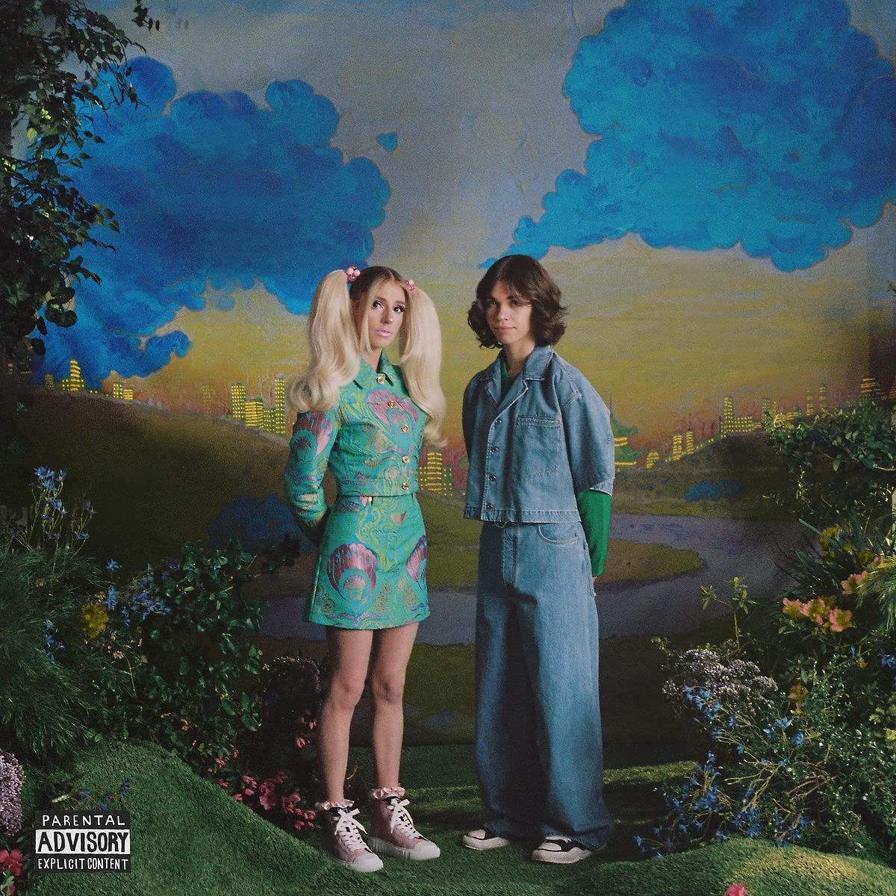

import { Slider, Button } from "@carbon/react";
import { ArrowUpRight } from "@carbon/icons-react";

import SliderJS1 from "../review/slider1";
import SliderJS2 from "../review/slider2";
import SliderJS3 from "../review/slider3";
import SliderJS4 from "../review/slider4";
import AdvJS2 from "../review/adv2";
import AdvJS3 from "../review/adv3";

import { Link } from "gatsby";

Album review

<h1 className="h1--no--margin">{props.pageContext.frontmatter.title}</h1>

  <Link to="/best50/2022/">2022 Black Music Best No.16</Link>

<Row  className="image-card-group">
	<Column colMd={3} colLg={4} noGutterMdLeft="">
       <ImageCard>

</ImageCard>
	</Column>
	<Column colMd={4} colLg={8} noGutterMdLeft="">
	

		p,kbとdsによるJazz Duo, DOMi and JD BECKのデビューアルバム。Youtube/SNSでカヴァー中心に超絶技巧を披露してきたところをAnderson. Paakにフックアップされ、彼の新レーベルであるApeshitからのリリースとなった。ちなみにCDジャケットの向かって左がDOMi（22歳)で左がJD Beck(なんと18歳)である。とても若い二人であるが、たぶん天才肌でテクニックは既に十分な域に達している。
		 DOMiのp/kbは穏やかで茫洋としており、JD Beckのdsは細かく刻むタッチが特徴的である。サウンドは、Flying Lotus/Brainfeeder系をよりJazzに近づけたような感じで、音圧少なめであり、軽くポップな印象を受ける。
		 15曲中、6曲はVocal曲であり、本人たち以外にThunsercatをはじめとする豪華なゲスト陣が唄っているが、こちらも、軽くゆるめな感じだ。Brainfeeder, Robert Glasper当たりを咀嚼した次の世代の誕生を予感させてくれる作品である
		

	

	  <Button className="button-right-mergin"  href="https://amzn.to/3k24sBf" renderIcon={ArrowUpRight} size='sm' kind='primary'>
      amazon.com
    </Button>
    <Button className="button-right-mergin"  href="https://amzn.to/3GwMUoq" renderIcon={ArrowUpRight} size='sm' kind='secondary'>
      amazon.co.jp
    </Button>
		<Button className="button-right-mergin"  href="https://apple.co/3Go9TBJ" renderIcon={ArrowUpRight} size='sm' kind='tertiary'>
      apple music
    </Button>
		<AdvJS2/>
	

	</Column>
</Row>
<Row >
	<Column colMd={4} colLg={4} noGutterMdLeft="">
		

    	<h3>Score card</h3>
			<SliderJS1 value="5" />
    	<SliderJS2 value="1" />
			<SliderJS3 value="2" />
    	<SliderJS4 value="9" />
		

	</Column>
	<Column colMd={8} colLg={8} noGutterMdLeft="">
		

			<h3>Producers</h3>
			

				Domi & JD Beck(all)
			

			<h3>Guests</h3>
			

				Thundercat, Mac DeMarco, Herbie Hancock, Anderson. Paak, noop Dogg, Busta Rhymes, Kurt Rosenwinkel
			

		

	</Column>
</Row>

<h3>Tracks</h3>

| No. | Title                  | Composers                                                                  | Performer                                                     | Time  |
| --- | ---------------------- | -------------------------------------------------------------------------- | ------------------------------------------------------------- | ----- |
| 1   | Louna's Intro          | Domi Louna, JD Beck                                                        | DOMi & JD BECK                                                | 01:01 |
| 2   | Whatup                 | Domi Louna, JD Beck                                                        | DOMi & JD BECK                                                | 02:28 |
| 3   | Smile                  | Domi Louna, JD Beck                                                        | DOMi & JD BECK                                                | 03:11 |
| 4   | Bowling                | Domi Louna, JD Beck, Stephen Bruner                                        | DOMi & JD BECK feat. Thundercat                               | 02:00 |
| 5   | Not Tight              | Domi Louna, JD Beck, Stephen Bruner                                        | DOMi & JD BECK                                                | 04:08 |
| 6   | Two Shrimps            | Domi Louna, JD Beck, Mac DeMarco                                           | DOMi & JD BECK feat. Mac DeMarco                              | 03:05 |
| 7   | U Don't Have To Rob Me | Domi Louna, JD Beck                                                        | DOMi & JD BECK                                                | 02:41 |
| 8   | Moon                   | Domi Louna, JD Beck, Brandon Anderson, Herbie Hancock                      | DOMi & JD BECK feat. Herbie Hancock                           | 04:31 |
| 9   | Duke                   | Domi Louna, JD Beck                                                        | DOMi & JD BECK                                                | 02:21 |
| 10  | Take a Chance          | Domi Louna, JD Beck, Brandon Anderson, Tayla Parx                          | DOMi & JD BECK feat. Anderson. Paak                           | 04:24 |
| 11  | Space Mountain         | Domi Louna, JD Beck                                                        | DOMi & JD BECK                                                | 02:27 |
| 12  | Pilot                  | Domi Louna, JD Beck, Brandon Anderson, Trevor George Smith Jr., C. Broadus | DOMi & JD BECK feat. Snoop Dogg, Busta Rhymes, Anderson. Paak | 03:22 |
| 13  | Whoa                   | Domi Louna, JD Beck                                                        | DOMi & JD BECK feat. Kurt Rosenwinkel                         | 04:01 |
| 14  | Sniff                  | Domi Louna, JD Beck                                                        | DOMi & JD BECK                                                | 03:35 |
| 15  | Thank U                | Domi Louna, JD Beck                                                        | DOMi & JD BECK                                                | 00:45 |

<AdvJS3 />
