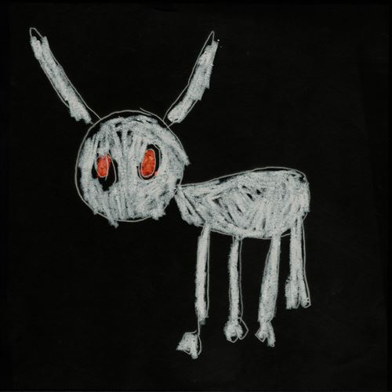

import { Slider, Button } from "@carbon/react";
import { ArrowUpRight } from "@carbon/icons-react";

import SliderJS1 from "./slider1";
import SliderJS2 from "./slider2";
import SliderJS3 from "./slider3";
import SliderJS4 from "./slider4";
import AdvJS2 from "./adv2";
import AdvJS3 from "./adv3";

import { Link } from "gatsby";

import Review1 from "./drake9.mdx";
import Review2 from "./drake8.mdx";
import Review3 from "./drake7.mdx";

Album review

<h1 className="h1--no--margin">{props.pageContext.frontmatter.title}</h1>

<Row  className="image-card-group">
	<Column colMd={3} colLg={4} noGutterMdLeft="">
       <ImageCard>

</ImageCard>
	</Column>
	<Column colMd={4} colLg={8} noGutterMdLeft="">
		

			Drakeの1年ぶり作品で、スタジオアルバムとしては8作目。前作はハウスだったが、当作では既定路線に戻り、23曲、84分という大作となっている。ただ、全体としてのコンセプトがあるわけではないので、すこしづつ聴くのも良いと思う。
			 声が地味目で、フローもアンニョイで抑揚がない人だが、各曲ともそんな第一印象と違って、Trackはかなりポップ。盟友Noah "40" Shebibの出番は控えめで、様々なProducerを起用しており、Bad Bannyを迎えたラテン曲⑲などバラエティにも富んでいるし、聴きどころも多い。
			 Guest陣も様々だが元カノSZAが⑨⑳で、きっちりとした仕事をしている。Lyricは失恋物が多く、この辺は変わりようがないのかもしれない。
		

		

		  <Button className="button-right-mergin"  href="https://amzn.to/3vQ0DoD" renderIcon={ArrowUpRight} size='sm' kind='primary'>
  	    amazon.com
  	  </Button>
  	  <Button className="button-right-mergin"  href="https://amzn.to/3HxTg7V" renderIcon={ArrowUpRight} size='sm' kind='secondary'>
  	    amazon.co.jp
  	  </Button>
			<Button className="button-right-mergin"  href="https://apple.co/3vVFA44" renderIcon={ArrowUpRight} size='sm' kind='tertiary'>
  	   	apple music
  	  </Button>
			<AdvJS2/>
		

	</Column>
</Row>
<Row >
	<Column colMd={4} colLg={4} noGutterMdLeft="">
		

		  <h3>Score card</h3>
			<SliderJS1 value="2" />
		  <SliderJS2 value="1" />
			<SliderJS3 value="2" />
		  <SliderJS4 value="9" />
		

	</Column>
	<Column colMd={8} colLg={8} noGutterMdLeft="">
		

			<h3>Producers</h3>
			

				40 and Harley Arsenault(1)
				 Sango, Budgie Beats and Teezo Touchdown(2)
				 Lil Yachty, PoWR Trav, Jaystolaa, 40, Gentuar Memishi, Glyn Brown and Cash Cobain(3)
				 OZ, Nik D, Pooh Beatz, xynothing and BNYX®(4)
				 Southside, Smatt Sertified, T9C and Lil E$$o(5)
				 Coleman, Vinylz, Tay Keith, Boi-1da, FNZ and OZ(6)
				 BNYX®, Sebastian Shah and Harley Arsenault(7)
				 Nyan, Alex Lustig, Jahaan Sweet and BNYX®(8)
				 BNYX®, Grant Lapointe, Noel Cadastre, 40 and D10(9)
				 Jahaan Sweet and Ray “Quasi” Nelson(10)
				 Jahaan Sweet and 40(11)
				 DJ Screw and Trackmasters(12)
				 Young Troy, Tommy Parker, SAUCEboy, TheBoyKam, Dnny Phntm, 40 and Eli Brown(13)
				 Stwo and 40(14)
				 Lil Yachty, Bangs, BNYX® and Gentuar Memishi(15)
				 BNYX®, Coleman, Boi-1da, Fierce, Maneesh, Harley Arsenault and Jdolla(16)
				 Mario Luciano, Jason Wool and Conductor Williams(17)
				 Kid Masterpiece(19)
				 Gordo, Klahr, LIOHN, BNYX®, TheLoudPack and UV Killin Em(20)
				 ChildBoy and Lil Yachty(21)
				 BNYX®, SADPONY, Justin Raisen, Fluxury and Lil Yachty(22)
				 Lil Yachty, Anthoine Walters, Beatmenace, 40, Gentuar Memishi and Bangs(13)
			

			<h3>Guests</h3>
			

				Teezo Touchdown, 21 Savage, J. Cole, Yeat, SZA, PartyNextDoor, Chief Keef, Bad Bunny, Sexyy Red, Lil Yachty
			

		

	</Column>
</Row>

<h3>Tracks</h3>

| No. | Title                | Composers                                                                                                                                                                                                         | Performer                   | Time  |
| --- | -------------------- | ----------------------------------------------------------------------------------------------------------------------------------------------------------------------------------------------------------------- | --------------------------- | ----- |
| 1   | Virginia Beach       | Harley Arsenault / Christopher Breaux / Aubrey Graham / James Ryan Ho / Noah Shebib                                                                                                                               | Drake                       | 04:11 |
| 2   | Amen                 | Aubrey Graham / Benjamin Scholefield / Rudolph Stanfield / Andrew Thomas / Kai Wright                                                                                                                             | Drake feat: Teezo Touchdown | 02:21 |
| 3   | Calling for You      | Sheyaa Bin Abraham-Joseph / Nohelani Cypriano / Teo Flores / Aubrey Graham / Dennis Graue / Fred LeBlanc / Miles McCollum / Gentuar Memishi / Jean W. Milfort / Noah Shebib / Cameron Smalls                      | Drake feat: 21 Savage       | 04:46 |
| 4   | Fear of Heights      | Darryl Clemons / D-Ford / Benjamin Saint Fort / Nik Frascona / Simon Gebrelul / Aubrey Graham / Mika Joseph / Ozan Yildirim                                                                                       | Drake                       | 02:35 |
| 5   | Daylight             | Alessio Bevilacqua / Matthew-Kyle Brown / Aubrey Graham / Adonis Gree / Joshua Luellen                                                                                                                            | Drake                       | 02:44 |
| 6   | First Person Shooter | Isaac de Boni / Brytavious Chambers / J. Cole / Aubrey Graham / Alex Hernandez / Joseph R. Washington, Jr / Michael Mule / Coleman Name / Moses Samuels / Ozan Yildirim                                           | Drake feat: J. Cole         | 04:07 |
| 7   | IDGAF                | Benjamin Saint Fort / Aubrey Graham / Shah Slam / Noah Smith / J. Taylor / Norma Winstone                                                                                                                         | Drake feat: Yeat            | 04:20 |
| 8   | 7969 Santa           | Keith Cozart / Benjamin Saint Fort / Aubrey Graham / Nyan Lieberthal / Alex Lustig / Tyree Pittman / Jennifer Sweet / T. Lament Taylor / Andrew Thomas                                                            | Drake                       | 04:20 |
| 9   | Slime You Out        | Noel Cadastre / Benjamin Saint Fort / Aubrey Graham / Guy Lapointe / Cozy Powell / Sean Rowe / Noah Shebib / Dalton Tennant                                                                                       | Drake feat: SZA             | 05:10 |
| 10  | Bahamas Promises     | Aubrey Graham / Ron Nelson / Jennifer Sweet                                                                                                                                                                       | Drake                       | 03:04 |
| 11  | Tried Our Best       | Aubrey Graham / Noah Shebib / Jennifer Sweet                                                                                                                                                                      | Drake                       | 03:30 |
| 12  | Screw the World      | S. Barnes / Allan Wayne Felder / Nicole Renee Harris / Jordan Hutchins / Nat Jones / A. O'Bryant / Jean-Claude Olivier / Dan Reeves / Ladele Smith / Kurt Walker                                                  | Drake                       | 01:52 |
| 13  | Drew a Picasso       | Earle Brown / Phil Campbell / Aubrey Graham / John Hyszko / Kamyar Karimi / Thomas Lumpkins / Noah Shebib / Sampha Sisay / Domi Wagner                                                                            | Drake                       | 04:23 |
| 14  | Members Only         | Jahron Brathwaite / Aubrey Graham / Noah Shebib / Steven Vidal                                                                                                                                                    | Drake feat: PartyNextDoor   | 04:38 |
| 15  | What Would Pluto Do  | Benjamin Saint Fort / Aubrey Graham / Miles McCollum / Gentuar Memishi / Bennett Pepple                                                                                                                           | Drake                       | 03:03 |
| 16  | All the Parties      | Harley Arsenault / Maneesh Bidaye / Fierce / Benjamin Saint Fort / Aubrey Graham / Coleman Name / Moses Samuels / James Yancey                                                                                    | Drake feat: Chief Keef      | 03:39 |
| 17  | 8am in Charlotte     | Mario Dragoi / Nichol Eskridge / Aubrey Graham / Lauren Santi / Dub Williams / Jim Woodland                                                                                                                       | Drake                       | 04:27 |
| 18  | BBL Love             | Kaushik Barua / Aubrey Graham / Andrew Thomas                                                                                                                                                                     | Drake                       | 02:41 |
| 19  | Gently               | Damon Blackmon / Nik Frascona / Aubrey Graham / Benito Antonio Martinez Ocasio / Ozan Yildirim                                                                                                                    | Drake feat: Bad Bunny       | 02:14 |
| 20  | Rich Baby Daddy      | Shivam Barot / Damon Blackmon / Yvng Chain / D-Ford / Mac Fellander-Tsai / Benjamin Saint Fort / Aubrey Graham / Johannes Klahr / Richard Zastenker / Sean Rowe / Isabella Summers / Florence Welch / Jake Wherry | Drake feat: Sexyy Red / SZA | 05:19 |
| 21  | Another Late Night   | Aubrey Graham / Drae Jackson / Miles McCollum                                                                                                                                                                     | Drake feat: Lil Yachty      | 02:50 |
| 22  | Away From Home       | Benjamin Saint Fort / Aubrey Graham / "Lights Out" Levine / Miles McCollum / Justin Raisen                                                                                                                        | Drake                       | 04:19 |
| 23  | Polar Opposites      | Osvaldo Gomez / Aubrey Graham / Miles McCollum / Gentuar Memishi / Bennett Pepple / Noah Shebib / Walters                                                                                                         | Drake                       | 04:17 |

<h3>Other Reviews</h3>

<Row>
  <Column colMd={3} colLg={3} noGutterMdLeft>
    <Review1 />
  </Column>
  <Column colMd={3} colLg={3} noGutterMdLeft>
    <Review2 />
  </Column>
	<Column colMd={3} colLg={3} noGutterMdLeft>
    <Review3 />
  </Column>
</Row>

<AdvJS3 />
