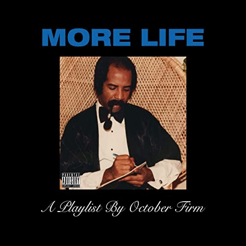

import { Slider, Button } from "carbon-components-react";
import { ArrowUpRight24 } from "@carbon/icons-react";

import SliderJS1 from "../review/slider1";
import SliderJS2 from "../review/slider2";
import SliderJS3 from "../review/slider3";
import SliderJS4 from "../review/slider4";
import AdvJS2 from "../review/adv2";
import AdvJS3 from "../review/adv3";

import { Link } from "gatsby";

import Review1 from "../review/drake8.mdx";

Album Review

<h1 className="h1--no--margin">{props.pageContext.frontmatter.title}</h1>

  <Link to="/best50/2017/">2017 Black Music Album Best No.13</Link>

<Row  className="image-card-group">
	<Column colMd={"3"} colLg={"4"} noGutterMdLeft="">
       <ImageCard>

</ImageCard>
	</Column>
	<Column colMd={"4"} colLg={"8"} noGutterMdLeft="">
	

	お馴染みDrakeの1年振りの作品。本人はAlbumとMixtapeの間に位置するPlaylistと表現しており、22曲81分と、今までになくバラエティに富んだ作品になっている。特に前半はPopで聴きやすい曲も多数。GrimeよりSkepta、GiggsやNana RoguesみたいなUKのProducerが加わったり、NigeriaのDJ, Black CoffeeやMoodymann、Hiatus Kaiyoteを引用したりと、おいしいところを取り入れている。その代わりに盟友Noah "40" Shebib参加曲は減っている。後半になると、Drakeらしいアンビエントで茫洋としてダウナーのものが増えてくるが、前作から引き続きのダンスホールっぽい曲も。また、RapはGuestに任せ、本人はいよいよほぼ唄のみになってしまった。Playlistとはいえ、流しっぱなしにしては勿体ない作品である。
	

	

	  <Button className="button-right-mergin"  href="https://amzn.to/2WgCe6X" kind="primary" size="small" renderIcon={ArrowUpRight24}>
      amazon.com
    </Button>
    <Button className="button-right-mergin"  href="https://amzn.to/309KTco" kind="secondary" size="small" renderIcon={ArrowUpRight24}>
      amazon.co.jp
    </Button>
	

	
	</Column>
</Row>
<Row >
	<Column colMd={"4"} colLg={"4"} noGutterMdLeft="">

  <h3>Score card</h3>
	<SliderJS1 value="3" />
  <SliderJS2 value="1" />
	<SliderJS3 value="2" />
  <SliderJS4 value="8" />

</Column>
<Column colMd={"8"} colLg={"8"} noGutterMdLeft="">

<h3>Producers</h3>

	boi-1da(1,22)
	 Murda Beatz(2,11)
	 Nana Rogues(3,10)
	 Noah "40" Shebib(4)
	 Nineteen85 and Stwo(5)
	 Frank Dukes, Nineteen85(6)
	 T-Minus(7,12)
	 FrancisGotHeat(8)
	 iBeatz(9)
	 G. Ry, Wallis Lane(13)
	 Hagler(14)
	 Chef Pasquale, Ness Pasquale(15)
	 Noah "40" Shebib and Stwo(16)
	 Jazzfeezy and Steve Samson(17)
	 Kanye West, Noah Goldstein and Noah "40" Shebib(18)
	 G. Ry, Noah "40" Shebib* and PARTYNEXTDOOR(19)
	 Vinylz(20)
	 Supah Mario(21)

<h3>Guests</h3>

	Giggs, Black Cofee, Jorja Smith, Sampha, Quabo, Travi$ Scott, 2 Chainz, Young Thug, Kanye West, PARTYNEXTDOOR

</Column>
</Row>

<h3>Tracks</h3>

| No. | Title                    | Composers                                                                                                                                                                                                                                                                                                                | Performer                          | Time  |
| --- | ------------------------ | ------------------------------------------------------------------------------------------------------------------------------------------------------------------------------------------------------------------------------------------------------------------------------------------------------------------------ | ---------------------------------- | ----- |
| 1   | Free Smoke               | Bryan Antoine / Paul Bender / Marvin Bernard / Aubrey Graham / Simon Mavin / Perrin Moss / Allen Ritter / Naomi Saalfield / Matthew Samuels / Daniel Sewell                                                                                                                                                              | Drake                              | 03:39 |
| 2   | No Long Talk             | Kevin Gomringer / Tim Gomringer / Aubrey Graham / Shane Lindstrom / Nathaniel Thompson                                                                                                                                                                                                                                   | Drake ft. Giggs                    | 02:30 |
| 3   | Passionfruit             | Aubrey Graham / Nana Rogues                                                                                                                                                                                                                                                                                              | Drake                              | 04:59 |
| 4   | Jorja (Interlude)        | Adrian Eccleston / Aubrey Graham / Jorja Smith / Don McLean / Noah Shebib                                                                                                                                                                                                                                                | Drake                              | 01:48 |
| 5   | Get It Together          | Aubrey Graham / Paul Jefferies / Nkosinathi Maphumulo / Bucie Nqwiliso / Noah Shebib                                                                                                                                                                                                                                     | Drake ft. Black Cofee, Jorja Smith | 04:10 |
| 6   | Madiba Riddim            | Frank Dukes / Adam Feeney / Aubrey Graham / Charlie Handsome / Paul Jefferies                                                                                                                                                                                                                                            | Drake                              | 03:25 |
| 7   | Blem                     | Aubrey Graham / Lionel Richie / Tyler Williams                                                                                                                                                                                                                                                                           | Drake                              | 03:37 |
| 8   | 4422                     | Sampha Sisay / Francis Ngyun Tran                                                                                                                                                                                                                                                                                        | Drake ft. Sampha                   | 03:06 |
| 9   | Gyalchester              | Rico Brooks / Aubrey Graham / Istv?n Megyimorecz                                                                                                                                                                                                                                                                         | Drake                              | 03:09 |
| 10  | Skepta (Interlude)       | Nana Rogues / Skepta                                                                                                                                                                                                                                                                                                     | Drake                              | 02:23 |
| 11  | Portland                 | Kevin Gomringer / Tim Gomringer / Aubrey Graham / Shane Lindstrom / Quavious Marshall / Jacques Webster                                                                                                                                                                                                                  | Drake ft. Quabo, Travi$ Scott      | 03:57 |
| 12  | Sacrifices               | Tauheed Epps / Aubrey Graham / Daniel Johnson / Jeffery Williams / Tyler Williams                                                                                                                                                                                                                                        | Drake ft. 2 Chainz, Young Thug     | 05:08 |
| 13  | Nothings into Somethings | Aubrey Graham / Paimon Jahanbin / Ryan Martinez / Edgar Nabeyin Panford                                                                                                                                                                                                                                                  | Drake                              | 02:34 |
| 14  | Teenage Fever            | LaShawn Daniels / Aubrey Graham / Fred "Uncle Freddie" Jerkins III / Rodney Jerkins / Jennifer Lopez / Cory Rooney / Marvin Thomas                                                                                                                                                                                       | Drake                              | 03:40 |
| 15  | KMT                      | Courtney Clayburn / Aubrey Graham / Cameron Shaikh / Nathaniel Thompson                                                                                                                                                                                                                                                  | Drake ft. Giggs                    | 02:43 |
| 16  | Lose You                 | Aubrey Graham / Noah Shebib / Steven Vidal                                                                                                                                                                                                                                                                               | Drake                              | 05:05 |
| 17  | Can't Have Everything    | Aubrey Graham / Steve Samson / Jaswinder Singh                                                                                                                                                                                                                                                                           | Drake                              | 03:48 |
| 18  | Glow                     | Phillip Bailey / Gabriel Garz?n-Montano / Noah Goldstein / Aubrey Graham / Anthony Jeffries / Louis King Johnson Jr. / Ilsey Juber / King Louie / Majid Al Maskati / Carlo "Illangelo" Montagnese / Kenza Samir / Sakiya Sandifer / Noah Shebib / Jordan Ullman / Kanye West / Maurice White / Cydel Young / Malik Yusef | Drake ft. Kanye West               | 03:26 |
| 19  | Since Way Back           | Jahron Brathwaite / Warryn Campbell / Aubrey Graham / R. Kelly / Ryan Martinez / Noah Shebib                                                                                                                                                                                                                             | Drake ft. PARTYNEXTDOOR            | 06:08 |
| 20  | Fake Love                | Adam Feeney / Aubrey Graham / Brittany Hazzard / Anderson Hernandez / Leon Huff / Gene McFadden / John Whitehead                                                                                                                                                                                                         | Drake                              | 03:31 |
| 21  | Ice Melts                | Aubrey Graham / Larry Griffin, Jr. / Jonathan D. Priester / Jeffery Williams                                                                                                                                                                                                                                             | Drake ft. Young Thug               | 04:11 |

<h3>Other Reviews</h3>

<Row>
  <Column colMd={3} colLg={3} noGutterMdLeft>
    <Review1 />
  </Column>
</Row>

<AdvJS3 />