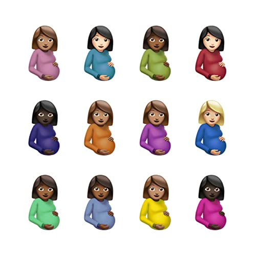

import { Slider, Button } from "carbon-components-react";
import { ArrowUpRight24 } from "@carbon/icons-react";

import SliderJS1 from "../review/slider1";
import SliderJS2 from "../review/slider2";
import SliderJS3 from "../review/slider3";
import SliderJS4 from "../review/slider4";
import AdvJS2 from "../review/adv2";
import AdvJS3 from "../review/adv3";

import { Link } from "gatsby";

import Review1 from "../review/drake7.mdx";

Album review

<h1 className="h1--no--margin">{props.pageContext.frontmatter.title}</h1>

  <Link to="/best50/2021/">2021 Black Music Best No.18</Link>

<Row  className="image-card-group">
	<Column colMd={"3"} colLg={"4"} noGutterMdLeft="">
       <ImageCard>

</ImageCard>
	</Column>
	<Column colMd={"4"} colLg={"8"} noGutterMdLeft="">
		

			Drakeの3年振りの作品。スタジオアルバムとしては6作目となり、今回も21曲、86分今日の長尺になっている。今回に限ったことではないが、1枚のアルバムを何年も丹精込めて作り上げていくというアプローチをとらず、作り溜めた曲が一定数以上になったら、アルバムの形を借りてリリースしているという感じではないかと思われる。
			 とはいえ、個々の曲のクオリティは決して悪くないし、かえってバラエティの富んでいて、最後まで惰性に陥ることはないのは流石。
			 Drakeらしいアンビエントでダウナーのサウンドを基調にしつつ、Yebba(⑪)、Tems(⑯)、Ty Dilla $ign(⑰)などVocal Guest参加曲がアクセントになってる。
			 大物Rapperも多数客演しているが、Lil Wayne, RIck Ross参加の⑱などはストレートで良いと思う。またBeatlesのMichelleを大胆にサンプリングした①によって、のっけからリスナーの耳を釘付けにすることに成功している。
		

		

		  <Button className="button-right-mergin"  href="https://amzn.to/3A4p53H" kind="primary" size="small" renderIcon={ArrowUpRight24}>
  	    amazon.com
  	  </Button>
  	  <Button className="button-right-mergin"  href="https://amzn.to/339tF4k" kind="secondary" size="small" renderIcon={ArrowUpRight24}>
  	    amazon.co.jp
  	  </Button>
			<Button className="button-right-mergin"  href="https://apple.co/3tkU3Ty" kind="tertiary" size="small" renderIcon={ArrowUpRight24}>
  	   	apple music
  	  </Button>
			<AdvJS2/>
		

	</Column>
</Row>
<Row >
	<Column colMd={"4"} colLg={"4"} noGutterMdLeft="">
		

		  <h3>Score card</h3>
			<SliderJS1 value="4" />
		  <SliderJS2 value="1" />
			<SliderJS3 value="2" />
		  <SliderJS4 value="8" />
		

	</Column>
	<Column colMd={"8"} colLg={"8"} noGutterMdLeft="">
		

			<h3>Producers</h3>
			

				Noah "40" Shebib, Masego, Maneesh & Oliver El-Khatib and J.L.L.(1)
				 Supah Mario, O. Ojelade, Jarrel Young, Mark Bonino and Preme(2)
				 Oz The Producer and Ambezza(3)
				 Noah "40" Shebib, Leon Thomas III, AP and Eli Brown(4)
				 Oz The Producer, Dez Wright and Leon Thomas III(5)
				 Oz The Producer, Jahaan Patron, Travis Scott and WondaGurl(6)
				 Tm88 and Too Dope!(7)
				 Harley Arsenault, Noel and OG Run C(8)
				 Kid Masterpiece, Harley Arsenault, Noah "40" Shebib, Alex Lustig and Noel(9)
				 Leon Thomas III, FAXONLY, Jean Bleu, SImon Gabrelul and Anthoine Walters(10)
				 Yebba, James Francies, Noah "40" Shebib and Abbey Smith(11)
				 Vinylz, Oz The Producer and Nik D(12)
				 Metro Boomin and Peter Lee Johnson(13)
				 Cardo,, Dez Wright , KND and Maneesh(14)
				 GOVI, Monsune and Noah "40" Shebib (15)
				 TRESOR, Monsune and Noah "40" Shebib (16)
				 Nineteen85, Noel and Noah "40" Shebib (17)
				 Bink!(18)
				 Harley Arsenault, Clibbo, Houssaa, 3DDY, Yume and KanielTheOne(19)
				 PARTYNEXTDOOR, Noel, Noah "40" Shebib and Aliby(20)
				 Noah "40" Shebib (21)
			

			<h3>Guests</h3>
			

				Lil Baby,  Lil Durk, Giveon, Jay-Z, Young Thug, Future, YEBBA,  Project Pat, 21 Savage, Tems, Ty Dolla $ign, Rick Ross, Lil Wayne, Kid Cudi
			

		

	</Column>
</Row>

<h3>Tracks</h3>

| No. | Title                      | Composers                                                                                                                                                                                                                                                               | Performer                           | Time  |
| --- | -------------------------- | ----------------------------------------------------------------------------------------------------------------------------------------------------------------------------------------------------------------------------------------------------------------------- | ----------------------------------- | ----- |
| 1   | Champagne Poetry           | Maneesh Bidaye / Micah Davis / Aubrey Graham / Gabriel Hardeman / Jean-Andre Lawrence / John Lennon / Paul McCartney / Noah Shebib                                                                                                                                      | Drake                               | 05:36 |
| 2   | Papi’s Home                | Mark Borino / Anthony "Shep" Crawford / Aubrey Graham / Raynford Humphrey / Montell Jordan / Michael Gordon Jr. / Oriyomi Ojelade / Jonathan D. Priester / Jarrel Young                                                                                                 | Drake                               | 02:58 |
| 3   | Girls Want Girls           | Aubrey Graham / Dominique Jones / Mathias Liyew / Ozan Yildirim                                                                                                                                                                                                         | Drake feat: Lil Baby                | 03:41 |
| 4   | In the Bible               | Durk Banks / Eli Brown / Eliel Brown / Giveon Evans / Simon Gebrelul / Giveon / Aubrey Graham / Leon Thomas III / Austin Schindler / Noah Shebib                                                                                                                        | Drake feat: Lil Durk / Giveon       | 04:56 |
| 5   | Love All                   | Shawn Carter / Dylan Cleary-Krell / Luke Combs / Sean Combs / Aubrey Graham / Leon Thomas III / Majid Jordan / Steven Jordan / Khristopher Riddick-Tynes / Christopher Wallace / Ozan Yildirim                                                                          | Drake feat: Jay-Z                   | 03:48 |
| 6   | Fair Trade                 | Reibaldi Sephane Antoine / Brandon Banks / Kenneth Edmonds / Aubrey Graham / Teo Halm / Dernst Emile II / Michael Gordon Jr. / Kyla Moscovich / Ebony Oshunrinde / Marcus Reddick / Jahaan Sweet / Varren Wade / Jacques Webster / Charlotte Day Wilson / Ozan Yildirim | Drake feat: Travis Scott            | 04:51 |
| 7   | Way 2 Sexy                 | Fred Fairbrass / Richard Fairbrass / Aubrey Graham / Rob Manzoli / Lesidney Ragland / Brandon Simmons / Bryan Simmons / Nayvadius Wilburn / Jeffery Williams                                                                                                            | Drake feat: Future / Young Thug     | 04:17 |
| 8   | TSU                        | Harley Arsenault / Noel Cadastre / Christopher Cross / Aubrey Graham / Nate Hills / Nathaniel Hills / R. Kelly / Robert Kelly / Timothy Mosley / Justin Timberlake                                                                                                      | Drake                               | 05:08 |
| 9   | N 2 Deep                   | Harley Arsenault / Kaushik Barua / Chad Butler / Noel Cadastre / Shawn Carter / B. J. Freeman / Bernard Freeman / Aubrey Graham / Jay Jenkins / Leroy Williams, Jr. / Alex Lustig / Joseph McVey / Noah Shebib / Nayvadius Wilburn / Leroy Williams                     | Drake feat: Future                  | 04:33 |
| 10  | Pipe Down                  | Lazaro Camejo / Simon Gebrelul / Aubrey Graham / Abdelhady Moamer Hafez / Leon Thomas III / Robert E. Fairfax III / Derek Kastal / Anthoine Walters / Walters                                                                                                           | Drake                               | 03:25 |
| 11  | Yebba’s Heartbreak         | James Francies / Abigail Smith                                                                                                                                                                                                                                          | Drake feat: YEBBA                   | 02:13 |
| 12  | No Friends in the Industry | Bobby DeBarge / Robert Debarge / Nik Frascona / Aubrey Graham / Anderson Hernandez / Gregory Williams / Ozan Yildirim                                                                                                                                                   | Drake                               | 03:24 |
| 13  | Knife Talk                 | Sheyaa Bin Abraham-Joseph / Aubrey Graham / Jordan Houston / Patrick Houston / Peter Lee Johnson / Rakim Mayers / Leland Wayne / Lil Wayne                                                                                                                              | Drake feat: Project Pat / 21 Savage | 04:03 |
| 14  | 7am on Bridle Path         | Maneesh Bidaye / Dylan Cleary-Krell / David Duodu / Aubrey Graham / Ronald LaTour                                                                                                                                                                                       | Drake                               | 03:59 |
| 15  | Race My Mind               | David Axelrod / Michael Axelrod / Nile Goveia / Aubrey Graham / Osten Harvey / James Johnson / Peter Lee Johnson / Noah Shebib / Christopher Wallace / Scott Zhang                                                                                                      | Drake                               | 04:29 |
| 16  | Fountains                  | Aubrey Graham / Temilade Openiyi / Tresor Riziki                                                                                                                                                                                                                        | Drake feat: Tems                    | 03:12 |
| 17  | Get Along Better           | Noel Cadastre / Aubrey Graham / Tyrone Griffin / Paul Jefferies / Noah Shebib                                                                                                                                                                                           | Drake feat: Ty Dolla $ign           | 03:49 |
| 18  | You Only Live Twice        | Dwayne Carter / Aubrey Graham / Roosevelt Harrell / Brian Reid / William Roberts                                                                                                                                                                                        | Drake feat: Rick Ross / Lil Wayne   | 03:33 |
| 19  | IMY2                       | Harley Arsenault / Dounia Aznou / Ayoub Benfaress / Eddy Bizimana / Kaniel Castaneda / Aubrey Graham / Scott Mescudi / Clifford Owuor                                                                                                                                   | Drake feat: Kid Cudi                | 04:12 |
| 20  | Fucking Fans               | Jahron Brathwaite / Noel Cadastre / Aubrey Graham / Peter Ring / Noah Shebib                                                                                                                                                                                            | Drake                               | 04:05 |
| 21  | The Remorse                | Aubrey Graham / Anthony Hamilton / Noah Shebib                                                                                                                                                                                                                          | Drake                               | 05:51 |

<h3>Other Reviews</h3>

<Row>
  <Column colMd={3} colLg={3} noGutterMdLeft>
    <Review1 />
  </Column>
</Row>

<AdvJS3 />