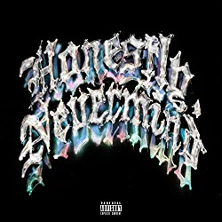

import { Slider, Button } from "@carbon/react";
import { ArrowUpRight } from "@carbon/icons-react";

import SliderJS1 from "../review/slider1";
import SliderJS2 from "../review/slider2";
import SliderJS3 from "../review/slider3";
import SliderJS4 from "../review/slider4";
import AdvJS2 from "../review/adv2";
import AdvJS3 from "../review/adv3";

import { Link } from "gatsby";

import Review1 from "../review/drake8.mdx";
import Review2 from "../review/drake7.mdx";

Album review

<h1 className="h1--no--margin">{props.pageContext.frontmatter.title}</h1>

  <Link to="/best50/2022/">2022 Black Music Best No.21</Link>

<Row  className="image-card-group">
	<Column colMd={3} colLg={4} noGutterMdLeft="">
       <ImageCard>

</ImageCard>
	</Column>
	<Column colMd={4} colLg={8} noGutterMdLeft="">
		

			突然のリリース、かつ、中身はもろにハウスということで、世界中のファンを驚かせたDrakeのスタジオアルバムとしては7作目。前作より9か月と短いインターバルでのリリースとなったが、直後に21 Savageとの共作も出しており、制作意欲が高まっているようだ。
			 ProducerもBlack Coffee, Gordoなど、そちら方面のDJが担っており、本格的にハウス(中でもNew Jersey系とのこと)に取り組んでいて、逆に盟友Noah "40" Shebibの出番は少な目となっている。
			 そんなことでTrackは特に前半はダンサブルな曲が多いが、後半にかけて、メロディアスな曲や、愁いを帯びた曲が増えてきて、最終的にはいつものDrake節に収まるといった感じになっている。
			 Lyricも、内省的なものが多く、サウンドは変わっても、Drakeらしい個性の強さはブレようがないと感じた。
		

		

		  <Button className="button-right-mergin"  href="https://amzn.to/3RuhqEw" renderIcon={ArrowUpRight} size='sm' kind='primary'>
  	    amazon.com
  	  </Button>
  	  <Button className="button-right-mergin"  href="https://amzn.to/3WW4eJt" renderIcon={ArrowUpRight} size='sm' kind='secondary'>
  	    amazon.co.jp
  	  </Button>
			<Button className="button-right-mergin"  href="https://apple.co/3WSSE1D" renderIcon={ArrowUpRight} size='sm' kind='tertiary'>
  	   	apple music
  	  </Button>
			<AdvJS2/>
		

	</Column>
</Row>
<Row >
	<Column colMd={4} colLg={4} noGutterMdLeft="">
		

		  <h3>Score card</h3>
			<SliderJS1 value="5" />
		  <SliderJS2 value="1" />
			<SliderJS3 value="2" />
		  <SliderJS4 value="8" />
		

	</Column>
	<Column colMd={8} colLg={8} noGutterMdLeft="">
		

			<h3>Producers</h3>
			

				Kid Masterpiece(1)
				 &Me and Rampa(2)
				 Black Coffee and Esona Tyolo(3)
				 Black Coffee(4)
				 Noah Shebib and Noel Cadastre(5)
				 Gordo, Klahr and Richard Zastenker(6)
				 Gordo(7)
				 Gordo, Kid Masterpiece, Klahr and Richard Zastenker(8)
				 Alex Lustig, Beau Nox and Govi(9)
				 Black Coffee and Noah "40" Shebib(10)
				 Noah "40" Shebib(11)
				 Ginton, Gordo and Vlado(12)
				 Nyan(13)
				 Tay Keith and VinylZ(14)
			

			<h3>Guests</h3>
			

				21 Savage
			

		

	</Column>
</Row>

<h3>Tracks</h3>

| No. | Title           | Composers                                                                                                                                                                                          | Performer             | Time  |
| --- | --------------- | -------------------------------------------------------------------------------------------------------------------------------------------------------------------------------------------------- | --------------------- | ----- |
| 1   | Intro           | Aubrey Graham                                                                                                                                                                                      | Drake                 | 00:36 |
| 2   | Falling Back    | Christian Astrop / Andr? Boadu / Aubrey Graham / Alex Lustig / Gregor S?tterlin                                                                                                                    | Drake                 | 04:26 |
| 3   | Texts Go Green  | Noel Cadastre / Aubrey Graham / Esona Tyolo                                                                                                                                                        | Drake                 | 05:08 |
| 4   | Currents        | Diamante Blackmon / Lawrence Edwards / Jamal Glaze / Aubrey Graham / LaMarquis Jefferson / Craig Love / Nathi Maphumulo / Donnell Prince / Mukengerwa Tresor Riziki / Noah Shebib / Jorja Smith    | Drake                 | 02:37 |
| 5   | A Keeper        | Andr? Boadu / Philip B?llhoff / Hannes B?scher / Aubrey Graham / Sipho Sililo / Gregor S?tterlin / David Vogt                                                                                      | Drake                 | 02:53 |
| 6   | Calling My Name | Christian Astrop / Diamante Blackmon / Aubrey Graham / Johannes Klahr / Alex Lustig / Richard Zastenker                                                                                            | Drake                 | 02:09 |
| 7   | Sticky          | Diamante Blackmon / Ry Cuming / Aubrey Graham                                                                                                                                                      | Drake                 | 04:03 |
| 8   | Massive         | Diamante Blackmon / Aubrey Graham / Johannes Klahr / Richard Zastenker / Mukengerwa Tresor Riziki                                                                                                  | Drake                 | 05:36 |
| 9   | Flight's Booked | Marsha Ambrosius / Christian Astrop / Kaushik Barua / Diamante Blackmon / Vidal Davis / Nile Goveia / Aubrey Graham / Alex Lustig / Richard Zastenker / Mukengerwa Tresor Riziki / Natalie Stewart | Drake                 | 04:14 |
| 10  | Overdrive       | Christian Astrop / James Bryan / Aubrey Graham / Alex Lustig / Nathi Maphumulo / Mukengerwa Tresor Riziki / Noah Shebib                                                                            | Drake                 | 03:22 |
| 11  | Down Hill       | Aubrey Graham / Mukengerwa Tresor Riziki / Noah Shebib                                                                                                                                             | Drake                 | 04:10 |
| 12  | Tie That Binds  | Christian Astrop / Diamante Blackmon / Ramon Ginton / Aubrey Graham / Marcel Kosic / Alex Lustig                                                                                                   | Drake                 | 05:36 |
| 13  | Liability       | Aubrey Graham / Nyan Lieberthal / Tim Suby                                                                                                                                                         | Drake                 | 03:57 |
| 14  | Jimmy Cooks     | Sheyaa Bin Abraham-Joseph / Brytavious Chambers / D-Ford / Kevin Gomringer / Tim Gomringer / Al Goodman / Aubrey Graham / Anderson Hernandez / Walter Morris / Harry Ray / IBN Young               | Drake feat: 21 Savage | 03:38 |

<h3>Other Reviews</h3>

<Row>
  <Column colMd={3} colLg={3} noGutterMdLeft>
    <Review1 />
  </Column>
	<Column colMd={3} colLg={3} noGutterMdLeft>
    <Review2 />
  </Column>
</Row>

<AdvJS3 />
