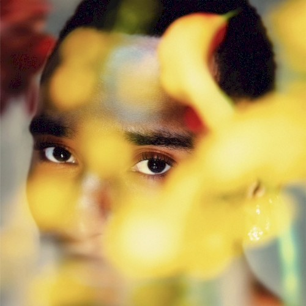

import { Slider, Button } from "@carbon/react";
import { ArrowUpRight } from "@carbon/icons-react";

import SliderJS1 from "../review/slider1";
import SliderJS2 from "../review/slider2";
import SliderJS3 from "../review/slider3";
import SliderJS4 from "../review/slider4";
import AdvJS2 from "../review/adv2";
import AdvJS3 from "../review/adv3";

import { Link } from "gatsby";

Album Review

<h1 className="h1--no--margin">{props.pageContext.frontmatter.title}</h1>

  <Link to="/best50/2025/">2025 Black Music Best No.28</Link>

<Row className="image-card-group">
	<Column colMd={3} colLg={4} noGutterMdLeft="">
		<ImageCard>

			

		</ImageCard>
	</Column>
	<Column colMd={4} colLg={8} noGutterMdLeft="">
		

			2000年代終盤より活動するOhio出身のSinger, Durand Bernarrの2025年春リリースのアルバム。リリース時で37歳と中堅の域にいるが、2020年代より客演で知られるようになり、2020年代にはいってアルバムが評価されて、当アルバムではグラミー3部門と日の目をみるまでに至った。
			 サウンドはビンテージでオーソドックスなソウルをベースに、ファンクやロック寄りの曲もあり、曲調はミディアムが多めで、アップ、バラードと様々。1曲以外は5分以上であり、各曲をじっくり聞かせようという意思も感じられる。
			 DurandのVocalは、表現力高く、ところどころ粘着質なところがあるのが特徴的だ。
		

		

			<Button className="button-right-mergin" href="https://amzn.to/4ae6nJh" renderIcon={ArrowUpRight} size='sm' kind='primary'>
				amazon.com
			</Button>
			<Button className="button-right-mergin" href="https://amzn.to/4aq3eHn" renderIcon={ArrowUpRight} size='sm' kind='secondary'>
				amazon.co.jp
			</Button>
			<Button className="button-right-mergin" href="https://apple.co/3NPa5S8" renderIcon={ArrowUpRight} size='sm' kind='tertiary'>
				apple music
			</Button>
			<AdvJS2/>
		

	</Column>
</Row>
<Row>
	<Column colMd={4} colLg={4} noGutterMdLeft="">
		

			<h3>Score card</h3>
			<SliderJS1 value="5" />
			<SliderJS2 value="2" />
			<SliderJS3 value="1" />
			<SliderJS4 value="4" />
		

	</Column>
	<Column colMd={4} colLg={8} noGutterMdLeft="">
		

			<h3>Producers</h3>
			

				Chuck Harmony(1)
				 Poe Leos and Stanley Randolph(2,3)
				 Brittany "b.kae" Habermehl(4)
				 Runako 'Narx' Bedeau and Emmanuel 'E-Whizz' Mukungu(5)
				 Chase Worrell(6)
				 Blake Straus(7)
				 Michael Barney(8)
				 Claude Kelly (9,10)
				 Timothy Bloom(11)
				 Durand Bernarr(12)
				 Faheem Najm(13)
				 Stanley Randolph(14)
				 Jonathan Yoni Asperil(15)
			

			<h3>Guests</h3>
			

				GAWD, T-Pain
			

		

	</Column>
</Row>

<h3>Tracks</h3>

| No. | Title         | Composers                                                                      | Performer                   | Time |
| --- | ------------- | ------------------------------------------------------------------------------ | --------------------------- | ---- |
| 1   | GENEROUS      | Bernarr Durand Ferebee, Jr., Chuck Harmony, Parson James, Claude Kelly         | Durand Bernarr              | 6:09 |
| 2   | Flounce       | Bernarr Durand Ferebee, Jr., Brittany Habermehl, Alana Linsey, Alayna Rodgers | Durand Bernarr feat. GAWD   | 4:40 |
| 3   | Impact        | Bernarr Durand Ferebee, Jr., Brittany Habermehl, Alana Linsey, Alayna Rodgers | Durand Bernarr              | 5:00 |
| 4   | Jump          | Bernarr Durand Ferebee, Jr., Jerome Castille, Kolesta "Choklate" Moore         | Durand Bernarr              | 4:23 |
| 5   | No Business   | Bernarr Durand Ferebee, Jr.                                                    | Durand Bernarr              | 5:20 |
| 6   | Overqualified | Bernarr Durand Ferebee, Jr.                                                    | Durand Bernarr              | 5:20 |
| 7   | Unspoken      | Bernarr Durand Ferebee, Jr., James Abrahart                                    | Durand Bernarr              | 3:29 |
| 8   | Completed     | Bernarr Durand Ferebee, Jr.                                                    | Durand Bernarr              | 5:49 |
| 9   | Reaching      | Bernarr Durand Ferebee, Jr.                                                    | Durand Bernarr              | 4:31 |
| 10  | PSST!         | Bernarr Durand Ferebee, Jr.                                                    | Durand Bernarr              | 4:33 |
| 11  | Here We Are   | Bernarr Durand Ferebee, Jr., Timothy Bloom                                     | Durand Bernarr              | 4:39 |
| 12  | BLAST!        | Bernarr Durand Ferebee, Jr., Ingrid Burley                                     | Durand Bernarr              | 5:01 |
| 13  | THAT!         | Bernarr Durand Ferebee, Jr., Faheem Najm                                       | Durand Bernarr feat. T-Pain | 4:21 |
| 14  | Specialty     | Bernarr Durand Ferebee, Jr., Ekela Dixon                                       | Durand Bernarr              | 6:26 |
| 15  | Home Alone    | Bernarr Durand Ferebee, Jr.                                                    | Durand Bernarr              | 7:03 |

<AdvJS3 />
