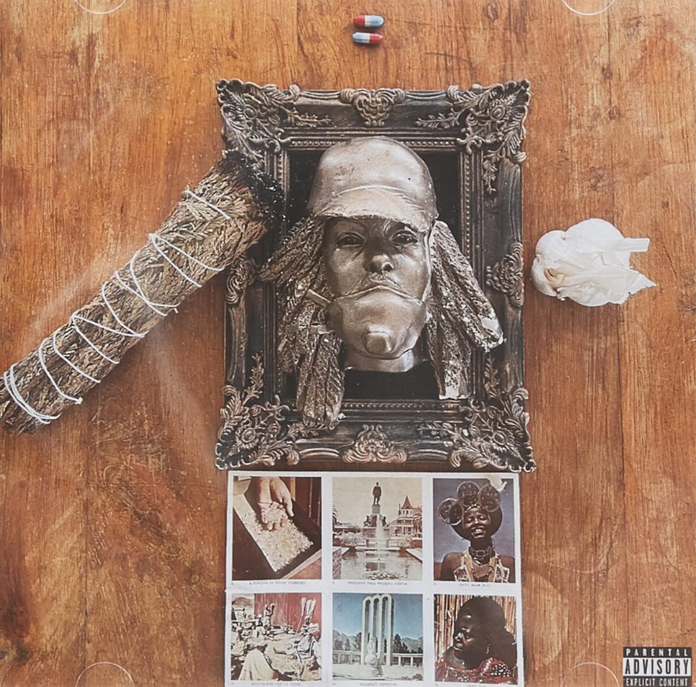

import { Slider, Button } from "@carbon/react";
import { ArrowUpRight } from "@carbon/icons-react";

import SliderJS1 from "../review/slider1";
import SliderJS2 from "../review/slider2";
import SliderJS3 from "../review/slider3";
import SliderJS4 from "../review/slider4";
import AdvJS2 from "../review/adv2";
import AdvJS3 from "../review/adv3";

import { Link } from "gatsby";

import Review1 from "../review/earlsweatshirt3.mdx";

Album Review

<h1 className="h1--no--margin">{props.pageContext.frontmatter.title}</h1>

<Row  className="image-card-group">
	<Column colMd={3} colLg={4} noGutterMdLeft="">
       <ImageCard>

</ImageCard>
	</Column>
	<Column colMd={4} colLg={8} noGutterMdLeft="">
	

		Earl Sweatshirtの4年ぶり、4作目のCD。この間、レーベル移籍を果たしWarnerからのリリースとなるが、音楽の方向性は前作を継承している。また、前作と同じく24分と収録時間は短めである。ただ、曲数が減ってるので各曲の特徴はでている。
		 さらに、違いとしては、制作は全て外部Producerに任せたところで、その分、TrackのQualityは上がっている。ほぼ全編、ゆったりとして、リズムをずれ気味にしつつ、目いっぱい抑えた感じのTrackになっていて、つぶやくようなフローと一体になっている。
		 Lyricも自身の思いを連ねてようなPersonalな感じで、ただ、今回はCovid19への言及が多数、見られている。
	

    

	  <Button className="button-right-mergin"  href="https://amzn.to/3GggCyZ" renderIcon={ArrowUpRight} size='sm' kind='primary'>
      amazon.com
    </Button>
    <Button className="button-right-mergin"  href="https://amzn.to/3vfSeXL" renderIcon={ArrowUpRight} size='sm' kind='secondary'>
      amazon.co.jp
    </Button>
		<Button className="button-right-mergin"  href="https://apple.co/3Ghm04P" renderIcon={ArrowUpRight} size='sm' kind='secondary'>
      apple music
    </Button>
		<AdvJS2/>
	

	</Column>
</Row>
<Row >
	<Column colMd={4} colLg={4} noGutterMdLeft="">
		

		  <h3>Score card</h3>
			<SliderJS1 value="1" />
		  <SliderJS2 value="2" />
			<SliderJS3 value="2" />
		  <SliderJS4 value="8" />
		

</Column>
<Column colMd={8} colLg={8} noGutterMdLeft="">

	<h3>Producers</h3>
	

		The Alchemist(1,6)
		 Black Noi$e(2,4,9,10)
		 Ancestors(3)
		 Bob Chambers and Theravada(5)
		 Samiyam(7)
		 Alexander Spit(8)
	

	<h3>Guests</h3>
	

		Zelooperz, Armand Hammer
	

</Column>
</Row>

<h3>Tracks</h3>

| No. | Title            | Composers                                                                         | Performer                          | Time  |
| --- | ---------------- | --------------------------------------------------------------------------------- | ---------------------------------- | ----- |
| 1   | Old Friend       | Thebe Kgositsile / Alan Maman                                                     | Earl Sweatshirt                    | 01:19 |
| 2   | 2010             | Thebe Kgositsile / Robert Mansell                                                 | Earl Sweatshirt                    | 02:28 |
| 3   | Sick!            | Sage Elsesser / Thebe Kgositsile                                                  | Earl Sweatshirt                    | 01:51 |
| 4   | Vision           | Thebe Kgositsile / Robert Mansell / Walter Williams                               | Earl Sweatshirt feat. Zelooperz    | 04:14 |
| 5   | Tabula Rasa      | Chaz Hall / Thebe Kgositsile / Thaniil Theoharis / Billy Woods / Xenophon Yialias | Earl Sweatshirt feat. Arman Hammer | 04:11 |
| 6   | Lye              | Thebe Kgositsile / Alan Maman                                                     | Earl Sweatshirt                    | 01:52 |
| 7   | Lobby (Int)      | Lobby (Int)                                                                       | Earl Sweatshirt                    | 01:12 |
| 8   | God Laughs       | Thebe Kgositsile / Alexander Manzano                                              | Earl Sweatshirt                    | 01:24 |
| 9   | Titanic          | Thebe Kgositsile / Robert Mansell                                                 | Earl Sweatshirt                    | 01:52 |
| 10  | Fire in the Hole | Thebe Kgositsile / Robert Mansell                                                 | Earl Sweatshirt                    | 03:37 |

<h3>Other Reviews</h3>

<Row>
  <Column colMd={3} colLg={3} noGutterMdLeft>
    <Review1 />
  </Column>
</Row>

<AdvJS3/>