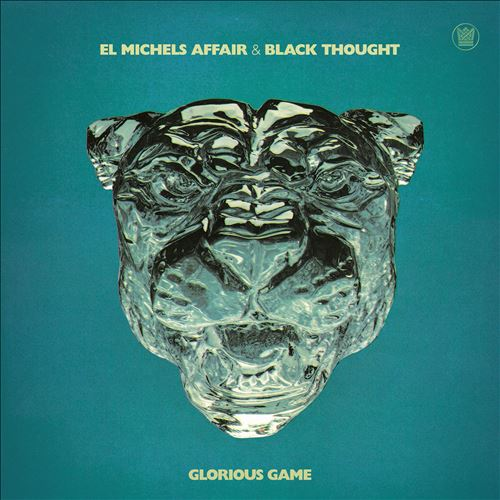

import { Slider, Button } from "@carbon/react";
import { ArrowUpRight } from "@carbon/icons-react";

import SliderJS1 from "../review/slider1";
import SliderJS2 from "../review/slider2";
import SliderJS3 from "../review/slider3";
import SliderJS4 from "../review/slider4";
import AdvJS2 from "../review/adv2";
import AdvJS3 from "../review/adv3";

import { Link } from "gatsby";

import Review1 from "../review/dangermouseblackthought1.mdx";

Album review

<h1 className="h1--no--margin">{props.pageContext.frontmatter.title}</h1>

  <Link to="/best50/2023/">2023 Black Music Best No.40</Link>

<Row  className="image-card-group">
	<Column colMd={3} colLg={4} noGutterMdLeft="">
       <ImageCard>

</ImageCard>
	</Column>
	<Column colMd={4} colLg={8} noGutterMdLeft="">
		

			ファンク系の2人インスト・ユニット、El Michels Affiairとご存じThe Roots所属のRapper, Black Thoughtのコラボ作。Black Thoughtにとっては昨年のDanger Mouseに続く共作である。前者の中心人物であるLeon MichelsがメインでProduceしている。
			 Wu-Tangとのコラボ諸作で慣らしたのか、TrackはストレートなHip-Hopを、バンドで再現しており、Black Thoughtもやりやすかったのか、うまく馴染んでいて、一体感がつたわってくる。
			 特に⑤〰⑧あたりのファンクでメローな曲が気持ち良く聴ける。
		

				

		  		<Button className="button-right-mergin"  href="https://amzn.to/41hZvEH" renderIcon={ArrowUpRight} size='sm' kind='primary'>
  	  		  amazon.com
  	  		</Button>
  	  		<Button className="button-right-mergin"  href="https://amzn.to/3Mwgf70" renderIcon={ArrowUpRight} size='sm' kind='secondary'>
  	  		  amazon.co.jp
  	  		</Button>
					<Button className="button-right-mergin"  href="https://apple.co/3Uvj9uz" renderIcon={ArrowUpRight} size='sm' kind='tertiary'>
  	  		 	apple music
  	  		</Button>
					<AdvJS2/>
				

		</Column>
</Row>
<Row >
	<Column colMd={4} colLg={4} noGutterMdLeft="">
		

		  <h3>Score card</h3>
			<SliderJS1 value="1" />
		  <SliderJS2 value="2" />
			<SliderJS3 value="2" />
		  <SliderJS4 value="9" />
		

	</Column>
	<Column colMd={8} colLg={8} noGutterMdLeft="">
		

			<h3>Producers</h3>
			

				Leon Michels(1,3,4,5,6,7,8,9,10,11)
				 Brainstory and Leon Michels(2)
				 Leon Michels and Hether(6)
			

			<h3>Guests</h3>
			

				KIRBY, Son Little, Brainstory
			

		

	</Column>
</Row>

<h3>Tracks</h3>

| No. | Title                   | Composers                                                                                                                                            | Performer                                          | Time  |
| --- | ----------------------- | ---------------------------------------------------------------------------------------------------------------------------------------------------- | -------------------------------------------------- | ----- |
| 1   | Grateful                | Cleveland Browne, Greville Gordon, Homer Steinweiss, Leon Michels, Nick Movshon, Paul Spring, Shabba Ranks, Black Thought, Wycliffe “Steely” Johnson | El Michels Affair / Black Thought                  | 02:51 |
| 2   | Glorious Game           | Black Thought, KIRBY, Kevin Martin, Tony Martin, Leon Michels, Eric Hagstrom                                                                         | El Michels Affair / Black Thought feat. KIRBY      | 03:53 |
| 3   | I'm Still Somehow       | Black Thought, Leon Michels, Joni Mitchell                                                                                                           | El Michels Affair / Black Thought                  | 02:04 |
| 4   | Hollow Way              | Black Thought, Erkin Koray, Homer Steinweiss, Nick Movshon, Eddie Holloway, Jake Graffagnino, Joseph Noel, Leon Michels                              | El Michels Affair / Black Thought                  | 02:24 |
| 5   | Protocol                | Black Thought, Leon Michels, Homer Steinweiss, Nick Movshon, Paul Spring, Son Little                                                                 | El Michels Affair / Black Thought feat. Son Little | 02:56 |
| 6   | The Weather             | Black Thought, Nick Movshon, Hether, Leon Michels                                                                                                    | El Michels Affair / Black Thought                  | 02:59 |
| 7   | That Girl               | Black Thought, Leon Michels, Homer Steinweiss, Kevin Martin, Nick Movshon, Paul Spring                                                               | El Michels Affair / Black Thought                  | 02:10 |
| 8   | I Would Never           | Black Thought, Leon Michels, Homer Steinweiss, Kevin Martin, Paul Spring, Nick Movshon                                                               | El Michels Affair / Black Thought                  | 02:43 |
| 9   | Alone                   | Black Thought, Leon Michels, Dave Guy, Kevin Martin, Nick Movshon                                                                                    | El Michels Affair / Black Thought                  | 02:05 |
| 10  | Miracle                 | Black Thought, Leon Michels, Nick Movshon                                                                                                            | El Michels Affair / Black Thought                  | 02:32 |
| 11  | Glorious Game (Reprise) | KIRBY, Dave Guy, Eric Hagstrom, Kevin Martin, Leon Michels, Black Thought                                                                            | El Michels Affair / Black Thought                  | 01:23 |
| 12  | Alter Ego               | Black Thought, Leon Michels, Eric Hagstrom, Kevin Martin, Tony Martin                                                                                | El Michels Affair / Black Thought feat. Brainstory | 03:10 |

<h3>Other Reviews</h3>

<Row>
  <Column colMd={3} colLg={3} noGutterMdLeft>
    <Review1 />
  </Column>
</Row>

<AdvJS3 />
