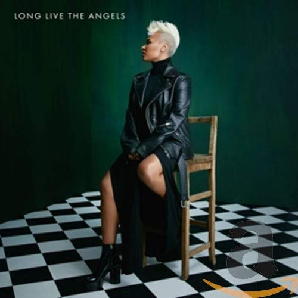

import { Slider, Button } from 'carbon-components-react';
import { ArrowUpRight24  } from '@carbon/icons-react';

import SliderJS1 from "../review/slider1"
import SliderJS2 from "../review/slider2"
import SliderJS3 from "../review/slider3"
import SliderJS4 from "../review/slider4"

import { Link } from "gatsby"

Album Review

<h1 className="h1--no--margin">{props.pageContext.frontmatter.title}</h1>

<Row  className="image-card-group">
	<Column colMd={"3"} colLg={"4"} noGutterMdLeft="">
       <ImageCard>

 

</ImageCard>
	</Column>
	<Column colMd={"4"} colLg={"8"} noGutterMdLeft="">
	

	デビュー作が高評価を得たEmeli Sandeのライブアルバムを挟んでの4年振り、2作目。意外に長めのインターバルでのリリースである。Accousticで、時にストリングスがはいるバンドサウンドを従え、前作よりさらにエモーショナルに切々と歌い上げる。その痛みはジャンルは違うが、Mary J. Bligeに近いものがある。曲はほぼスローのみで、時にGospel Choirがはいるのが特徴的といえる。EmeliのVocalを100%フォーカスした作品だ
	

    

	  <Button className="button-right-mergin"  href="https://amzn.to/2FoVz01" kind="primary" size="small" renderIcon={ArrowUpRight24}>
      amazon.com
    </Button>
    <Button className="button-right-mergin"  href="https://amzn.to/30XYxRo" kind="secondary" size="small" renderIcon={ArrowUpRight24}>
      amazon.co.jp
    </Button>
	

	
	
	</Column>
</Row>
<Row >
	<Column colMd={"4"} colLg={"4"} noGutterMdLeft="">

    <h3>Score card</h3>
		<SliderJS1 value="5" />
    <SliderJS2 value="2" />
		<SliderJS3 value="1" />
    <SliderJS4 value="8" />

</Column>
<Column colMd={"8"} colLg={"8"} noGutterMdLeft="">

<h3>Producers</h3>

	Emeli Sande and ProducerWEZ(1)
	 Chris Loco(2)
	 Mac & Phill and Naughty Boy(3,6)
	 Mojam and Mac & Phill(4,10)
	 Emeli Sande and Mac & Phill(5)
	 Naughty Boy(7)
	 Chris Loco(8)
	 Shakavelli and Naughty Boy(9)
	 Mojam and Jonny Coffer(11)
	 Mac & Phil(12,13,15)
	 TMS(14)

<h3>Guests</h3>

	Jay Electronica, Aine Zion, Joel Sande, The Serenje Choi

</Column>
</Row>

<h3>Tracks</h3>

| No. |	 Title                    |	 Composers                                                               	|	 Performer                                      |	 Time	|
| --- |	------------------------- | ------------------------------------------------------------------------- | ----------------------------------------------- | ----- |
|	1	  |	Selah                    	| Emeli Sande                                                              	|	Emeli Sande                                    	|	02:30 |
|	2	  |	Breathing Underwater     	| Chris Loco / Emeli Sande                                                 	|	Emeli Sande                                    	|	04:22 |
|	3	  |	Happen                   	| Jonny Coffer / Matthew Holmes / Shahid Khan / Philip Leigh / Emeli Sande 	|	Emeli Sande                                    	|	03:35 |
|	4	  |	Hurts                    	| Matthew Holmes / Philip Leigh / James Murray / Mustafa Omar / Emeli Sande	|	Emeli Sande                                    	|	03:58 |
|	5	  |	Give Me Something        	| Matthew Holmes / Philip Leigh / Chris Loco / Emeli Sande                 	|	Emeli Sande                                    	|	03:52 |
|	6	  |	Right Now                	| Matthew Holmes / Shahid Khan / Philip Leigh / Emeli Sande                	|	Emeli Sande                                    	|	02:14 |
|	7	  |	Shakes                   	| Jonny Coffer / Shahid Khan / Emeli Sande                                 	|	Emeli Sande                                    	|	02:49 |
|	8	  |	Garden                   	| Jay Electronica / Chris Loco / Emeli Sande / ?ine Zion                   	|	Emeli Sande feat. Jay Electronica, Aine Zion   	|	04:02 |
|	9	  |	I'd Rather Not           	| Shakil Ashraf / Jonny Coffer / Shahid Khan / Emeli Sande                 	|	Emeli Sande                                    	|	03:49 |
|	10	|	Lonely                   	| Matthew Holmes / Philip Leigh / James Murray / Mustafa Omar / Emeli Sande	|	Emeli Sande                                    	|	03:33 |
|	11	|	Sweet Architect          	| Jonny Coffer / James Murray / Mustafa Omar / Emeli Sande                 	|	Emeli Sande                                    	|	03:19 |
|	12	|	Tenderly                 	| Matthew Holmes / Philip Leigh / Joel Sande / Emeli Sande                 	|	Emeli Sande fest. Joel Sande, The Serenje Choir	|	03:22 |
|	13	|	Every Single Little Piece	| Matthew Holmes / Philip Leigh / Emeli Sande                              	|	Emeli Sande                                    	|	04:03 |
|	14	|	Highs & Lows             	| Tom Barnes / Wayne Hector / Peter Kelleher / Ben Kohn / Emeli Sande      	|	Emeli Sande                                    	|	03:14 |
|	15	|	Babe                     	| Matthew Holmes / Philip Leigh / Emeli Sande                              	|	Emeli Sande                                    	|	03:17 |
