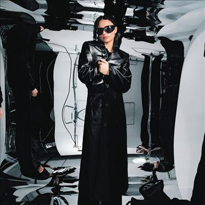

import { Slider, Button } from "@carbon/react";
import { ArrowUpRight } from "@carbon/icons-react";

import SliderJS1 from "../review/slider1";
import SliderJS2 from "../review/slider2";
import SliderJS3 from "../review/slider3";
import SliderJS4 from "../review/slider4";
import AdvJS2 from "../review/adv2";
import AdvJS3 from "../review/adv3";

import { Link } from "gatsby";

import Review1 from "../review/erikadecasier2.mdx";

Album review

<h1 className="h1--no--margin">{props.pageContext.frontmatter.title}</h1>

<Row className="image-card-group">
	<Column colMd={3} colLg={4} noGutterMdLeft="">
		<ImageCard>

</ImageCard>
	</Column>
	<Column colMd={4} colLg={8} noGutterMdLeft="">
		

			ポルトガル生まれで、コペンハーゲンを拠点に活動するErika De Casierの2ndアルバム。UKのレーベルからのリリースであり、GuestもUKより2人、USより1人となっている。
			 2017年あたりから個人レベルで音楽活動を開始し、2021年リリースの前作で名を知られるようになった。唄だけなく、Song Writingもこなし、今作でも半分は単独Produceという才能の持ち主である。アルバムのはいりはドラムンベースやジャングルっぽい曲もあり、エレクトロニックなところもあり、サウンドはUK寄りとなっている。浮遊感のあるTrackにErikaの抑えた、囁くようなVocalが合わさった独特な音像が魅力となっている。
			 メジャーに取り込まれる前に、もう少し、この形を突き詰めてもらいたいと思う。
		

		

			<Button className="button-right-mergin" href="https://amzn.to/3M01QhO" renderIcon={ArrowUpRight} size='sm' kind='primary'>
				amazon.com
			</Button>
			<Button className="button-right-mergin" href="https://amzn.to/4cgXOfK" renderIcon={ArrowUpRight} size='sm' kind='secondary'>
				amazon.co.jp
			</Button>
			<Button className="button-right-mergin" href="https://apple.co/4dgyvLX" renderIcon={ArrowUpRight} size='sm' kind='tertiary'>
				apple music
			</Button>
			<AdvJS2/>
		

	</Column>
</Row>
<Row>
	<Column colMd={4} colLg={4} noGutterMdLeft="">
		

			<h3>Score card</h3>
			<SliderJS1 value="5" />
			<SliderJS2 value="2" />
			<SliderJS3 value="1" />
			<SliderJS4 value="9" />
		

	</Column>
	<Column colMd={8} colLg={8} noGutterMdLeft="">
		

			<h3>Producers</h3>
			

				Erika de Casier(1,4,8,9,12,13,14)
				 Erika de Casier & Natal Zaks(2,3,5,6,7,11)
				 Erika de Casier, Nick León and Natal Zaks(10)
			

			<h3>Guests</h3>
			

				They Hate Change, Shygirl, Blood Orange
			

		

	</Column>
</Row>

<h3>Tracks</h3>

| No. | Title          | Composers                                                                                                     | Performer                              | Time  |
| --- | -------------- | ------------------------------------------------------------------------------------------------------------- | -------------------------------------- | ----- |
| 1   | Right This Way | Erika de Casier                                                                                               | Erika de Casier                        | 03:09 |
| 2   | Home Alone     | Erika de Casier, Carl Barsk, Natal Zaks                                                                       | Erika de Casier                        | 03:30 |
| 3   | Lucky          | Erika de Casier, Antea Birchett, Delisha Thomas, D'Mile, LaShawn Daniels, Rodney Jerkins                      | Erika de Casier                        | 02:09 |
| 4   | The Princess   | Erika de Casier, Tobias Sachse Mogensen                                                                       | Erika de Casier                        | 01:54 |
| 5   | ice            | André Gainey, Carl Barsk, Erika de Casier, Natal Zaks, Vonne Parks                                            | Erika de Casier feat. They Hate Change | 03:00 |
| 6   | Test It        | Erika de Casier, Jonathan Ludvigsen, Natal Zaks                                                               | Erika de Casier                        | 02:27 |
| 7   | ooh            | Erika de Casier, Natal Zaks                                                                                   | Erika de Casier                        | 02:22 |
| 8   | Believe It     | Erika de Casier                                                                                               | Erika de Casier                        | 02:39 |
| 9   | Anxious        | Carl Barsk, Erika de Casier, Jonathan Ludvigsen                                                               | Erika de Casier                        | 03:02 |
| 10  | Ex-Girlfriend  | Christian Rohde Lindinger, Jonathan Ludvigsen, Kirsten Jansen, Nick León, Niels Kirk, Erika de Casier, Shygirl | Erika de Casier feat. Shygirl          | 03:24 |
| 11  | Toxic          | Carl Barsk, Christian Rohde Lindinger, Erika de Casier, Jonathan Ludvigsen, Kirsten Jansen, Natal Zaks        | Erika de Casier                        | 03:04 |
| 12  | My Day Off     | Erika de Casier, Natal Zaks                                                                                   | Erika de Casier                        | 03:09 |
| 13  | Twice          | Carl Barsk, Devonté Hynes, Erika de Casier, Jonathan Ludvigsen, Natal Zaks                                    | Erika de Casier feat. Blood Orange     | 03:30 |
| 14  | Someone        | Carl Barsk, Jonathan Ludvigsen, Natal Zaks, Erika de Casier                                                  | Erika de Casier                        | 02:09 |

<h3>Other Reviews</h3>

<Row>
	<Column colMd={3} colLg={3} noGutterMdLeft>
		<Review1 />
	</Column>
</Row>

<AdvJS3 />
