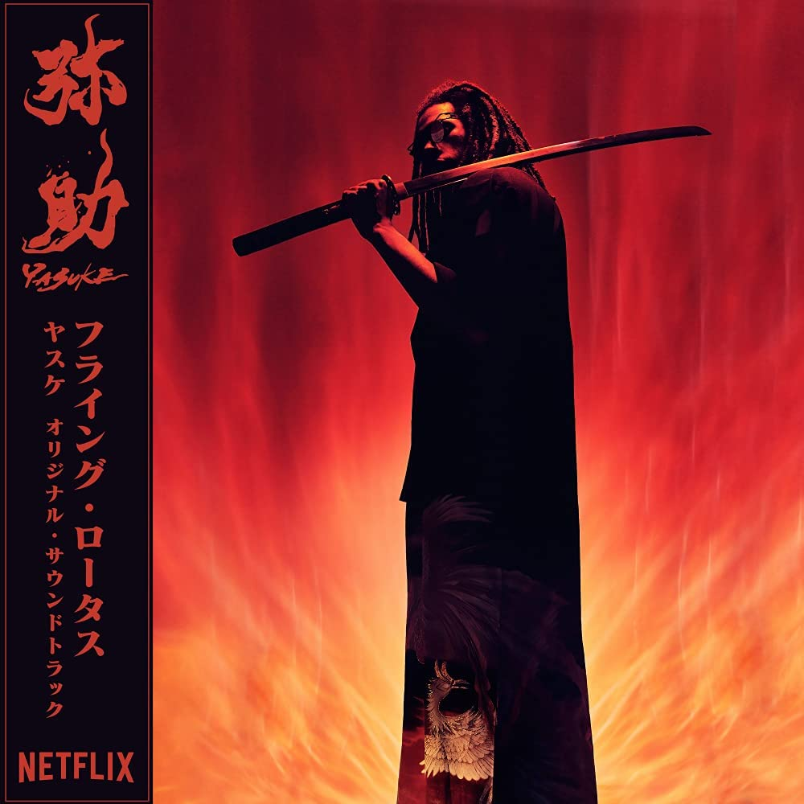

import { Slider, Button } from "carbon-components-react";
import { ArrowUpRight24 } from "@carbon/icons-react";

import SliderJS1 from "../review/slider1";
import SliderJS2 from "../review/slider2";
import SliderJS3 from "../review/slider3";
import SliderJS4 from "../review/slider4";
import AdvJS2 from "../review/adv2";
import AdvJS3 from "../review/adv3";

import { Link } from "gatsby";

import Review1 from "../review/flyinglotus3.mdx";

Album Review

<h1 className="h1--no--margin">{props.pageContext.frontmatter.title}</h1>

<Row  className="image-card-group">
	<Column colMd={"3"} colLg={"4"} noGutterMdLeft="">
       <ImageCard>

</ImageCard>
	</Column>
	<Column colMd={"4"} colLg={"8"} noGutterMdLeft="">
		

			Flying Lotusの2年ぶり、7作目となるアルバムは、Netflixアニメ「弥助(Yasuke)」のサントラとなった。織田信長に仕えた黒人侍を主人公にして、当時の日本を舞台にし、ファンタジー要素を盛り込んだアニメである。なので、いつものFlying Lotusのエレクトロ/クラブな雰囲気に和風なメロディや和楽器風の音色など和風テイストが大胆に取り入れられている。
			 また、輸入盤のCDジャケットの帯や背表紙も日本語になっている。
			 全編、Programming, , SynthesizerによるTrackで、ところどころThundercatなどの楽器演奏が加わっており、サントラなので、唄やRapはほんの少々となっている。
			 映像とともに楽しむべきではあるが、音楽だけでも、それなりに楽しめる作品となっている。
		

		

	  	<Button className="button-right-mergin"  href="https://amzn.to/3qdo9qA" kind="primary" size="small" renderIcon={ArrowUpRight24}>
      	amazon.com
    	</Button>
    	<Button className="button-right-mergin"  href="https://amzn.to/3qdo9qA" kind="secondary" size="small" renderIcon={ArrowUpRight24}>
      	amazon.co.jp
    	</Button>
			<Button className="button-right-mergin"  href="https://apple.co/3qg94EU" kind="tertiary" size="small" renderIcon={ArrowUpRight24}>
      	apple music
    	</Button>
			<AdvJS2/>
		

	</Column>
</Row>
<Row >
	<Column colMd={"4"} colLg={"4"} noGutterMdLeft="">
		

  		<h3>Score card</h3>
  		<SliderJS1 value="3" />
  		<SliderJS2 value="1" />
  		<SliderJS3 value="1" />
  		<SliderJS4 value="8" />
		

	</Column>
	<Column colMd={"8"} colLg={"8"} noGutterMdLeft="">
		

			<h3>Producers</h3>
			

				Steven Ellison(all)
			

			<h3>Guests</h3>
			

				Denzel Curry, Thundercat, Miguel Atwood Ferguson, Robert Glasper, Brendon Small, Niki Randa, Chris Fishman
			

		

	</Column>
</Row>

<h3>Tracks</h3>

| No. | Title                   | Composers      | Performer    | Time  |
| --- | ----------------------- | -------------- | ------------ | ----- |
| 1   | War at the Door         | Steven Ellison | Flying Lotus | 02:08 |
| 2   | Black Gold              | Steven Ellison | Flying Lotus | 01:35 |
| 3   | Your Lord               | Steven Ellison | Flying Lotus | 02:06 |
| 4   | Shoreline Sus           | Steven Ellison | Flying Lotus | 01:20 |
| 5   | Hiding in the Shadows   | Steven Ellison | Flying Lotus | 01:01 |
| 6   | Crust                   | Steven Ellison | Flying Lotus | 02:13 |
| 7   | Fighting Without Honor  | Steven Ellison | Flying Lotus | 01:54 |
| 8   | Pain and Blood          | Steven Ellison | Flying Lotus | 01:24 |
| 9   | War Lords               | Steven Ellison | Flying Lotus | 01:24 |
| 10  | Sachi                   | Steven Ellison | Flying Lotus | 01:25 |
| 11  | Your Screams            | Steven Ellison | Flying Lotus | 02:18 |
| 12  | Using What You Got      | Steven Ellison | Flying Lotus | 01:05 |
| 13  | African Samurai         | Steven Ellison | Flying Lotus | 01:54 |
| 14  | Where's the Girl?       | Steven Ellison | Flying Lotus | 00:40 |
| 15  | Kurosaka Strikes!       | Steven Ellison | Flying Lotus | 01:19 |
| 16  | This Cursed Life        | Steven Ellison | Flying Lotus | 01:27 |
| 17  | RoBomb                  | Steven Ellison | Flying Lotus | 01:05 |
| 18  | Taiko Time // Sacrifice | Steven Ellison | Flying Lotus | 01:21 |
| 19  | Your Day Off            | Steven Ellison | Flying Lotus | 01:33 |
| 20  | Your Armour             | Steven Ellison | Flying Lotus | 02:20 |
| 21  | Enchanted               | Steven Ellison | Flying Lotus | 01:26 |
| 22  | Mind Flight             | Steven Ellison | Flying Lotus | 02:53 |
| 23  | Survivors               | Steven Ellison | Flying Lotus | 01:17 |
| 24  | Your Head // We Won     | Steven Ellison | Flying Lotus | 01:24 |
| 25  | The Eyes of Vengeance   | Steven Ellison | Flying Lotus | 02:59 |
| 26  | Between Memories        | Steven Ellison | Flying Lotus | 01:47 |

<h3>Other Reviews</h3>

<Row>
  <Column colMd={3} colLg={3} noGutterMdLeft>
    <Review1 />
  </Column>
</Row>

<AdvJS3 />
