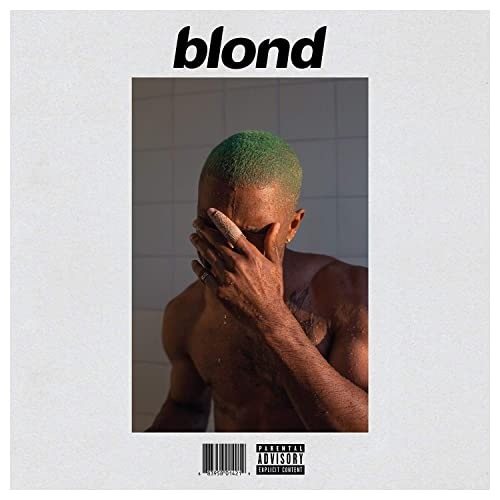

import { Slider, Button } from "carbon-components-react";
import { ArrowUpRight24 } from "@carbon/icons-react";

import SliderJS1 from "../review/slider1";
import SliderJS2 from "../review/slider2";
import SliderJS3 from "../review/slider3";
import SliderJS4 from "../review/slider4";

import { Link } from "gatsby";

Album Review

<h1 className="h1--no--margin">{props.pageContext.frontmatter.title}</h1>

  <Link to="/best50/2016/">2016 Black Music Album Best No.4</Link>

<Row  className="image-card-group">
	<Column colMd={"3"} colLg={"4"} noGutterMdLeft="">
       <ImageCard>

</ImageCard>
	</Column>
	<Column colMd={"4"} colLg={"8"} noGutterMdLeft="">
	

	Frank Oceanの4年振りのアルバム。Def Jamを離れ、自身のBoys Don't Cryからのリリースで、現時点(2016/10)では、ストリーミングと配信のみで聴くことができる。傾向的には前作のChannel Orangeと同じで、ロック寄り浮遊感のあるアンビエントで濃密なサウンドであり、バンドによるTrackが多くなっている。その他にもサンプリング、打ち込み、アコースティックな曲もある。どれもゆっくりとした美しく切ない曲ばかりで、歌詞はより内省的になっている。統一感がとれた、極めて私的な作品になっているが、不思議と引き込まれてしまう。
	

	

	  <Button className="button-right-mergin"  href="https://amzn.to/3blj3PJ" kind="primary" size="small" renderIcon={ArrowUpRight24}>
      amazon.com
    </Button>
    <Button className="button-right-mergin"  href="https://amzn.to/355i30T" kind="secondary" size="small" renderIcon={ArrowUpRight24}>
      amazon.co.jp
    </Button>
	

	
	</Column>
</Row>
<Row >
	<Column colMd={"4"} colLg={"4"} noGutterMdLeft="">

  <h3>Score card</h3>
	<SliderJS1 value="5" />
  <SliderJS2 value="1" />
	<SliderJS3 value="2" />
  <SliderJS4 value="9" />

</Column>
<Column colMd={"8"} colLg={"8"} noGutterMdLeft="">

<h3>Producers</h3>

	Frank Ocean, 88-Keys, Bob Ludwig, Buddy Ross, Hudson Mohawke, Jamie xx, Mike Dean, Michael Uzowuru, Om'Mas Keith, Pharrell Williams, Rostam Batmanglij, Tyler, The Creator, Vegyn

<h3>Guests</h3>

	Beyonce, ROsie Watson, Kendrick Lamar, Yung Lean, Austin Feinstein, Andre 3000, Sebastian, James Blake, Jonny Greenwood, Hugh Brunt, Kim Burrell

</Column>
</Row>

<h3>Tracks</h3>

| No. | Title          | Composers                                                                                                                                              | Performer   | Time  |
| --- | -------------- | ------------------------------------------------------------------------------------------------------------------------------------------------------ | ----------- | ----- |
| 1   | Nikes          | Christopher Breaux / Om'Mas Keith / Carl Palmer / Harry Palmer / Jeff Palmer                                                                           | Frank Ocean | 05:14 |
| 2   | Ivy            | Rostam Batmanglij / Christopher Breaux / Om'Mas Keith / Jamie Smith                                                                                    | Frank Ocean | 04:09 |
| 3   | Pink + White   | Christopher Breaux / Om'Mas Keith / Tyler Okonma / Pharrell Williams                                                                                   | Frank Ocean | 03:04 |
| 4   | Be Yourself    | Christopher Breaux / Om'Mas Keith                                                                                                                      | Frank Ocean | 01:26 |
| 5   | Solo           | Mikey Alfred / Dave Allen / Christopher Breaux / Hugo Burnham / Sage Elsesser / Om'Mas Keith / Jon King / Charles Njapa / Todd Rundgren / Rho Spearman | Frank Ocean | 04:17 |
| 6   | Skyline To     | Christopher Breaux / Kendrick Duckworth / Om'Mas Keith / Tyler Okonma                                                                                  | Frank Ocean | 03:04 |
| 7   | Self Control   | Ocean, Austin Feinstein, Jonatan Hastad                                                                                                                | Frank Ocean | 04:09 |
| 8   | Good Guy       | Ocean, Ross                                                                                                                                            | Frank Ocean | 01:06 |
| 9   | Nights         | Christopher Breaux / Om'Mas Keith / Buddy Ross / Joe Thornalley / Michael Uzowuru                                                                      | Frank Ocean | 05:07 |
| 10  | Solo (Reprise) | Andre Benjamin                                                                                                                                         | Frank Ocean | 01:18 |
| 11  | Pretty Sweet   | Christopher Breaux / Om'Mas Keith                                                                                                                      | Frank Ocean | 02:37 |
| 12  | Facebook Story | Sebastian, Akchote-Bozovi                                                                                                                              | Frank Ocean | 01:08 |
| 13  | Close to You   | Ocean, Burt Bacharach, Harold David, Stevland Morris, Francis Starlite                                                                                 | Frank Ocean | 01:25 |
| 14  | White Ferrari  | Christopher Breaux / Om'Mas Keith / John Lennon / James Litherland / Paul McCartney                                                                    | Frank Ocean | 04:08 |
| 15  | Seigfried      | Christopher Breaux / George Harrison / Om'Mas Keith / John Lennon / Paul McCartney / Elliott Smith / Richard Starkey                                   | Frank Ocean | 05:34 |
| 16  | Godspeed       | Christopher Breaux / Kim Burrell / Om'Mas Keith / Elliott Smith                                                                                        | Frank Ocean | 02:57 |
| 17  | Futura Free    | Mikey Alfred / Dave Allen / Christopher Breaux / Hugo Burnham / Sage Elsesser / Andy Gill / Om'Mas Keith / Jon King                                    | Frank Ocean | 09:24 |
