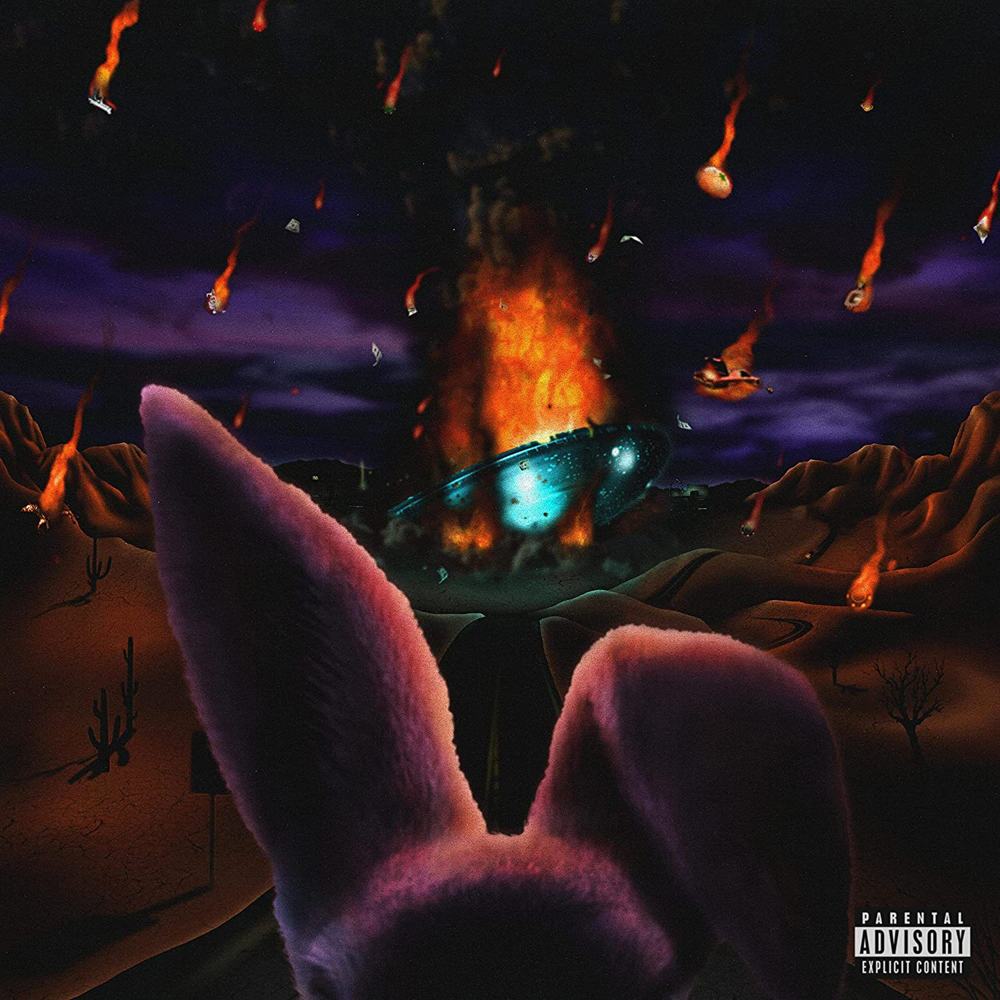

import { Slider, Button } from "@carbon/react";
import { ArrowUpRight } from "@carbon/icons-react";

import SliderJS1 from "../review/slider1";
import SliderJS2 from "../review/slider2";
import SliderJS3 from "../review/slider3";
import SliderJS4 from "../review/slider4";
import AdvJS2 from "../review/adv2";
import AdvJS3 from "../review/adv3";

import { Link } from "gatsby";

import Review1 from "../review/fgibbsalchemist1.mdx";
import Review2 from "../review/fgibsandmadlib2";

Album Review

<h1 className="h1--no--margin">{props.pageContext.frontmatter.title}</h1>

  <Link to="/best50/2022/">2022 Black Music Best No.35</Link>

<Row  className="image-card-group">
	<Column colMd={3} colLg={4} noGutterMdLeft="">
       <ImageCard>

</ImageCard>
	</Column>
	<Column colMd={4} colLg={8} noGutterMdLeft="">
	

		直近3作のAlchemistやMadlibといったProducerとのコラボ作品で好評だったFreddie Gibbsの単独作。今回は多くのProducerのサポートを得ており、AlchemistやMadlibはもちろん、KaytranadaやJames Blakeなど幅広い分野からの参加となる。
     Las Vegasの架空のCasino Hotelを物語の拠点に、一人の男が人生を振り返るようなコンセプトとなっている。なので全編、シリアスなトーンを基調にしつつ、内省的な印象強めになっている。
     これに⑩のようなメロウなTrackや⑮のようなMusic Souldchild参加の抒情的な曲が加わっている。
     Freddieの太くて力強いフローは、引き続きスキルフルで頼もしい。
  

	

	  <Button className="button-right-mergin"  href="https://amzn.to/3RybY3b" renderIcon={ArrowUpRight} size='sm' kind='primary'>
      amazon.com
    </Button>
    <Button className="button-right-mergin"  href="https://amzn.to/3X4eeAj" renderIcon={ArrowUpRight} size='sm' kind='secondary'>
      amazon.co.jp
    </Button>
		<Button className="button-right-mergin"  href="https://apple.co/3DI1oB6" renderIcon={ArrowUpRight} size='sm' kind='tertiary'>
      apple music
    </Button>
		<AdvJS2/>
	

	</Column>
</Row>
<Row >
	<Column colMd={4} colLg={4} noGutterMdLeft="">
    

      <h3>Score card</h3>
    	<SliderJS1 value="2" />
      <SliderJS2 value="1" />
    	<SliderJS3 value="1" />
      <SliderJS4 value="9" />
    

  </Column>
  <Column colMd={8} colLg={8} noGutterMdLeft="">
  

    <h3>Producers</h3>
    

    	Super Miles and Swoope(1)
       Alchemist(2)
       Sevn Thomas and Fraka(3)
       Kaytranada(4)
       iV Beatss and Norva "Va" Denton(5)
       Jake One(6)
       Boi-1da, Jahaan Sweet and Rogét Chahayed(7)
       Anderson .Paak, J.LBS and Thommy Brenneck(8)
       Justice League(9)
       DJ Paul(10)
       James Blake(11)
       Sevn Thomas, Sean Momberger and Jahaan Sweet(12)
       Sevn Thomas and Neenyo(13)
       Madlib(14)
       DJ Dahi(15)
    

    <h3>Guests</h3>
    

      Kelly Price, Offset, Moneybagg Yo, Rick Ross, Rakewon, Anderson .Paak, DJ Paul, Pusha T, Musiq Soulchild, Scarface
    

  

  </Column>
</Row>

<h3>Tracks</h3>

| No. | Title                | Composers                                                                 | Performer                                   | Time  |
| --- | -------------------- | ------------------------------------------------------------------------- | ------------------------------------------- | ----- |
| 1   | Couldn't Be Done     | Kelly Price / Fredrick Tipton                                             | Freddie Gibbs feat. Kelly Price             | 02:31 |
| 2   | Blackest in the Room | Daniel Maman / Fredrick Tipton                                            | Freddie Gibbs                               | 02:47 |
| 3   | Pain & Strife        | Kiari Cephus / Fredrick Tipton                                            | Freddie Gibbs feat. Offset                  | 02:37 |
| 4   | Zipper Bagz          | Louis Celestin / Fredrick Tipton                                          | Freddie Gibbs                               | 02:14 |
| 5   | Too MuchI            | IV Beatss / Norva Denton / Ben Lambert / Fredrick Tipton / Demario White  | Freddie Gibbs feat. Moneybagg Yo            | 03:32 |
| 6   | Lobster Omelette     | Jacob Dutton / William Roberts / Fredrick Tipton                          | Freddie Gibbs feat. Rick Ross               | 02:40 |
| 7   | Space Rabbit         | Fredrick Tipton                                                           | Freddie Gibbs                               | 02:57 |
| 8   | Feel No Pain         | Anderson .Paak / Thomas Brenneck / J.LBS / Fredrick Tipton / Corey Woods  | Freddie Gibbs feat. Anderson .Paak, Rakewon | 03:17 |
| 9   | Rabbit Vision        | Fredrick Tipton                                                           | Freddie Gibbs                               | 03:13 |
| 10  | PYS                  | Paul Beauregard / Fredrick Tipton                                         | Freddie Gibbs feat. DJ Paul                 | 02:48 |
| 11  | Dark Hearted         | James Blake / Fredrick Tipton                                             | Freddie Gibbs                               | 03:25 |
| 12  | Gold Rings           | Rupert Thomas, Jr. / Sean Momberger / Terrence Thornton / Fredrick Tipton | Freddie Gibbs feat. Pusha T                 | 03:42 |
| 13  | Grandma's Stove      | Taalib Johnson / Fredrick Tipton                                          | Freddie Gibbs                               | 04:11 |
| 14  | CIA                  | Fredrick Tipton                                                           | Freddie Gibbs feat. Musiq Soulchild         | 02:56 |
| 15  | Decoded              | Bradley Jordan / Dacoury Natche / Fredrick Tipton                         | Freddie Gibbs feat. Scarface                | 03:14 |

<h3>Other Reviews</h3>

<Row>
  <Column colMd={3} colLg={3} noGutterMdLeft>
    <Review1 />
  </Column>
  <Column colMd={3} colLg={3} noGutterMdLeft>
    <Review2 />
  </Column>
</Row>

<AdvJS3 />
