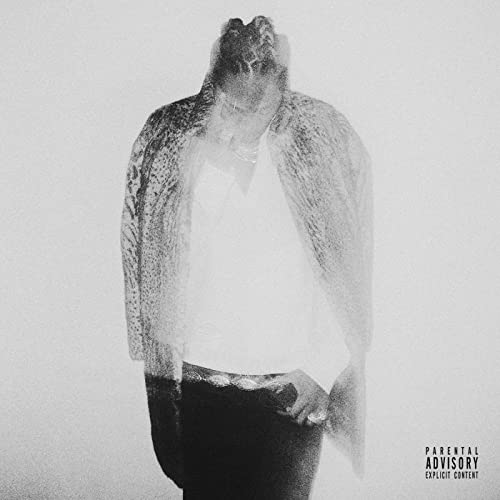

import { Slider, Button } from 'carbon-components-react';
import { ArrowUpRight24  } from '@carbon/icons-react';

import SliderJS1 from "../review/slider1"
import SliderJS2 from "../review/slider2"
import SliderJS3 from "../review/slider3"
import SliderJS4 from "../review/slider4"

import { Link } from "gatsby"

import Review1 from "../review/future5.mdx"

Album Review

<h1 className="h1--no--margin">{props.pageContext.frontmatter.title}</h1>

<Link to="/best50/2017/">2017 Black Music Album Best No.18</Link>

<Row  className="image-card-group">
	<Column colMd={"3"} colLg={"4"} noGutterMdLeft="">
       <ImageCard>

 
</ImageCard>
	</Column>
	<Column colMd={"4"} colLg={"8"} noGutterMdLeft="">
	

	2017年2月に2週連続で配信アルバムをリリースしたFutureのこれは2週目のほう。2作品で連続1位を獲得していて、これは史上初らしい。今までのようなサウスっぽさはあまりなく、Popで聴きやすい作品になっている。アンビエントなスロー曲は確かに多いが、本人が唄っている曲もほとんどで、明るい曲やメローな曲など含め、全体感として大分R&B寄りで、いつになくバラエティに富んでいる。また、本人がパーソナルな作品といっているように、Lyricは内省的なものが多い。
	

	

	  <Button href="https://amzn.to/3fEKHsj" kind="primary" size="small" renderIcon={ArrowUpRight24}>
      amazon.com
    </Button>
    <Button href="https://amzn.to/2ZCjHUD" kind="secondary" size="small" renderIcon={ArrowUpRight24}>
      amazon.co.jp
    </Button>
	

	
	
	</Column>
</Row>
<Row >
	<Column colMd={"4"} colLg={"4"} noGutterMdLeft="">

    <h3>Score card</h3>
	<SliderJS1 value="3" />
    <SliderJS2 value="2" />
	<SliderJS3 value="2" />
    <SliderJS4 value="9" />

</Column>
<Column colMd={"8"} colLg={"8"} noGutterMdLeft="">

<h3>Producers</h3>

Metro Boomin(1,17)
 High Klassified(2)
 Southside and Jake One(3)
 DJ Mustard(4)
 Detail, The Track Burn and Sidney Swift(5)
 Dre Moon(6)
 Southside(7)
 Major Seven and Detail(8,9,15)
 DJ Spinz(10)
 Dre Moon(11,16)
 Wheezy(12)
 DY and Cicero(13)
 Nash B and Southside(14)
 Detai and, D. A. Doman(18)
 Go Grizzly and Detail(19)

<h3>Guests</h3>

The Weeknd, Rihanna, Chris Brown, Nicki Minaj

</Column>
</Row>

<h3>Tracks</h3>

| No. |	 Title                     |	 Composers                                                                                                                       |	 Performer                   |	Time |
| --- |	-------------------------- | ----------------------------------------------------------------------------------------------------------------------------------- | ----------------------------- | ----- |
| 1	  |	Midnight                   | Bastian Langeb?k / Jordan Thomas / Kiah Victoria / Andrew Wansel / Jessie Ware                                                      | Jessie Ware                   | 03:57 |
| 2	  |	Thinking About You         | Thomas Hull / Jessie Ware                                                                                                           | Jessie Ware                   | 03:29 |
| 3	  |	Stay Awake, Wait for Me    | Ajay Bhattacharyya / Danny Parker / Jessie Ware                                                                                     | Jessie Ware                   | 03:36 |
| 4	  |	Your Domino                | Ajay Bhattacharyya / Danny Parker / Daniel Schnair / Jessie Ware                                                                    | Jessie Ware                   | 03:47 |
| 5	  |	Alone                      | Sarah Aarons / Thomas Hull / Jessie Ware                                                                                            | Jessie Ware                   | 03:37 |
| 6	  |	Selfish Love               | Ross Golan / Magnus August H?iberg / Benjamin Levin / Ammar Malik / Nathan Perez / Ryan Tedder / Jessie Ware                        | Jessie Ware                   | 03:58 |
| 7	  |	First Time                 | Fin Dow-Smith / James Newman / Jessie Ware                                                                                          | Jessie Ware                   | 04:06 |
| 8	  |	Hearts                     | Benjamin Ash / Benjamin Levin / Julia Michaels / Jessie Ware                                                                        | Jessie Ware                   | 03:34 |
| 9	  |	Slow Me Down               | Frederik Ball / Nina Nesbitt / Sam Preston / Jessie Ware                                                                            | Jessie Ware                   | 03:24 |
| 10  |	Finish What We Started     | Julian Bunetta / John Ryan / Jamie Scott / Jessie Ware                                                                              | Jessie Ware                   | 03:49 |
| 11  |	Last of the True Believers | Paul Buchanan / Liam Howe / Jessie Ware / Felix White / Hugo White                                                                  | Jessie Ware ft. Paul Buchanan | 03:53 |
| 12  |	Sam                        | Dave Christopher / Benjamin Levin / Dave Okumu / Pino Palladino / Nico Segal / Ed Sheeran / Francis Farewell Starlite / Jessie Ware | Jessie Ware                   | 05:16 |

<Row>
<Column colMd={3} colLg={3} noGutterMdLeft>
<Review1 />
</Column>
</Row>