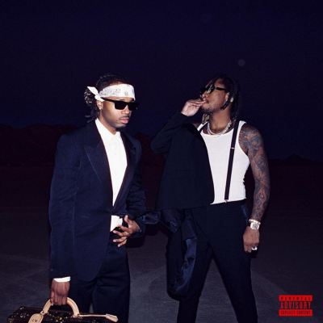

import { Slider, Button } from "@carbon/react";
import { ArrowUpRight } from "@carbon/icons-react";

import SliderJS1 from "../review/slider1";
import SliderJS2 from "../review/slider2";
import SliderJS3 from "../review/slider3";
import SliderJS4 from "../review/slider4";
import AdvJS2 from "../review/adv2";
import AdvJS3 from "../review/adv3";

import { Link } from "gatsby";

import Review2_1 from "../review/future5.mdx";
import Review2_2 from "../review/future4.mdx";

import Review3_1 from "../review/metroboomin1.mdx";

Album Review

<h1 className="h1--no--margin">{props.pageContext.frontmatter.title}</h1>

<Link to="/best50/2024/">2024 Black Music Best No.9</Link>

<Row className="image-card-group">
	<Column colMd={3} colLg={4} noGutterMdLeft="">
		<ImageCard>

		</ImageCard>
	</Column>
	<Column colMd={4} colLg={8} noGutterMdLeft="">
		

			FutureとMetro BoominというATLを代表する盟友コンビによるコラボ作。当然、FutureがRAP、Metro Boominが制作担当ということになるが、意外にも若手Producerとの共同Produce曲が多数となっている。なお、この後3週間後には"We Still Don't Trust You"というアルバムをリリースし、多作家ぶりを発揮している。
			 全体のトーンとしてはゆったりしたメランコリックな曲が多く、ダウナーな印象で、もちろんTrapが中心となっている。ゲスト参加はそれほど多くはないが、Kendrick LamarとDrake、J. Coleとの今年最大のビーフに油をそそいだ⑤が含まれている。
		

		

			<Button className="button-right-mergin" href="https://amzn.to/3OMFXDX" renderIcon={ArrowUpRight} size='sm' kind='primary'>
				amazon.com
			</Button>
			<Button className="button-right-mergin" href="https://amzn.to/3ON4Sr0" renderIcon={ArrowUpRight} size='sm' kind='secondary'>
				amazon.co.jp
			</Button>
			<Button className="button-right-mergin" href="https://apple.co/4gqITSB" renderIcon={ArrowUpRight} size='sm' kind='tertiary'>
				apple music
			</Button>
			<AdvJS2/>
		

	</Column>
</Row>
<Row>
	<Column colMd={4} colLg={4} noGutterMdLeft="">
		

			<h3>Score card</h3>
			<SliderJS1 value="2" />
			<SliderJS2 value="2" />
			<SliderJS3 value="2" />
			<SliderJS4 value="8" />
		

	</Column>
	<Column colMd={8} colLg={8} noGutterMdLeft="">
		

			<h3>Producers</h3>
			

				Metro Boomin, D. Rich and Prince 85(1)
				 Metro Boomin, MIKE DEAN, DAVID x ELI and ecy(2)
				 Metro Boomin, Southside, OZ and Nik D(3)
				 Metro Boomin, MIKE DEAN and D. Rich(4)
				 Metro Boomin and Will A Fool(5)
				 Metro Boomin(6,13,16)
				 Metro Boomin and Prince 85(7)
				 Metro Boomin, Southside, Honorable C.N.O.T.E., Boi-1da and Deputy(8)
				 Metro Boomin, Dre Moon and Allen Ritter(9)
				 Metro Boomin and Zaytoven(10)
				 Metro Boomin and Doughboy Beatz(11)
				 Metro Boomin, Zaytoven, Lil 88 and Outtatown(12)
				 Metro Boomin, Southside and Wheezy(14)
				 Metro Boomin, Allen Ritter and Peter Lee Johnson(15)
				 Metro Boomin and G Koop(17)
			

			<h3>Guests</h3>
			

				The Weeknd, Travis Scott, Playboi Carti, Kendrick Lamar, Rick Ross
			

		

	</Column>
</Row>

<h3>Tracks</h3>

| No. | Title                           | Composers                                                                                       | Performer                                               | Time  |
| --- | ------------------------------- | ----------------------------------------------------------------------------------------------- | ------------------------------------------------------- | ----- |
| 1   | We Don't Trust You              | Mejdi Rhars / Leland Wayne / Nayvadius Wilburn                                                  | Metro Boomin / Future                                   | 03:46 |
| 2   | Young Metro                     | Leland Wayne / The Weeknd / Nayvadius Wilburn                                                   | Metro Boomin / Future feat. The Weeknd                  | 03:25 |
| 3   | Ice Attack                      | Nik Frascona / Leland Wayne / Nayvadius Wilburn                                                 | Metro Boomin / Future                                   | 03:19 |
| 4   | Type Shit                       | Jordan Carter / Leland Wayne / Jacques Webster / Nayvadius Wilburn                              | Metro Boomin / Future feat. Travis Scott, Playboi Carti | 03:48 |
| 5   | Claustrophobic                  | Leland Wayne / Nayvadius Wilburn                                                                | Metro Boomin / Future                                   | 03:42 |
| 6   | Like That                       | Joe Cooley / Kendrick Lamar / Rodney Oliver / Leland Wayne / Nayvadius Wilburn                  | Metro Boomin / Future feat. Kendrick Lamar              | 04:27 |
| 7   | Slimed In                       | Leland Wayne / Nayvadius Wilburn / Jeffery Williams / Jeffrey Lamar Williams / Jeffrey Williams | Metro Boomin / Future                                   | 03:14 |
| 8   | Magic Don Juan (Princess Diana) | Shantae Allen / Leland Wayne / Nayvadius Wilburn                                                | Metro Boomin / Future                                   | 03:40 |
| 9   | Cinderella                      | Leland Wayne / Jacques Webster / Nayvadius Wilburn                                              | Metro Boomin / Future feat. Travis Scott,               | 02:49 |
| 10  | Runnin Outta Time               | Jordan Holt-May / Leland Wayne / Nayvadius Wilburn                                              | Metro Boomin / Future                                   | 03:25 |
| 11  | Fried (She a Vibe)              | Leland Wayne / Nayvadius Wilburn                                                                | Metro Boomin / Future                                   | 03:30 |
| 12  | Ain't No Love                   | Leland Wayne / Nayvadius Wilburn                                                                | Metro Boomin / Future                                   | 03:02 |
| 13  | Everyday Hustle                 | William Roberts / Leland Wayne / Nayvadius Wilburn                                              | Metro Boomin / Future feat. Rick Ross                   | 03:46 |
| 14  | GTA                             | Leland Wayne / Nayvadius Wilburn                                                                | Metro Boomin / Future                                   | 03:53 |
| 15  | Seen It All                     | Leland Wayne / Nayvadius Wilburn                                                                | Metro Boomin / Future                                   | 02:59 |
| 16  | WTFYM                           | Leland Wayne / Nayvadius Wilburn                                                                | Metro Boomin / Future                                   | 04:52 |
| 17  | Where My Twin @                 | Leland Wayne / Nayvadius Wilburn                                                                | Metro Boomin / Future                                   | 02:02 |

<h3>Other Reviews</h3>

<Row>
	<Column colMd={3} colLg={3} noGutterMdLeft>
		<Review2_1 />
	</Column>
	<Column colMd={3} colLg={3} noGutterMdLeft>
		<Review2_2 />
	</Column>
</Row>
<Row>
	<Column colMd={3} colLg={3} noGutterMdLeft>
		<Review3_1 />
	</Column>
</Row>

<AdvJS3 />
