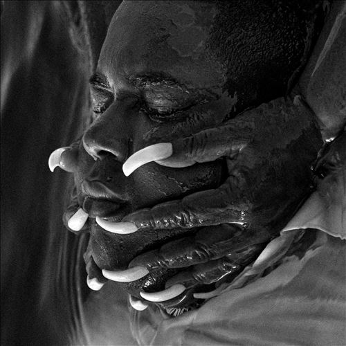

import { Slider, Button } from "@carbon/react";
import { ArrowUpRight } from "@carbon/icons-react";

import SliderJS1 from "../review/slider1";
import SliderJS2 from "../review/slider2";
import SliderJS3 from "../review/slider3";
import SliderJS4 from "../review/slider4";
import AdvJS2 from "../review/adv2";
import AdvJS3 from "../review/adv3";

import Review1 from "../review/gallant1.mdx";

import { Link } from "gatsby";

Album Review

<h1 className="h1--no--margin">{props.pageContext.frontmatter.title}</h1>

  <Link to="/best50/2023/">2023 Black Music Best No.46</Link>

<Row  className="image-card-group">
	<Column colMd={3} colLg={4} noGutterMdLeft="">
       <ImageCard>

</ImageCard>
	</Column>
	<Column colMd={4} colLg={8} noGutterMdLeft="">
		

			LAをベースに活躍するTrio, Gabrielsの1stアルバム。2022年に先行リリースしていたEP(2022年 47位)7曲を含んだフルアルバムということになる。
			 メンバー構成はJacob LuskがVoで、Ari BalouzianとRyan Hopeが制作や楽器を担当している。 当作では加えてKendrick Lamarの諸作で知られるSounwaveがProducerとして参加しているが、Hip-Hop色は全くなく、上質なVintage Soulに仕上がっている。
			 サウンド的には、Gospel, Doo Wop、JazzにSoulを加えた温かみのあるもので、Mid〰Slowがほとんど。Stringsをアクセントに使っているのも特徴的だ。また、⑦では映画"追憶"の主題歌(The Way We Were)を途中に挟んでいる。Jacob Luskの唄は高音でファルセットを多用しており、美しく儚い。
		

		

		  <Button className="button-right-mergin"  href="https://amzn.to/49m9CgA" renderIcon={ArrowUpRight} size='sm' kind='primary'>
  	    amazon.com
  	  </Button>
  	  <Button className="button-right-mergin"  href="https://amzn.to/49nDxoG" renderIcon={ArrowUpRight} size='sm' kind='secondary'>
  	    amazon.co.jp
  	  </Button>
			<Button className="button-right-mergin"  href="https://apple.co/40l9XM6" renderIcon={ArrowUpRight} size='sm' kind='tertiary'>
  	    ampple music
  	  </Button>
			<AdvJS2/>
		

	</Column>
</Row>
<Row >
	<Column colMd={4} colLg={4} noGutterMdLeft="">
		

		  <h3>Score card</h3>
			<SliderJS1 value="5" />
		  <SliderJS2 value="3" />
			<SliderJS3 value="1" />
		  <SliderJS4 value="8" />
		

	</Column>
	<Column colMd={8} colLg={8} noGutterMdLeft="">
		

			<h3>Producers</h3>
			

				Sounwave, Ari Balouzian, Jacob Lusk and Ryan Hope(all)
			

			<h3>Guests</h3>
			

			

		

	</Column>
</Row>

<h3>Tracks</h3>

| No. | Title                             | Composers                                                                                      | Performer | Time  |
| --- | --------------------------------- | ---------------------------------------------------------------------------------------------- | --------- | ----- |
| 1   | Offering                          | Ari Balouzian, Jacob Lusk, Ryan Hope, Sounwave                                                 | Gabriels  | 03:10 |
| 2   | The Blind                         | Ari Balouzian, Jacob Lusk, Ryan Hope, Sounwave                                                 | Gabriels  | 04:16 |
| 3   | Angels & Queens                   | Ari Balouzian, Jacob Lusk, Ryan Hope, Sounwave, John Anderson                                  | Gabriels  | 03:19 |
| 4   | Taboo                             | Ari Balouzian, Jacob Lusk, Ryan Hope, Sounwave                                                 | Gabriels  | 03:09 |
| 5   | To the Moon and Back              | Ari Balouzian, Jacob Lusk, Ryan Hope, Sounwave                                                 | Gabriels  | 03:27 |
| 6   | Professional                      | Ryan Hope, Jacob Lusk, Ari Balouzian                                                           | Gabriels  | 04:01 |
| 7   | We Will Remember                  | Ari Balouzian, Jacob Lusk, Ryan Hope, Sounwave, Alan Bergman, Marilyn Bergman, Marvin Hamlisch | Gabriels  | 03:49 |
| 8   | Remember Me                       | Ari Balouzian, Jacob Lusk, Ryan Hope, Sounwave                                                 | Gabriels  | 03:50 |
| 9   | If You Only Knew                  | Sam Beste, Ari Balouzian, Jacob Lusk, Ryan Hope , Sounwave                                     | Gabriels  | 04:12 |
| 10  | Love and Hate in a Different Time | Ryan Hope, Jacob Lusk, Ari Balouzian                                                           | Gabriels  | 03:48 |
| 11  | Glory                             | Ari Balouzian, Jacob Lusk, Ryan Hope, Sounwave                                                 | Gabriels  | 02:44 |
| 12  | Great Wind                        | Ari Balouzian, Jacob Lusk, Ryan Hope, Sounwave                                                 | Gabriels  | 03:59 |
| 13  | Mama                              | Ari Balouzian, Jacob Lusk, Ryan Hope, Sounwave                                                 | Gabriels  | 05:16 |

<AdvJS3 />
