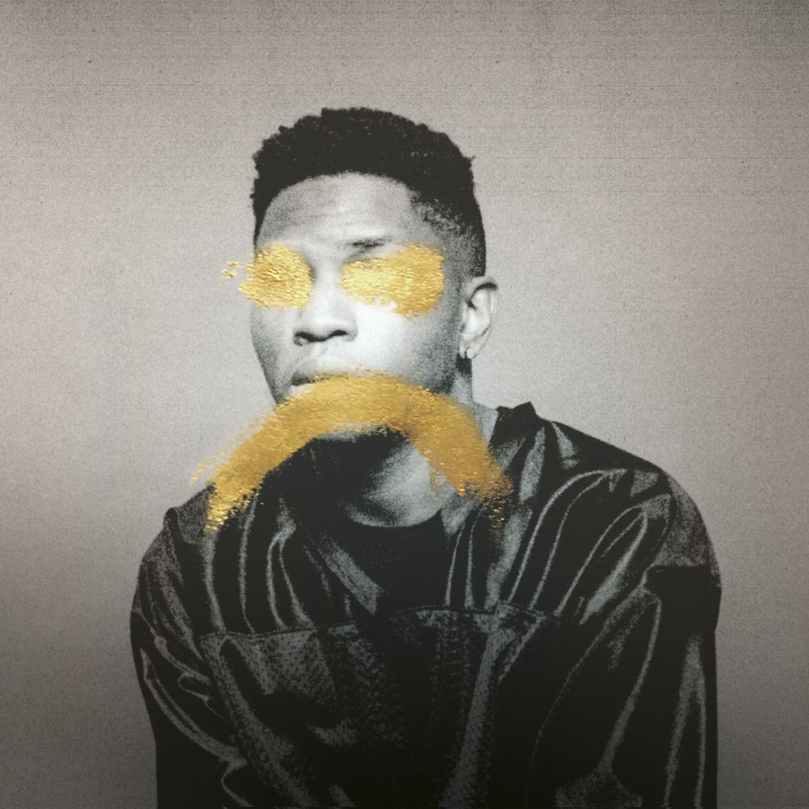

import { Slider, Button } from "carbon-components-react";
import { ArrowUpRight24 } from "@carbon/icons-react";

import SliderJS1 from "../review/slider1";
import SliderJS2 from "../review/slider2";
import SliderJS3 from "../review/slider3";
import SliderJS4 from "../review/slider4";
import AdvJS2 from "../review/adv2";
import AdvJS3 from "../review/adv3";

import Review1 from "../review/gallant2.mdx";

import { Link } from "gatsby";

Album Review

<h1 className="h1--no--margin">{props.pageContext.frontmatter.title}</h1>

  <Link to="/best50/2016/">2016 Black Music Album Best No.28</Link>

<Row  className="image-card-group">
	<Column colMd={"3"} colLg={"4"} noGutterMdLeft="">
       <ImageCard>

</ImageCard>
	</Column>
	<Column colMd={"4"} colLg={"8"} noGutterMdLeft="">
	

	DC生まれで、Maryland育ち、24歳(リリース時)のR&Bシンガー、Gallantのデビューアルバム。2016年春に配信開始、その後Physicalもリリースされ、Grammy賞にもNominateされている。
	 とにかくメロディが良い曲ばかりで、Gallantの感傷的で繊細なVocalが絶妙にマッチしている。ファルセットを多用しているが、地声に芯があって青臭くないところがありがたいところ。
	 曲はR&Bベースに、Rock, Houseなどをとりまぜ、切なく懐かしい感じであったり、アンビエントであったりと耳障りが良い。
	 カナダ人のStintが多くの曲をProduceしている。9曲目のTitleはアニメの宮﨑（駿）監督のことらしいです。
	

	

	  <Button className="button-right-mergin"  href="https://amzn.to/30QeWr8" kind="primary" size="small" renderIcon={ArrowUpRight24}>
      amazon.com
    </Button>
    <Button className="button-right-mergin"  href="https://amzn.to/33RWj8b" kind="secondary" size="small" renderIcon={ArrowUpRight24}>
      amazon.co.jp
    </Button>
	

	
	<AdvJS2/>
	</Column>
</Row>
<Row >
	<Column colMd={"4"} colLg={"4"} noGutterMdLeft="">

  <h3>Score card</h3>
	<SliderJS1 value="5" />
  <SliderJS2 value="2" />
	<SliderJS3 value="2" />
  <SliderJS4 value="9" />

</Column>
<Column colMd={"8"} colLg={"8"} noGutterMdLeft="">

<h3>Producers</h3>

	Stint(1,2,3,5,7,10,11,13,16)
	 Josh Abraham and Oligee(4)
	 Patrizio Moi(6,15)
	 Bordeux(8)
	 Ebrahim Lakhan(9)
	 Maths Time Joy(12)
	 Adrian Younge and Stint(14)

<h3>Guests</h3>

	Jhene Aiko

</Column>
</Row>

<h3>Tracks</h3>

| No. | Title                    | Composers                                                                                 | Performer                | Time  |
| --- | ------------------------ | ----------------------------------------------------------------------------------------- | ------------------------ | ----- |
| 1   | First                    | Ajay Bhattacharyya / Christopher Gallant                                                  | Gallant                  | 00:37 |
| 2   | Talking to Myself        | Ajay Bhattacharyya / Christopher Gallant / Arthur Jones / Arthur Timothy Jones            | Gallant                  | 03:57 |
| 3   | Shotgun                  | Ajay Bhattacharyya / Christopher Gallant                                                  | Gallant                  | 03:17 |
| 4   | Bourbon                  | Josh Abraham / Christopher Gallant / Oliver Goldstein                                     | Gallant                  | 04:47 |
| 5   | Bone + Tissue            | Ajay Bhattacharyya / Christopher Gallant                                                  | Gallant                  | 03:41 |
| 6   | Oh, Universe (Interlude) | Christopher Gallant / Patrizio Moi                                                        | Gallant                  | 01:02 |
| 7   | Weight in Gold           | Ajay Bhattacharyya / Christopher Gallant                                                  | Gallant                  | 03:23 |
| 8   | Episode                  | Christopher Gallant / Joseph Postiglione / Steven Zhu                                     | Gallant                  | 04:36 |
| 9   | Miyazaki                 | Yannick "Hazel" Beaucaine / Darryl Brown / Ebrahim Lakhani / Amel Larrieux / Bryce Wilson | Gallant                  | 02:12 |
| 10  | Counting                 | Ajay Bhattacharyya / Christopher Gallant                                                  | Gallant                  | 04:34 |
| 11  | Percogesic               | Ajay Bhattacharyya / Christopher Gallant / Willis Norman                                  | Gallant                  | 04:12 |
| 12  | Jupiter                  | Christopher Gallant / Timothy James                                                       | Gallant                  | 04:36 |
| 13  | Open Up                  | Ajay Bhattacharyya / Christopher Gallant                                                  | Gallant                  | 04:37 |
| 14  | Skipping Stones          | Jhen? Aiko / Ajay Bhattacharyya / Christopher Gallant / Adrian Young                      | Gallant feat. Jhene Aiko | 03:04 |
| 15  | Chandra                  | Christopher Gallant / Patrizio Moi                                                        | Gallant                  | 03:43 |
| 16  | Last                     | Ajay Bhattacharyya / Christopher Gallant                                                  | Gallant                  | 00:31 |

<AdvJS3/>

<Row>
  <Column colMd={3} colLg={3} noGutterMdLeft>
    <Review1 />
  </Column>
</Row>