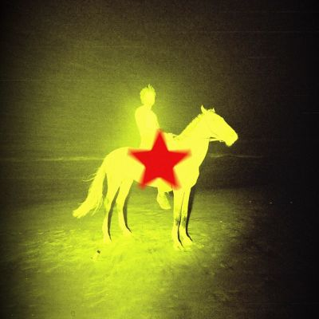

import { Slider, Button } from "@carbon/react";
import { ArrowUpRight } from "@carbon/icons-react";

import SliderJS1 from "../review/slider1";
import SliderJS2 from "../review/slider2";
import SliderJS3 from "../review/slider3";
import SliderJS4 from "../review/slider4";
import AdvJS2 from "../review/adv2";
import AdvJS3 from "../review/adv3";

import { Link } from "gatsby";
import Review1 from "../review/genesisowusu1.mdx";

Album Review

<h1 className="h1--no--margin">{props.pageContext.frontmatter.title}</h1>

<Row  className="image-card-group">
	<Column colMd={3} colLg={4} noGutterMdLeft="">
       <ImageCard>

</ImageCard>
	</Column>
	<Column colMd={4} colLg={8} noGutterMdLeft="">
		

			Genesis Owusuの3年ぶりとなる3rdスタジオアルバム。過去作の内省的・寓話的な表現から一転し、2020年代の地球上で起きている生々しい現実に直結した作品です。世界にはびこるヘイトや強欲、偏見を「世界規模の災厄（The Worldwide Scourge）」と位置づけ、正面から対峙。
			 暗澹たるディストピアの絶望から、人々の連帯と慎重な希望を見出すまでの感情の軌跡をリニアに描き出しています。
      ポストパンク、シンセパンク、ファンク、ネオソウル、インダストリアル、エレクトロニックを自在に越境するサウンドが特徴で、性急で荒々しいパンクから、ぬめり気のある重厚なスラッジ・ファンク、エレクトロニック・サウンドまで、緊張感とダンサブルな祝祭性がアルバム全体でせめぎ合っている。
       全編の主プロデュースとミックスは盟友Dann Humeが手掛け、ウェールズの改築教会に籠もり二人三脚で密室感のある鋭敏な音響を構築している。
			 ①で見せる息をつかせぬ荒々しいパンク・シャウトや攻撃的なラップから、⑥での艶やかで甘美な歌唱まで、表現のレンジが広い。リリックでは、ガザの悲劇、大統領選の狂騒、SNSに蔓延する陰謀論やインセル文化などを逃げずに直截な言葉で告発しています。
		

		

		  <Button className="button-right-mergin"  href="https://amzn.to/4iOEOfo" renderIcon={ArrowUpRight} size='sm' kind='primary'>
  	    amazon.com
  	  </Button>
  	  <Button className="button-right-mergin"  href="https://amzn.to/4gTSnaW" renderIcon={ArrowUpRight} size='sm' kind='secondary'>
  	    amazon.co.jp
  	  </Button>
			<Button className="button-right-mergin"  href="https://apple.co/4x89xri" renderIcon={ArrowUpRight} size='sm' kind='tertiary'>
  	    apple music
  	  </Button>
		<AdvJS2/>
		

	</Column>
</Row>
<Row >
	<Column colMd={4} colLg={4} noGutterMdLeft="">
		

		  <h3>Score card</h3>
			<SliderJS1 value="2" />
		  <SliderJS2 value="3" />
			<SliderJS3 value="2" />
		  <SliderJS4 value="8" />
		

	</Column>
	<Column colMd={4} colLg={8} noGutterMdLeft="">
		

			<h3>Producers</h3>
			

				Dann Hume(1,2,3,4,5,6,8,9,11,12,13,14)
				 Dann Hume and Andrew Klippel(7,10)
			

			<h3>Guests</h3>
			

				Duckwrth, Ladyhawke
			

		

	</Column>
</Row>

<h3>Tracks</h3>

| No. | Title                       | Composers                                                                                            | Performer                     | Time |
| --- | --------------------------- | ---------------------------------------------------------------------------------------------------- | ----------------------------- | ---- |
| 1   | PIRATE RADIO                | Kofi Owusu-Ansah, Dann Hume                                                                          | Genesis Owusu                 | 2:54 |
| 2   | STAMPEDE                    | Kofi Owusu-Ansah, Dann Hume                                                                          | Genesis Owusu                 | 3:09 |
| 3   | HELLSTAR                    | Kofi Owusu-Ansah, Dann Hume, Jared Lee                                                               | Genesis Owusu feat. Duckwrth  | 3:52 |
| 4   | FALLING BOTH WAYS           | Kofi Owusu-Ansah, Dann Hume, Pip Brown                                                               | Genesis Owusu feat. Ladyhawke | 3:13 |
| 5   | THE WORLDWIDE SCOURGE       | Kofi Owusu-Ansah, Dann Hume                                                                          | Genesis Owusu                 | 4:50 |
| 6   | BLESSED ARE THE MEEK        | Kofi Owusu-Ansah, Dann Hume                                                                          | Genesis Owusu                 | 3:50 |
| 7   | LIFE KEEPS GOING            | Kofi Owusu-Ansah, Felix Bloxsom, Andrew Klippel, Kim Moyes                                           | Genesis Owusu                 | 3:39 |
| 8   | MOST NORMAL AMERICAN VOTER: | Kofi Owusu-Ansah, Dann Hume                                                                          | Genesis Owusu                 | 2:36 |
| 9   | DEATH CULT ZOMBIE           | Kofi Owusu-Ansah, Dann Hume                                                                          | Genesis Owusu                 | 3:36 |
| 10  | SITUATIONS                  | Kofi Owusu-Ansah, Kirin J. Callinan, Jonti Danilewitz, Michael Di Francesco, Dann Hume, Julian Sudek | Genesis Owusu                 | 3:34 |
| 11  | 4LIFE                       | Kofi Owusu-Ansah, Dann Hume                                                                          | Genesis Owusu                 | 4:10 |
| 12  | RUNNIN OUTTA TIME           | Kofi Owusu-Ansah, Dann Hume                                                                          | Genesis Owusu                 | 3:34 |
| 13  | BIG DOG                     | Kofi Owusu-Ansah, Dann Hume                                                                          | Genesis Owusu                 | 3:36 |
| 14  | ONE4ALL                     | Kofi Owusu-Ansah, Dann Hume                                                                          | Genesis Owusu                 | 3:45 |

<h3>Other Reviews</h3>

<Row>
  <Column colMd={3} colLg={3} noGutterMdLeft>
    <Review1 />
  </Column>
</Row>

<AdvJS3 />
