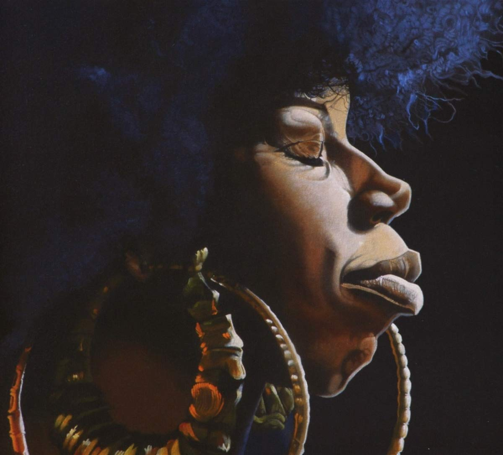

import { Slider, Button } from 'carbon-components-react';
import { ArrowUpRight24  } from '@carbon/icons-react';

import SliderJS1 from "../review/slider1"
import SliderJS2 from "../review/slider2"
import SliderJS3 from "../review/slider3"
import SliderJS4 from "../review/slider4"

import { Link } from "gatsby"

CD review

<h1 className="h1--no--margin">{props.pageContext.frontmatter.title}</h1>

<Link to="/best50/2018/">2018 Black Music Best No.27</Link>

<Row  className="image-card-group">
	<Column colMd={"4"} colLg={"4"} noGutterMdLeft="">
       <ImageCard>

 

</ImageCard>
	</Column>
	<Column colMd={"8"} colLg={"8"} noGutterMdLeft="">
	

	1983年生まれで2004年デビューのVocal, Georgia Anne Muldrowの2018年最新作。半数以上の曲を自身でProduceし、Brainfeederからのリリースということで、注目を集めている。Erykah BaduやMos Defの作品にゲスト参加してた人で、アルバムの全体感も敢えて言うならErykah Baduに近いかもしれない。ただ、特定のジャンルやArtistに例えるのが難しい独特の世界観が展開されていて、こちらも敢えて言うならネオソウルということになるか。Lyricもコンシャスなものが多そうだ。曲調は、ところどころFunkであったり、Jazzyであったりでゆったり目で茫洋としたものがメインとなる。
  

	

	  <Button href="https://amzn.to/2YJKDS9" kind="primary" size="small" renderIcon={ArrowUpRight24}>
      amazon.com
    </Button>
    <Button href="https://amzn.to/2NyOiM9" kind="secondary" size="small" renderIcon={ArrowUpRight24}>
      amazon.co.jp
    </Button>
	

	
  
  </Column>
</Row>
<Row >
	<Column colMd={"4"} colLg={"4"} noGutterMdLeft="">
    

      <h3>Score card</h3>
	    <SliderJS1 value="5" />
      <SliderJS2 value="3" />
	    <SliderJS3 value="1" />
      <SliderJS4 value="9" />
    

  </Column>
  <Column colMd={"8"} colLg={"8"} noGutterMdLeft="">
    

      <h3>Producers</h3>
      

        Georgia Anne Muldrow(1, 4, 5, 8, 9, 10, 11, 12, 13)
         Mike & Keys(2, 4, 8)
         Mike & Keys and DJ Khalil(3)
         Moods(6)
         Lustbass(7)
      

      <h3>Guests</h3>
      

	      Shana Jenson, Dudley Perkins
      

    

  </Column>
</Row>

<h3>Tracks</h3>

|	No. |	 Title                                       |	 Composers                                                                  |	 Performer                                |	 Time	|
| --- |	-------------------------------------------- | ---------------------------------------------------------------------------- | ----------------------------------------- | ----- |
|	1	  |	I.O.T.A. (Instrument of the Ancestors)       | Georgia Anne Muldrow                                                        	|	Georgia Anne Muldrow                     	|	01:09 |
|	2	  |	Play It Up                                   | John Groover / Michael Cox, Jr. / Georgia Anne Muldrow                      	|	Georgia Anne Muldrow                     	|	03:47 |
|	3	  |	Overload                                     | Khalil Abdul-Rahman / John Groover / Michael Cox, Jr. / Georgia Anne Muldrow	|	Georgia Anne Muldrow                     	|	03:58 |
|	4	  |	Blam                                         | John Groover / Michael Cox, Jr. / Georgia Anne Muldrow                      	|	Georgia Anne Muldrow                     	|	02:47 |
|	5	  |	Williehook (Skit)                            | Georgia Anne Muldrow                                                        	|	Georgia Anne Muldrow                     	|	00:54 |
|	6	  |	Aerosol                                      | Nick Lubberson / Georgia Anne Muldrow                                       	|	Georgia Anne Muldrow                     	|	02:01 |
|	7	  |	Vital Transformation                         | Allan Dela Merced Malabanan / Georgia Anne Muldrow                          	|	Georgia Anne Muldrow                     	|	04:28 |
|	8	  |	You Can Always Count on Me                   | Buddy Jones / Charlie Wilson                                                	|	Georgia Anne Muldrow feat. Shana Jenson  	|	03:05 |
|	9	  |	These Are the Things I Really Like About You | Georgia Anne Muldrow / Dudley Perkins                                       	|	Georgia Anne Muldrow feat. Dudley Perkins	|	02:15 |
|	10	|	Canadian Hillbilly                           | Georgia Anne Muldrow                                                        	|	Georgia Anne Muldrow                     	|	04:21 |
|	11	|	Conmigo (Reprise)                            | Georgia Anne Muldrow                                                        	|	Georgia Anne Muldrow                     	|	02:37 |
|	12	|	Bobbie's Dittie                              | Miles Griffith / Georgia Anne Muldrow / Nokware Declaime Perkins            	|	Georgia Anne Muldrow                     	|	04:28 |
|	13	|	Ciao                                         | Georgia Anne Muldrow                                                        	|	Georgia Anne Muldrow                     	|	00:59 |
