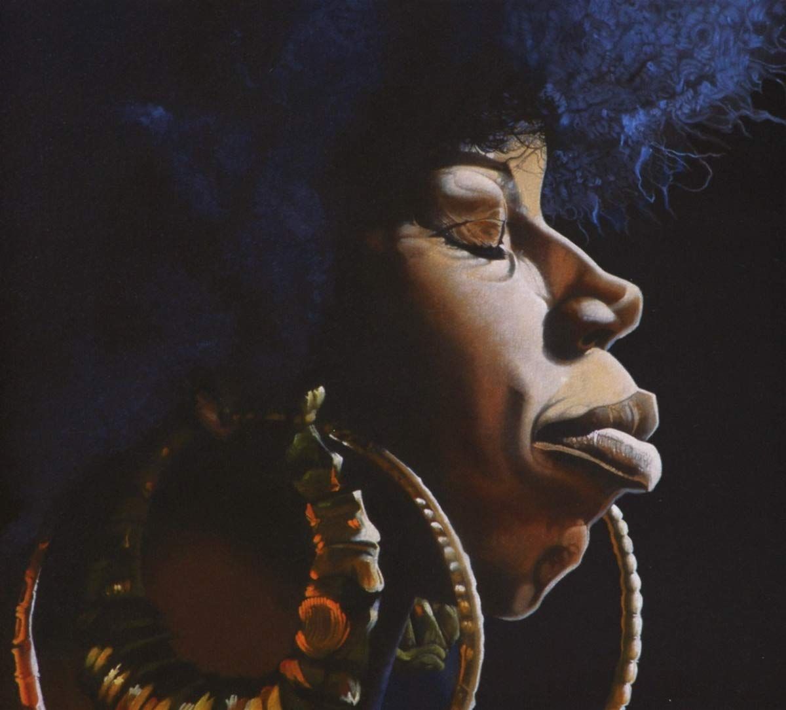

import { Slider, Button } from "@carbon/react";
import { ArrowUpRight } from "@carbon/icons-react";

import SliderJS1 from "../review/slider1";
import SliderJS2 from "../review/slider2";
import SliderJS3 from "../review/slider3";
import SliderJS4 from "../review/slider4";
import AdvJS2 from "../review/adv2";
import AdvJS3 from "../review/adv3";

import { Link } from "gatsby";

import Review1 from "../review/georgiaannemuldrow2.mdx";

Album Review

<h1 className="h1--no--margin">{props.pageContext.frontmatter.title}</h1>

	<Link to="/best50/2018/">2018 Black Music Best No.27</Link>

<Row className="image-card-group">
	<Column colMd={3} colLg={4} noGutterMdLeft="">
		<ImageCard>

		</ImageCard>
	</Column>
	<Column colMd={4} colLg={8} noGutterMdLeft="">
		

			1983年生まれで2004年デビューのVocal, Georgia Anne Muldrowの2018年最新作。半数以上の曲を自身でProduceし、Brainfeederからのリリースということで、注目を集めている。
			 Erykah BaduやMos Defの作品にゲスト参加してた人で、アルバムの全体感も敢えて言うならErykah Baduに近いかもしれない。ただ、特定のジャンルやArtistに例えるのが難しい独特の世界観が展開されていて、こちらも敢えて言うならネオソウルということになるか。
			 Lyricもコンシャスなものが多そうだ。曲調は、ところどころFunkであったり、Jazzyであったりでゆったり目で茫洋としたものがメインとなる。
		

		

			<Button className="button-right-mergin" href="https://amzn.to/2YJKDS9" renderIcon={ArrowUpRight} size='sm' kind='primary'>
				amazon.com
			</Button>
			<Button className="button-right-mergin" href="https://amzn.to/2NyOiM9" renderIcon={ArrowUpRight} size='sm' kind='secondary'>
				amazon.co.jp
			</Button>
			<Button className="button-right-mergin" href="https://apple.co/4dQNAEJ" renderIcon={ArrowUpRight} size='sm' kind='tertiary'>
				apple music
			</Button>
			<AdvJS2/>
		

	</Column>
</Row>
<Row>
	<Column colMd={4} colLg={4} noGutterMdLeft="">
<<<<<<< HEAD
    

      <h3>Score card</h3>
	    <SliderJS1 value="5" />
      <SliderJS2 value="3" />
	    <SliderJS3 value="1" />
      <SliderJS4 value="9" />
    

  </Column>
  <Column colMd={8} colLg={8} noGutterMdLeft="">
    

      <h3>Producers</h3>
      

        Georgia Anne Muldrow(1, 5, 9, 10, 11, 12, 13)
         Mike & Keys(2)
         Mike & Keys and Georgia Anne Muldrow(2, 4, 8)
         Mike & Keys and DJ Khalil(3)
         Moods(6)
         Lustbass(7)
      

      <h3>Guests</h3>
      

	      Shana Jenson, Dudley Perkins
      

    

  </Column>
=======
		

			<h3>Score card</h3>
			<SliderJS1 value="5" />
			<SliderJS2 value="3" />
			<SliderJS3 value="1" />
			<SliderJS4 value="9" />
		

	</Column>
	<Column colMd={8} colLg={8} noGutterMdLeft="">
		

			<h3>Producers</h3>
			

				Georgia Anne Muldrow(1, 4, 5, 8, 9, 10, 11, 12, 13)
				 Mike & Keys(2, 4, 8)
				 Mike & Keys and DJ Khalil(3)
				 Moods(6)
				 Lustbass(7)
			

			<h3>Guests</h3>
			

				Shana Jenson, Dudley Perkins
			

		

	</Column>
>>>>>>> f0affd31b7c605dfb837cdac33952028ef57aba2
</Row>

<h3>Tracks</h3>

| No. | Title                                        | Composers                                                                    | Performer                                 | Time  |
| --- | -------------------------------------------- | ---------------------------------------------------------------------------- | ----------------------------------------- | ----- |
| 1   | I.O.T.A. (Instrument of the Ancestors)       | Georgia Anne Muldrow                                                         | Georgia Anne Muldrow                      | 01:09 |
| 2   | Play It Up                                   | John Groover / Michael Cox, Jr. / Georgia Anne Muldrow                       | Georgia Anne Muldrow                      | 03:47 |
| 3   | Overload                                     | Khalil Abdul-Rahman / John Groover / Michael Cox, Jr. / Georgia Anne Muldrow | Georgia Anne Muldrow                      | 03:58 |
| 4   | Blam                                         | John Groover / Michael Cox, Jr. / Georgia Anne Muldrow                       | Georgia Anne Muldrow                      | 02:47 |
| 5   | Williehook (Skit)                            | Georgia Anne Muldrow                                                         | Georgia Anne Muldrow                      | 00:54 |
| 6   | Aerosol                                      | Nick Lubberson / Georgia Anne Muldrow                                        | Georgia Anne Muldrow                      | 02:01 |
| 7   | Vital Transformation                         | Allan Dela Merced Malabanan / Georgia Anne Muldrow                           | Georgia Anne Muldrow                      | 04:28 |
| 8   | You Can Always Count on Me                   | Buddy Jones / Charlie Wilson / Georgia Anne Muldrow / Shana Jenson           | Georgia Anne Muldrow feat. Shana Jenson   | 03:05 |
| 9   | These Are the Things I Really Like About You | Georgia Anne Muldrow / Dudley Perkins                                        | Georgia Anne Muldrow feat. Dudley Perkins | 02:15 |
| 10  | Canadian Hillbilly                           | Georgia Anne Muldrow                                                         | Georgia Anne Muldrow                      | 04:21 |
| 11  | Conmigo (Reprise)                            | Georgia Anne Muldrow                                                         | Georgia Anne Muldrow                      | 02:37 |
| 12  | Bobbie's Dittie                              | Miles Griffith / Georgia Anne Muldrow / Nokware Declaime Perkins             | Georgia Anne Muldrow                      | 04:28 |
| 13  | Ciao                                         | Georgia Anne Muldrow                                                         | Georgia Anne Muldrow                      | 00:59 |

<Row>
	<Column colMd={3} colLg={3} noGutterMdLeft>
		<Review1 />
	</Column>
</Row>

<AdvJS3 />
