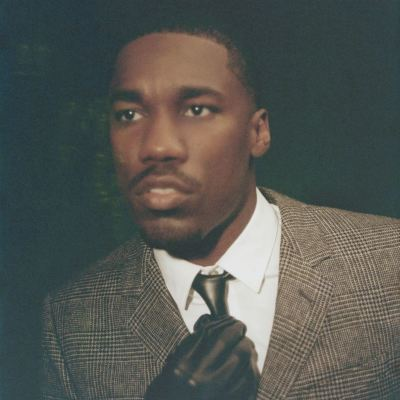

import { Slider, Button } from "@carbon/react";
import { ArrowUpRight } from "@carbon/icons-react";

import SliderJS1 from "../review/slider1";
import SliderJS2 from "../review/slider2";
import SliderJS3 from "../review/slider3";
import SliderJS4 from "../review/slider4";
import AdvJS2 from "../review/adv2";
import AdvJS3 from "../review/adv3";

import { Link } from "gatsby";

Album review

<h1 className="h1--no--margin">{props.pageContext.frontmatter.title}</h1>

<Row  className="image-card-group">
	<Column colMd={3} colLg={4} noGutterMdLeft="">
       <ImageCard>

</ImageCard>
	</Column>
	<Column colMd={4} colLg={8} noGutterMdLeft="">
		

			R&Bシンガー、GIVĒONの2ndアルバム。ロングビーチ出身の30歳で、5年前あたりから、シングル、アルバムをリリースし始めている。年齢的には中堅でもあり、青臭いところはなく、落ち着いて柔らかいバリトンを聴かせてくれる。
			 サウンドはメロウなスローバラード中心で70年代フィリーソウルを髣髴させる丁寧なつくり。ホーン、ストリングス、シタールなどをフィーチャーしているのも特徴的だ。
		

		

		  <Button className="button-right-mergin"  href="https://amzn.to/4aXG9wq" renderIcon={ArrowUpRight} size='sm' kind='primary'>
  	    amazon.com
  	  </Button>
  	  <Button className="button-right-mergin"  href="https://amzn.to/498JB52" renderIcon={ArrowUpRight} size='sm' kind='secondary'>
  	    amazon.co.jp
  	  </Button>
			<Button className="button-right-mergin"  href="https://apple.co/3YI4mPW" renderIcon={ArrowUpRight} size='sm' kind='tertiary'>
  	    apple music
  	  </Button>
			<AdvJS2/>
		

	</Column>
</Row>
<Row >
	<Column colMd={4} colLg={4} noGutterMdLeft="">
		

		  <h3>Score card</h3>
			<SliderJS1 value="5" />
		  <SliderJS2 value="2" />
			<SliderJS3 value="1" />
		  <SliderJS4 value="8" />
		

	</Column>
	<Column colMd={8} colLg={8} noGutterMdLeft="">
		

			<h3>Producers</h3>
			

				 SEVN Thomas, Aaron Paris, Matthew Burnett and Peter Lee Johnson(1)
				 SEVN Thomas, Jahaan Sweet, Gitty, Maneesh Bidaye, Matthew Burnett(2,3)
				 NinetyFour, SEVN Thomas,, Jahaan Sweet, Gitty, Matthew Burnett and Beat Butcha(4)
				 Peter Lee Johnson, SEVN Thomas,, Jahaan Sweet, Gitty, Matthew Burnett(5)
				 SEVN Thomas,, Jahaan Sweet, Gitty, Matthew Burnett, Kemy Siala and Los Hendrix(6)
				 SEVN Thomas, Jahaan Sweet, Gitty, Matthew Burnett(7)
				 SEVN Thomas andMatthew Burnett(8)
				 GING FKA Frank Dukes(9)
				 SEVN Thomas, Gitty, Maneesh and Matthew Burnett(10)
				 SEVN Thomas, Jasper Harris, Cashmere Cat and Rowan (11)
				 SEVN Thomas, Matthew Burnett and Peter Lee Johnson(12)
				 Gitty, Maneesh and Burnett(13)
				 Rupert Gueringer, David Phelps, SEVN Thomasand Rowan
			

			<h3>Guests</h3>
			

			

		

	</Column>
</Row>

<h3>Tracks</h3>

| No. | Title                  | Composers                                                                                                                                      | Performer | Time  |
| --- | ---------------------- | ---------------------------------------------------------------------------------------------------------------------------------------------- | --------- | ----- |
| 1   | MUD                    | Giveon Evans, Leon Thomas, Rupert Thomas Jr, Aaron Paris, Matthew Burnett, Peter Lee Johnson, Lazaro Camejo, Marvin Moore                      | GIVĒON    | 02:13 |
| 2   | RATHER BE              | Giveon Evans, Ari PenSmith, Deavon Petty Chisolm, Jahaan Sweet, Jeff Gitelman, Maneesh Bidaye, Marcus Semaj, Matthew Burnett, Rupert Thomas Jr | GIVĒON    | 02:51 |
| 3   | TWENTIES               | Giveon Evans, Rupert Thomas Jr, Maneesh Bidaye, Sarah Aarons, Deavon Petty Chisolm, Jahaan Sweet, Matthew Burnett, Jeff Gitelman               | GIVĒON    | 02:51 |
| 4   | STRANGERS              | Giveon Evans, Rupert Thomas Jr, Ari PenSmith, Elliott Dubook, Deavon Petty Chisolm, Jahaan Sweet, Eric Dugar                                   | GIVĒON    | 03:33 |
| 5   | NUMB                   | Giveon Evans, Rupert Thomas Jr, Jahaan Sweet, Jeff Gitelman, Matthew Burnett, Peter Lee Johnson, Sarah Aarons                                  | GIVĒON    | 03:18 |
| 6   | I CAN TELL             | Giveon Evans, Rupert Thomas Jr, Carlon Daniel Munoz, Jahaan Sweet, James Essien, Jeff Gitelman, Kemy Siala, Matthew Burnett                    | GIVĒON    | 03:15 |
| 7   | DIAMONDS FOR YOUR PAIN | Giveon Evans, Rupert Thomas Jr, Jahaan Sweet, Peter Lee Johnson                                                                                | GIVĒON    | 01:28 |
| 8   | KEEPER                 | Giveon Evans, Rupert Thomas Jr, Jeff Gitelman, Matthew Burnett, Jahaan Sweet, James Essien                                                     | GIVĒON    | 03:42 |
| 9   | SIX:THIRTY             | Giveon Evans, Frank Dukes                                                                                                                      | GIVĒON    | 00:32 |
| 10  | BACKUP PLAN            | Giveon Evans, Rupert Thomas Jr, Jeff Gitelman, Maneesh Bidaye                                                                                  | GIVĒON    | 03:10 |
| 11  | BLEEDING               | Giveon Evans, Ari PenSmith, Deavon Petty Chisolm, Jasper Harris, Carlos Martin, Magnue Holberg                                                 | GIVĒON    | 02:57 |
| 12  | DON'T LEAVE            | Giveon Evans, Rupert Thomas Jr, Peter Lee Johnson, Deavon Petty Chisolm, Leon Thomas, Ari PenSmith                                             | GIVĒON    | 03:28 |
| 13  | AVALANCHE              | Giveon Evans, Deavon Petty Chisolm, Jeff Gitelman, Burnett                                                                                     | GIVĒON    | 02:30 |
| 14  | GOOD BAD UGLY          | Giveon Evans, Rupert Thomas Jr, Leon Thomas, Phelps, Jason Boyd, James Martin                                                                  | GIVĒON    | 03:08 |

<AdvJS3 />
