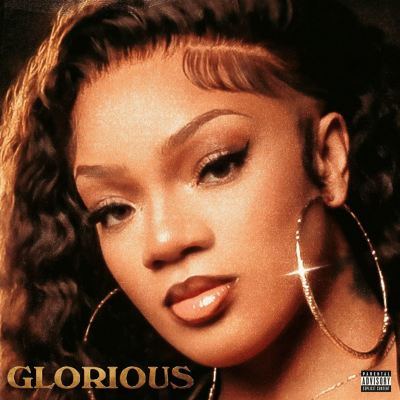

import { Slider, Button } from "@carbon/react";
import { ArrowUpRight } from "@carbon/icons-react";

import SliderJS1 from "../review/slider1";
import SliderJS2 from "../review/slider2";
import SliderJS3 from "../review/slider3";
import SliderJS4 from "../review/slider4";
import AdvJS2 from "../review/adv2";
import AdvJS3 from "../review/adv3";

import { Link } from "gatsby";

Album Review

<h1 className="h1--no--margin">{props.pageContext.frontmatter.title}</h1>

  <Link to="/best50/2024/">2024 Black Music Best No.8</Link>

 
<Row  className="image-card-group">
	<Column colMd={3} colLg={4} noGutterMdLeft="">
       <ImageCard>

</ImageCard>
	</Column>
	<Column colMd={4} colLg={8} noGutterMdLeft="">
		

			2024年にブレークを果たし、"Year Go!"でグラミーにもノミネートされた、メンフィス出身のRapper, GloRillaの公式デビューアルバム。28歳と今となっては遅めのデビューではあるが、既に貫禄と落ち着きが感じられる。
			 構成は南部らしいTrapチューンが多くなっており、Vocalゲストを招いた⑦⑭⑮がアクセントとなっている。また、Latto, Sexyy Red, Megan Thee Stallionと女性Rapperが多めに客演しており、一大勢力になったことを見せつけている。
			 さらに自身のルーツであるGospel曲⑨はインパクト大。ここでKirk Franklinが"完璧でなくてもいいんだよ"と説いているが、GloRillaも①で”失敗に勝るものはない”とRapしており、中低音で力強いフローも合わせて、彼女の生き方を垣間見えた気がする。
		

		

		  <Button className="button-right-mergin"  href="https://amzn.to/4huRWCQ" renderIcon={ArrowUpRight} size='sm' kind='primary'>
  	    amazon.com
  	  </Button>
  	  <Button className="button-right-mergin"  href="https://amzn.to/4hQVa3E" renderIcon={ArrowUpRight} size='sm' kind='secondary'>
  	    amazon.co.jp
  	  </Button>
			<Button className="button-right-mergin"  href="https://apple.co/3WRBm84" renderIcon={ArrowUpRight} size='sm' kind='tertiary'>
  	    apple music
			</Button>
			<AdvJS2/>
		

	</Column>
</Row>
<Row >
	<Column colMd={4} colLg={4} noGutterMdLeft="">
		

		  <h3>Score card</h3>
			<SliderJS1 value="2" />
		  <SliderJS2 value="2" />
			<SliderJS3 value="1" />
		  <SliderJS4 value="9" />
		

	</Column>
	<Column colMd={8} colLg={8} noGutterMdLeft="">
		

			<h3>Producers</h3>
			

				Go Grizzly, B100, Byeperfect, Wireshark, Musik MajorX and London Jae(1)
				 SkipOnDaBeat and FNZ(2)
				 Supah Mario(3)
				 Chaii Beats(4)
				 Ace Charisma and Lil Ronnie(5)
				 SkipOnDaBeat, Timbaland, CRVS SERRANO, Sakii, Yo Gotti and Satori ('6)
				 Drum Dummie, FRAXILLE, Max Hummel and Hawky(7)
				 NEVRMIND, Major Seven, Samuel “Muzikman” Williams and KINGBNJMN(8)
				 Steven Shaeffer, Hennessey Beats and Halfway(9)
				 Go Grizzly, B100 and London Jae(10)
				 Ace Charisma and Ghostrage(11)
				 Keelondn(12)
				 London Jae, Pooh Beatz, COUPE and Squat Beats(13)
				 DJ Montay(14)
				 Jazze Pha, Higainerz, Lewis Young, Cartier Fly, FinesseMadeTheBeat and KXVI(15)
			

			<h3>Guests</h3>
			

				Latto, Sexyy Red, Muni Long, Kirk Franklin, Chandler Moore, Maverick City Music, Kierra Sheard, Megan Thee Stallion, BossMan Dlow, Fridayy
			

		

	</Column>
</Row>

<h3>Tracks</h3>

| No. | Title                | Composers                                                                                                                                                                                                                 | Performer                                                                           | Time  |
| --- | -------------------- | ------------------------------------------------------------------------------------------------------------------------------------------------------------------------------------------------------------------------- | ----------------------------------------------------------------------------------- | ----- |
| 1   | INTRO                | Egor Chupin / Darryl Clemons / Quinton L Cook / Julius Rivera III / Morris Jones / Jaucquez Lowe / Timothy McKibbins / Kevin Andre Price / Vadim Rogozhin / Gloria Woods                                                  | GloRilla                                                                            | 01:28 |
| 2   | HOLLON               | Aaron Bolton / Isaac de Boni / Edgar Ferrera / Maurice "Parlae" Gleaton / Donald Jenkins / Montay Humphrey "DJ Montay" / Michael Mule / Anthony Platt / Korey Roberson / Howard Simmons / Gloria Woods                    | GloRilla                                                                            | 02:08 |
| 3   | PROCEDURE            | Jonathan D. Priester / Alyssa Stephens / Gloria Woods                                                                                                                                                                     | GloRilla feat: Latto                                                                | 02:54 |
| 4   | TGIF                 | Lucas Alegria / Dillon Brophy / Yakki Davis / Jess Jackson / Ronnie Jackson / Mario Mims / Jorge M. Taveras / Gloria Woods                                                                                                | GloRilla                                                                            | 02:44 |
| 5   | WHATCHU KNO ABOUT ME | Jeremy Allen / Javaan Anderson / Boosie Badazz / Yakki Davis / Amari Freeman / Ronnie Jackson / Jonathan Reed / Webbie / Janae Wherry / Gloria Woods                                                                      | GloRilla feat: Sexyy Red                                                            | 02:29 |
| 6   | STOP PLAYING         | Cristian Colon / Edgar Ferrera / Mario Mims / Timothy Mosley / Jimmy Nguyen / Jordan Nguyen / Jordan Thorpe / Gloria Woods                                                                                                | GloRilla                                                                            | 03:36 |
| 7   | DON’T DESERVE        | Dudley Alexander / Will Boyette / Jonah Gunnes Gumdal / Priscilla Hamilton / Rafael Ishman / Ronnie Jackson / Fokin Maxim / Artem Raschepkin / Tevin Revells / Gloria Woods                                               | GloRilla feat: Muni Long                                                            | 03:52 |
| 8   | RAIN DOWN ON ME      | Dudley Alexander / Damien Aubrey / Marlon Hampton / J. Drew Sheard II / Benjahmin Reynolds / Marcaelis Sanders / Kierra Sheard / Kirk Smith / Joakim Toftgaard / Omar Walker / Samuel Williams / Gloria Woods / Rex Zamor | GloRilla feat: Kirk Franklin / Chandler Moore / Maverick City Music / Kierra Sheard | 03:48 |
| 9   | GLO’S PRAYER         | Aidan Jonathan Crotinger / Steven Shaeffer / Artyom Tsalko / Gloria Woods                                                                                                                                                 | GloRilla                                                                            | 03:07 |
| 10  | HOW I LOOK           | Julius Rivera III / Morris Jones / Jaucquez Lowe / Timothy McKibbins / Megan Pete / Kevin Andre Price / Gloria Woods                                                                                                      | GloRilla feat: Megan Thee Stallion                                                  | 01:58 |
| 11  | I AIN’T GOING        | Amari Freeman / Chandler Tevas Ingram / Gloria Woods                                                                                                                                                                      | GloRilla                                                                            | 02:51 |
| 12  | STEP                 | Kirill Komyshey / Devante McCreary / Gloria Woods                                                                                                                                                                         | GloRilla feat: BossMan Dlow                                                         | 02:43 |
| 13  | LET HER COOK         | Darryl Clemons / Yakki Davis / Isaac Hayes / Edward Maclin Cooper III / Julius Rivera III / Jaucquez Lowe / Gloria Woods                                                                                                  | GloRilla                                                                            | 02:35 |
| 14  | I LUV HER            | Laurie Conde / Montay Humphrey "DJ Montay" / Faheem Najm / Korey Roberson / Gloria Woods                                                                                                                                  | GloRilla feat: T-Pain                                                               | 02:56 |
| 15  | QUEEN OF MEMPHIS     | Phalon Alexander / Ardarious Ester / Jabre Jones / Francis LeBlanc / Kavi Lybarger / Moritz Schneider / Gloria Woods / Lewis Young                                                                                        | GloRilla feat: Fridayy                                                              | 02:46 |

<AdvJS3 />
