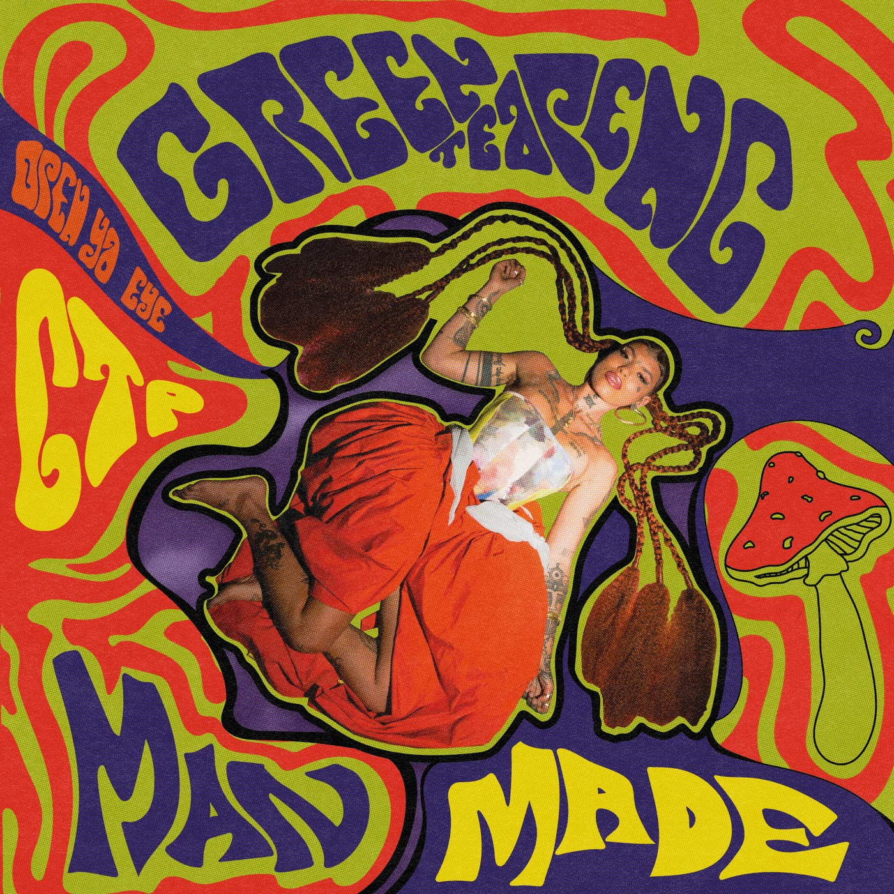

import { Slider, Button } from "carbon-components-react";
import { ArrowUpRight24 } from "@carbon/icons-react";

import SliderJS1 from "../review/slider1";
import SliderJS2 from "../review/slider2";
import SliderJS3 from "../review/slider3";
import SliderJS4 from "../review/slider4";
import AdvJS2 from "../review/adv2";
import AdvJS3 from "../review/adv3";

import { Link } from "gatsby";

Album Review

<h1 className="h1--no--margin">{props.pageContext.frontmatter.title}</h1>

<Row  className="image-card-group">
	<Column colMd={"3"} colLg={"4"} noGutterMdLeft="">
       <ImageCard>

</ImageCard>
	</Column>
	<Column colMd={"4"} colLg={"8"} noGutterMdLeft="">
	

		London近郊Bermondsey出身のSinger, Greentea Pengのデビューアルバム。年齢は25-26歳@2021とのこと。アラブ人の父とアフリカ人の母を持ち、風貌や音楽性からは父の血筋の影響も窺える。
		 自身で作風をpsychedelic R&Bと表現しているが、日本でいうようなサイケというより、エスニックな印象を受ける。敢えて例えるなら、呪術性を弱めたErykah Baduといった感じで、本人も影響について言及している。
		 ゆったりとして揺らいだような曲が多く、5人編成のバンドによるTrackはよくよく聞くとジャズ、レゲエ、インド音楽、エレクトロなどのジャンルをまたがった多彩なもの。これにGreantea Pengの抑えたVocalが加わり、中毒性を強めている。
	

	

	  <Button className="button-right-mergin"  href="https://amzn.to/2Wsmpxm" kind="primary" size="small" renderIcon={ArrowUpRight24}>
      amazon.com
    </Button>
    <Button className="button-right-mergin"  href="https://amzn.to/3oj2xs2" kind="secondary" size="small" renderIcon={ArrowUpRight24}>
      amazon.co.jp
    </Button>
		<Button className="button-right-mergin"  href="https://geo.music.apple.com/us/album/man-made/1561826242?itsct=music_box_link&itscg=30200&at=11lcug&ls=1&app=music" kind="tertiary" size="small" renderIcon={ArrowUpRight24}>
      apple music
    </Button>
		<AdvJS2/>
	

	</Column>
</Row>
<Row >
	<Column colMd={"4"} colLg={"4"} noGutterMdLeft="">
	

	  <h3>Score card</h3>
		<SliderJS1 value="4" />
	  <SliderJS2 value="3" />
		<SliderJS3 value="1" />
	  <SliderJS4 value="9" />
	

</Column>
<Column colMd={"8"} colLg={"8"} noGutterMdLeft="">

	<h3>Producers</h3>
	

		Jake Harvey Tavemer, Joshua Kikonyogo and Earbuds(1)
		 Earbuds(2,5,7,8,9,11,12,13,15,16)
		 George Joannides(3)
		 Swindle(4,16)
		 SAMO(6)
		 "Commissoner" Gordon(10)
		 Mala(14)
		 Joshua Kikonyogo and SAMO(17)
	

	<h3>Guests</h3>
	

		Simmy, Kid Cruise	
	

</Column>
</Row>

<h3>Tracks</h3>

| No. | Title                  | Composers                                                                                                                                                          | Performer                             | Time  |
| --- | ---------------------- | ------------------------------------------------------------------------------------------------------------------------------------------------------------------ | ------------------------------------- | ----- |
| 1   | Make Noise             | Aria Wells, Jake Harvey Tavemer, Joshua Kikonyogo, Anish Bhatt, Tagara Mhiza, Jordan Thompson Hadfield, Jaega Francis McKenna-Gordon, Joe Armon-Jones, Tom Hammond | Greentea Peng                         | 03:32 |
| 2   | This Sound             | Aria Wells, Anish Bhatt, Tagara Mhiza, Jordan Thompson Hadfield, Jaega Francis McKenna-Gordon, Mathew Anthony Kwasniewski-Kelvin, Richarf Crawford                 | Greentea Peng                         | 02:21 |
| 3   | Free My People         | Aria Wells, George Joannides, Samuel Ampiah, Cameron Mathew Tomon, Anish Bhatt, Jordan Thompson Hadfield, Jaega Francis McKenna-Gordon, Joe Armon-Jones,           | Greentea Peng feat. Simmy, Kid Cruise | 03:35 |
| 4   | Be Careful             | Aria Wells, Cameron Palmer, Tagara Mhiza, Jaega Francis McKenna-Gordon                                                                                             | Greentea Peng                         | 02:26 |
| 5   | Nah It Ain't the Same  | Aria Wells, Anish Bhatt, Tagara Mhiza, Jordan Thompson Hadfield, Jaega Francis McKenna-Gordon, Joe Armon-Jones                                                     | Greentea Peng                         | 04:05 |
| 6   | Earnest                | Aria Wells, Samo Castillano, Anish Bhatt, Tagara Mhiza, Jordan Thompson Hadfield, Jaega Francis McKenna-Gordon, Joe Armon-Jones, Tom Hamond                        | Greentea Peng                         | 03:46 |
| 7   | Suffer                 | Aria Wells, Anish Bhatt, Tagara Mhiza, Jordan Thompson Hadfield                                                                                                    | Greentea Peng                         | 02:55 |
| 8   | Mataji Freestyle       | Aria Wells, Anish Bhatt, Tagara Mhiza, Jaega Francis McKenna-Gordon, Joe Armon-Jones                                                                               | Greentea Peng                         | 03:32 |
| 9   | Kali v2                | Aria Wells, Anish Bhatt, Tagara Mhiza, Jordan Thompson Hadfield, Joe Armon-Jones                                                                                   | Greentea Peng                         | 03:01 |
| 10  | Satta                  | Aria Wells, Gordon Williams, Winston Riley                                                                                                                         | Greentea Peng                         | 02:58 |
| 11  | Party Hard (Interlude) | Aria Wells, Ian Greenidge, Anish Bhatt, Tagara Mhiza, Jordan Thompson Hadfield, Jaega Francis McKenna-Gordon, Joe Armon-Jones                                      | Greentea Peng                         | 02:41 |
| 12  | Dingaling              | Aria Wells, Anish Bhatt, Tagara Mhiza, Jordan Thompson Hadfield, Tony Olabode, Ryan Benton Thomas, Armedu uUgusutine, Idibia Innocent Ujah                         | Greentea Peng                         | 03:20 |
| 13  | Maya                   | Aria Wells, Anish Bhatt, Tagara Mhiza, Jordan Thompson Hadfield                                                                                                    | Greentea Peng                         | 03:29 |
| 14  | Man Made               | Aria Wells, Mark Lawrence, Tagara Mhiza, Jaega Francis McKenna-Gordon, Joe Armon-Jones                                                                             | Greentea Peng                         | 03:38 |
| 15  | Meditation             | Aria Wells, Anish Bhatt, Tagara Mhiza, Jordan Thompson Hadfield, Jaega Francis McKenna-Gordon, Joe Armon-Jones                                                     | Greentea Peng                         | 07:07 |
| 16  | Poor Man (Skit)        | Aria Wells, Anish Bhatt, Tagara Mhiza, Jaega Francis McKenna-Gordon, Joe Armon-Jones                                                                               | Greentea Peng                         | 02:38 |
| 17  | Sinner                 | Aria Wells, Joshua Kikonyogo, Samo Castillano, Tagara Mhiza, Jordan Thompson Hadfield, Jaega Francis McKenna-Gordon                                                | Greentea Peng                         | 02:20 |
| 18  | Jimtastic Blues        | Aria Wells, Cameron Palmer, Tagara Mhiza, Jordan Thompson Hadfield, Jaega Francis McKenna-Gordon                                                                   | Greentea Peng                         | 03:35 |

<AdvJS3 />
