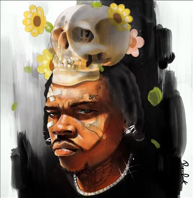

import { Slider, Button } from "@carbon/react";
import { ArrowUpRight } from "@carbon/icons-react";

import SliderJS1 from "../review/slider1";
import SliderJS2 from "../review/slider2";
import SliderJS3 from "../review/slider3";
import SliderJS4 from "../review/slider4";
import AdvJS2 from "../review/adv2";
import AdvJS3 from "../review/adv3";

import { Link } from "gatsby";

Album Review

<h1 className="h1--no--margin">{props.pageContext.frontmatter.title}</h1>

  <Link to="/best50/2023/">2023 Black Music Best No.30</Link>

<Row  className="image-card-group">
	<Column colMd={3} colLg={4} noGutterMdLeft="">
       <ImageCard>

</ImageCard>
	</Column>
	<Column colMd={4} colLg={8} noGutterMdLeft="">
	

		Georgia出身、30歳のRapper, Gunnaの1年ぶりのアリバム。2010年代中ごろから活動し、各年1枚リリースのペースをキープしている働き者で、Chartトップも獲得済みに中堅である。
		 2022年に収監されたり、その際、密告者疑惑をかけられたりと、ざわついていたプライベートや周りへの不信感を複数曲でもろに反映している。
		 作風はいわゆるTrapで、ゆったりとして哀愁感のあるTrackにGunnaの唄うようで活舌の良いフローがのっかっている。また、制作陣に著名なProducerの名はなく、ゲストも無しということで、自分言葉で語りたいという強い意志が感じられる。
	

	

	  <Button className="button-right-mergin"  href="https://amzn.to/4cb68i4" renderIcon={ArrowUpRight} size='sm' kind='primary'>
      amazon.com
    </Button>
    <Button className="button-right-mergin"  href="https://amzn.to/3wOjTmV" renderIcon={ArrowUpRight} size='sm' kind='secondary'>
      amazon.co.jp
    </Button>
		<Button className="button-right-mergin"  href="https://apple.co/3TapAmH" renderIcon={ArrowUpRight} size='sm' kind='tertiary'>
      apple music
    </Button>
		<AdvJS2/>
	

	</Column>
</Row>
<Row >
	<Column colMd={4} colLg={4} noGutterMdLeft="">
		

		  <h3>Score card</h3>
			<SliderJS1 value="1" />
		  <SliderJS2 value="2" />
			<SliderJS3 value="3" />
		  <SliderJS4 value="8" />
		

	</Column>
	<Column colMd={8} colLg={8} noGutterMdLeft="">
		

			<h3>Producers</h3>
			

				Turbo, Cam Griffin and Omar Grand(1,12)
				 Kenny Stuntin and Ayo Sim(2)
				 Turbo, Nils, Cam Griffin and Omar Grand(3)
				 Turbo, Pooh Beatz, Mario Petersen and LNKmusic(4)
				 Royal808, X-plosive and Florian “Flo” Ongonga(5)
				 Dunk Rock and Florian “Flo” Ongonga(6)
				 Angelo Ferraro and Florian “Flo” Ongonga(7)
				 Turbo & Yung Talent(8)
				 88Krazy, Slowburnz and Williskeating(9)
				 Rance and Swiff D(10)
				 EVRGRN, Kenny Stuntin and Zoo Kids(11)
				 Turbo, Ghetto Guitar, Cam Griffin and Omar Grand(13)
				 Aviator Keyyz, Rick Anthony and Sammy Haig(14)
				 Fresh Ayr, CuBeatz, Jojo Kelete and Klimperboy(15)
			

			<h3>Guests</h3>
			

			

		

	</Column>
</Row>

<h3>Tracks</h3>

| No. | Title               | Composers                                                                                                           | Performer | Time  |
| --- | ------------------- | ------------------------------------------------------------------------------------------------------------------- | --------- | ----- |
| 1   | back at it          | Chandler Great / Cameron Griffin / Gunna / Omar Perrin                                                              | Gunna     | 03:06 |
| 2   | back to the moon    | Simarpreet Singh Bahia / Gunna / Kenneth Redfield                                                                   | Gunna     | 03:13 |
| 3   | idk nomore          | Chandler Great / Cameron Griffin / Gunna / Nils Nohden / Omar Perrin                                                | Gunna     | 02:59 |
| 4   | paybach             | Darryl Clemons / Chandler Great / Gunna / Leon Krol / Mario Peterson                                                | Gunna     | 02:53 |
| 5   | ca$h $hit           | Gunna / Thomas Kessler / Florian "Flo" Ongonga / Felix Roggenkamper                                                 | Gunna     | 02:11 |
| 6   | fukumean            | Lucas DiFabbio / Gunna / Florian "Flo" Ongonga                                                                      | Gunna     | 02:05 |
| 7   | rodeo dr            | Angelo Ferrao / Gunna / Florian "Flo" Ongonga                                                                       | Gunna     | 02:56 |
| 8   | bottom              | Chandler Great / Gunna / Camren Martin                                                                              | Gunna     | 02:57 |
| 9   | p angels            | Gunna / Willis Keaton                                                                                               | Gunna     | 02:56 |
| 10  | born rich           | Larrance Dopson / Gunna / Steve Thornton                                                                            | Gunna     | 02:52 |
| 11  | go crazy            | William Paul Winter Clarke / Gunna / Sacha Saul Katz / Amman Moosa Nuram / Kenneth Redfield                         | Gunna     | 02:53 |
| 12  | bread & butter      | Chandler Great / Cameron Griffin / Sergio Kitchens / Omar Perrin                                                    | Gunna     | 03:46 |
| 13  | turned your back    | Chandler Great / Cameron Griffin / Gunna / Omar Perrin                                                              | Gunna     | 04:03 |
| 14  | i was just thinking | Rick Anthony / Kenny Gilmore / Gunna / Sammy Haig                                                                   | Gunna     | 03:12 |
| 15  | alright             | Kevin Gomringer / Tim Gomringer / Gunna / Johannes Selomun Kelete / Florian "Flo" Ongonga / Jeffery Oliver Robinson | Gunna     | 03:04 |

<AdvJS3 />
