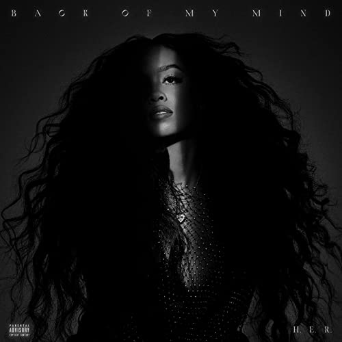

import { Slider, Button } from "carbon-components-react";
import { ArrowUpRight24 } from "@carbon/icons-react";

import SliderJS1 from "../review/slider1";
import SliderJS2 from "../review/slider2";
import SliderJS3 from "../review/slider3";
import SliderJS4 from "../review/slider4";
import AdvJS2 from "../review/adv2";
import AdvJS3 from "../review/adv3";

import { Link } from "gatsby";

Album review

<h1 className="h1--no--margin">{props.pageContext.frontmatter.title}</h1>

  <Link to="/best50/2021/">2021 Black Music Best No.15</Link>

<Row className="image-card-group">
	<Column colMd={"3"} colLg={"4"} noGutterMdLeft="">
       <ImageCard>

</ImageCard>
	</Column>
	<Column colMd={"4"} colLg={"8"} noGutterMdLeft="">
	

		USはベイエリア出身のSinger, H.E.R.(Having Everything Revealed"の略とのこと)の意外にも1stフルアルバム。(イメージでUKの人かと思ってました。) 
		 24歳ながら、Grammy2回にAcademy1回受賞と実績としては十分で、満を持してのリリースと言えるのではないか。そんなおまたせ感を払拭するように21曲79分の大作になっている。
		 彼女の囁くようなVocalをフィーチャーしたミディアム～スローの静謐で、やや茫洋としたTrackがほとんどを占める。
		 そんな中でもThundercat, Kaytranadaらによる⑥などはカッコよく、数曲でのRapper, Male Singerの客演で変化をつけている。また⑫⑮⑯など高音多めの曲では唄い方がAlicia Keysに似てる気がした。
		 どれも佳曲ではあるが、曲調が近いので、全体としては長いかもしれない。
	

	

	  <Button className="button-right-mergin"  href="https://amzn.to/3gKwZ9J" kind="primary" size="small" renderIcon={ArrowUpRight24}>
      amazon.com
    </Button>
    <Button className="button-right-mergin"  href="https://amzn.to/3zyhxFi" kind="secondary" size="small" renderIcon={ArrowUpRight24}>
      amazon.co.jp
    </Button>
		<Button className="button-right-mergin"  href="https://geo.music.apple.com/us/album/back-of-my-mind-apple-music-edition/1571344275?itsct=music_box_link&itscg=30200&at=11lcug&ct=albums_back_of_my_mind_%28apple_music_edit&ls=1&app=music" kind="tertiary" size="small" renderIcon={ArrowUpRight24}>
      apple music
    </Button>
		<AdvJS2/>
	

	</Column>
</Row>
<Row >
	<Column colMd={"4"} colLg={"4"} noGutterMdLeft="">
		

    	<h3>Score card</h3>
			<SliderJS1 value="4" />
    	<SliderJS2 value="2" />
			<SliderJS3 value="1" />
    	<SliderJS4 value="9" />
		

	</Column>
	<Column colMd={"8"} colLg={"8"} noGutterMdLeft="">
		

			<h3>Producers</h3>
			

				DJ Camper and Flippa(1,2,14)
				 Hit-Boy(3)
				 Cardiak and Jeff "Gitty" Gitelman(4)
				 Chi Chi(5)
				 Kaytranada, Thundercat and Jeff "Gitty" Gitelman(6)
				 Cardiak and Nova Wav(7)
				 Cardiak, Mike Will Made It and Wu10(8)
				 Grades and Scribz Riley(9)
				 DJ Camper(10,16)
				 DJ Camper and Asa Taccone(11)
				 Jeff "Gitty" Gitelman(12)
				 Bordeaux and Non Native(13,15)
				 Darkchild(17)
				 H.E.R. and Jeff "Gitty" Gitelman(18)
				 H.E.R., DJ Camper and Hue Strother(19)
				 DJ Khaled, StreetRunner and Tarik Azzouz(20)
				 Cardo, Mario Luciano and Thurdi(21)
			

			<h3>Guests</h3>
			

				Ty Dolla $ign, Cordae, Lil Baby, Chris Brown, Yung Bleu , DJ Khaled, Bryson Tiller
			

		

	</Column>
</Row>

<h3>Tracks</h3>

| No. | Title             | Composers                                                                                                                                                           | Performer                             | Time  |
| --- | ----------------- | ------------------------------------------------------------------------------------------------------------------------------------------------------------------- | ------------------------------------- | ----- |
| 1   | We Made It        | Gabriella Wilson, Tiara Thomas, Elijah Dias, Darhyl Camper, Ronald Colson, David Foster, Carole Bayer Sager                                                         | H.E.R.                                | 05:14 |
| 2   | Back of My Mind   | Gabriella Wilson, Tyrone Griffin, Darhyl Camper, Ronald Colson                                                                                                      | H.E.R. feat. Ty Dolla $ign            | 03:41 |
| 3   | Trauma            | Gabriella Wilson, Cordae Dunston, Tiara Thomas, Chauncey Hollis                                                                                                     | H.E.R. feat. Cordae                   | 04:31 |
| 4   | Damage            | Gabriella Wilson, Tiara Thomas, Anthony Clemons, Carl McCormick, Jeff Gitelman, James Harris, Terry Lewis                                                           | H.E.R.                                | 03:47 |
| 5   | Find a Way        | Gabriella Wilson, Dominique Jones, Tiara Thomas, Seandrea Sledge, Chidi Osondu                                                                                      | H.E.R. feat. Lil Baby                 | 03:17 |
| 6   | Bloody Waters     | Gabriella Wilson, Stephen Bruner, Latisha Hyman, Louis Celestin, Jeff Gitelman                                                                                      | H.E.R.                                | 04:20 |
| 7   | Closer to Me      | Gabriella Wilson, Carl McCormick, Brittany Coney, Denisia Andrews, Goapele Mohlabane, Anthony Anderson, Michael Aaberg                                              | H.E.R.                                | 04:06 |
| 8   | Come Through      | Gabriella Wilson, Chris Brown, Tiara Thomas, Carl McCormick, Michael Williams II, Kelvin Wooten                                                                     | H.E.R. feat. Chris Brown              | 03:34 |
| 9   | My Own            | Gabriella Wilson, Tiara Thomas, Daniel Traynor, Michael Orabiyi                                                                                                     | H.E.R.                                | 03:39 |
| 10  | Lucky             | Gabriella Wilson, Stacy Barthe, Darhyl Camper                                                                                                                       | H.E.R.                                | 03:01 |
| 11  | Cheat Code        | Gabriella Wilson, Julia Michaels, Darhyl Camper, Asa Taccone                                                                                                        | H.E.R.                                | 03:01 |
| 12  | Mean It           | Gabriella Wilson, Charles Hinshaw, Jeff Gitelman                                                                                                                    | H.E.R.                                | 03:17 |
| 13  | Paradise          | Gabriella Wilson, Jeremy Biddle, Luis Campozano, Brendan Walsh                                                                                                      | H.E.R. feat. Yung Bleu                | 02:37 |
| 14  | Process           | Gabriella Wilson, Priscilla Hamilton, Gamal Lewis, Jeff Gitelman, Darhyl Camper, Ronald Colson                                                                      | H.E.R.                                | 03:54 |
| 15  | Hold On           | Gabriella Wilson, Tiara Thomas, Maxx Moore, Campozano, Brendan Walsh                                                                                                | H.E.R.                                | 03:22 |
| 16  | Don't             | Gabriella Wilson, Tiara Thomas, Darhyl Camper                                                                                                                       | H.E.R.                                | 04:01 |
| 17  | Exhausted         | Gabriella Wilson, Nelson Bridges, Steven J. Collins, Vurdell Muller, Rodney Jerkins                                                                                 | H.E.R.                                | 03:29 |
| 18  | Hard to Love      | Gabriella Wilson, Nasri Atweh, Jeff Gitelman                                                                                                                        | H.E.R.                                | 04:02 |
| 19  | For Anyone        | Gabriella Wilson, Darhyl Camper, Hue Strother                                                                                                                       | H.E.R.                                | 03:54 |
| 20  | I Can Have It All | Gabriella Wilson, Khaled Khaled, Bryson Tiller, Robert Williams, Tiara Thomas, Coney, Andrews, Nicholas Warwar, Tarik Azzouz, Gene Page, Billy Page, Dave Lewis     | H.E.R. feat. DJ Khaled, Bryson Tiller | 04:23 |
| 21  | Slide             | Gabriella Wilson, Keenon Jackson, Tiara Thomas, Dias, Ronald LaTour, Steve Arrington, Charles Carter, Shawn Carter, Jermaine Mauldin, Waung Hankerson, Roger Parker | H.E.R.                                | 03:58 |

<AdvJS3 />
