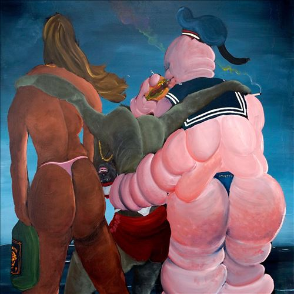

import { Slider, Button } from "@carbon/react";
import { ArrowUpRight } from "@carbon/icons-react";

import SliderJS1 from "../review/slider1";
import SliderJS2 from "../review/slider2";
import SliderJS3 from "../review/slider3";
import SliderJS4 from "../review/slider4";
import AdvJS2 from "../review/adv2";
import AdvJS3 from "../review/adv3";

import { Link } from "gatsby";

Album review

<h1 className="h1--no--margin">{props.pageContext.frontmatter.title}</h1>

  <Link to="/best50/2022/">2022 Black Music Best No.41</Link>

<Row  className="image-card-group">
	<Column colMd={3} colLg={4} noGutterMdLeft="">
       <ImageCard>

</ImageCard>
	</Column>
	<Column colMd={4} colLg={8} noGutterMdLeft="">
		

			Hudson Mohawkeの7年ぶりとなる3rdアルバム。その間も客演やMix Tapeなどでの活動もあり不在感は無かったと思う。リリースはまだコロナ禍終盤だった2022年秋なので、希望を見出せるようなPopで明るい曲が多く、本人もポジティブなメッセージを込めたと言っている。
			 TrackはUKクラブミュージックやEDMをベースに、曲によってはR&B/GospelやHip-Hop色が加わっているもので、歌入りの曲も多くて、彩を添えている。
			 エクスペリメンタルなところも、まだまだ、残っており、いろいろなタイプの曲が有って、非常に面白い。
			 制作はほぼ本人によるが。⑪では、お気に入りだというNeptunesのChad Hugoが参加している。
		

		

		  <Button className="button-right-mergin"  href="https://amzn.to/3XJSKej" renderIcon={ArrowUpRight} size='sm' kind='primary'>
  	    amazon.com
  	  </Button>
  	  <Button className="button-right-mergin"  href="https://amzn.to/3XPcwVB" renderIcon={ArrowUpRight} size='sm' kind='secondary'>
  	    amazon.co.jp
  	  </Button>
			<Button className="button-right-mergin"  href="https://apple.co/44EnlMx" renderIcon={ArrowUpRight} size='sm' kind='tertiary'>
  	   	apple music
  	  </Button>
			<AdvJS2/>
		

	</Column>
</Row>
<Row >
	<Column colMd={4} colLg={4} noGutterMdLeft="">
		

		  <h3>Score card</h3>
			<SliderJS1 value="4" />
		  <SliderJS2 value="1" />
			<SliderJS3 value="1" />
		  <SliderJS4 value="8" />
		

	</Column>
	<Column colMd={8} colLg={8} noGutterMdLeft="">
		

			<h3>Producers</h3>
			

				Hudson Mohawke(all)
			

			<h3>Guests</h3>
			

				Jamaica Elrasher, Mette Towley, Clarence Coffee, Jr., Tkay Maidze, Káryyn, Tayla Parx, Sasha Alex Sloan
			

		

	</Column>
</Row>

<h3>Tracks</h3>

| No. | Title                | Composers                                       | Performer      | Time  |
| --- | -------------------- | ----------------------------------------------- | -------------- | ----- |
| 1   | Ingle Nook           | Ross Birchard / Johan Lenox / Olivier St. Louis | Hudson Mohawke | 01:53 |
| 2   | Intentions           | Ross Birchard                                   | Hudson Mohawke | 04:18 |
| 3   | Expo                 | Ross Birchard                                   | Hudson Mohawke | 00:40 |
| 4   | Behold               | Ross Birchard                                   | Hudson Mohawke | 02:20 |
| 5   | Bicstan              | Ross Birchard                                   | Hudson Mohawke | 04:45 |
| 6   | Stump                | Ross Birchard                                   | Hudson Mohawke | 04:21 |
| 7   | Dance Forever        | Ross Birchard / Mette Towley                    | Hudson Mohawke | 03:05 |
| 8   | Bow                  | Ross Birchard / Clarence Coffee, Jr.            | Hudson Mohawke | 02:41 |
| 9   | Is It Supposed       | Ross Birchard / Tayla Parx                      | Hudson Mohawke | 06:14 |
| 10  | Lonely Days          | Ross Birchard / Faith Evans                     | Hudson Mohawke | 05:29 |
| 11  | Redeem               | Ross Birchard / Chad Hugo                       | Hudson Mohawke | 02:08 |
| 12  | Rain Shadow          | Ross Birchard                                   | Hudson Mohawke | 05:33 |
| 13  | Kpipe                | Ross Birchard / Káryyn                          | Hudson Mohawke | 03:10 |
| 14  | 3 Sheets to the Wind | Ross Birchard                                   | Hudson Mohawke | 02:24 |
| 15  | Some Buzz            | Ross Birchard / Norman Whiteside                | Hudson Mohawke | 02:36 |
| 16  | Tincture             | Ross Birchard                                   | Hudson Mohawke | 03:26 |
| 17  | Nork 69Ross Birchard | Ross Birchard                                   | Hudson Mohawke | 02:10 |
| 18  | Come a Little Closer | Ross Birchard / Sasha Alex Sloan                | Hudson Mohawke | 03:44 |
| 19  | Ingle Nook Slumber   | Ross Birchard                                   | Hudson Mohawke | 01:54 |

<AdvJS3/>