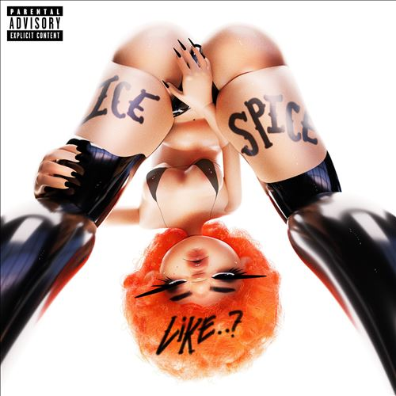

import { Slider, Button } from "@carbon/react";
import { ArrowUpRight } from "@carbon/icons-react";

import SliderJS1 from "../review/slider1";
import SliderJS2 from "../review/slider2";
import SliderJS3 from "../review/slider3";
import SliderJS4 from "../review/slider4";
import AdvJS2 from "../review/adv2";
import AdvJS3 from "../review/adv3";

import { Link } from "gatsby";

Album review

<h1 className="h1--no--margin">{props.pageContext.frontmatter.title}</h1>

  <Link to="/best50/2023/">2023 Black Music Best No.20</Link>

<Row  className="image-card-group">
	<Column colMd={3} colLg={4} noGutterMdLeft="">
       <ImageCard>

</ImageCard>
	</Column>
	<Column colMd={4} colLg={8} noGutterMdLeft="">
		

			Bronx育ちのRapper, Ice Spice(23歳)の7曲入りEP。13分強という短めの作品である。Rapを始めたのは2年前とのことで、⑦がDrakeに認められて、Virul Hitして、2023年の最も勢いのある新人Rapperの1人となり、映画Barbieのサントラにも参加している。
			 軸としていたNY Drillは通過したと本人も言っているが、当作ではJersey Clubも取り入れるなど、音楽性を広げており、その先にはメインストリームを目指しているそうで、この辺は、大学時代からの仲間であるRITUOSAとの二人三脚での試みと言えそうだ。
			 Rapのほうは、中低音中心で、ほんの少し掠れ気味。勢いで押すタイプではないところがかえってユニークだ。
		

		

		  <Button className="button-right-mergin"  href="https://amzn.to/3LQ4IxW" renderIcon={ArrowUpRight} size='sm' kind='primary'>
  	    amazon.com
  	  </Button>
  	  <Button className="button-right-mergin"  href="https://amzn.to/3PQJCRz" renderIcon={ArrowUpRight} size='sm' kind='secondary'>
  	    amazon.co.jp
  	  </Button>
			<Button className="button-right-mergin"  href="https://apple.co/3rIyFJD" renderIcon={ArrowUpRight} size='sm' kind='tertiary'>
  	    apple music
  	  </Button>
			<AdvJS2/>
		

	</Column>
</Row>
<Row >
	<Column colMd={4} colLg={4} noGutterMdLeft="">
		

		  <h3>Score card</h3>
			<SliderJS1 value="5" />
		  <SliderJS2 value="1" />
			<SliderJS3 value="1" />
		  <SliderJS4 value="8" />
		

	</Column>
	<Column colMd={8} colLg={8} noGutterMdLeft="">
		

			<h3>Producers</h3>
			

				RIOTUSA(all)
			

			<h3>Guests</h3>
			

				Lil Tjay
			

		

	</Column>
</Row>

<h3>Tracks</h3>

| No. | Title             | Composers                                                                                                                    | Performer                | Time  |
| --- | ----------------- | ---------------------------------------------------------------------------------------------------------------------------- | ------------------------ | ----- |
| 1   | In Ha Mood        | RIOTUSA / Ice Spice                                                                                                          | Ice Spice                | 02:09 |
| 2   | Princess Diana    | RIOTUSA / Ice Spice                                                                                                          | Ice Spice                | 02:35 |
| 3   | Gangsta Boo       | Sean Combs / Chauncey Hawkins / Michael Carlos Jones / RIOTUSA / Frank Romano / Adonis Shropshire / Ice Spice / Mario Winans | Ice Spice feat: Lil Tjay | 02:39 |
| 4   | Actin a Smoochie  | RIOTUSA / Ice Spice                                                                                                          | Ice Spice                | 02:14 |
| 5   | Bikini Bottom     | RIOTUSA / Ice Spice                                                                                                          | Ice Spice                | 01:47 |
| 6   | Munch (Feelin’ U) | RIOTUSA / Ice Spice                                                                                                          | Ice Spice                | 01:44 |

<AdvJS3 />
