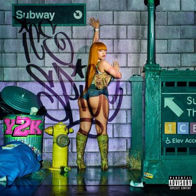

import { Slider, Button } from "@carbon/react";
import { ArrowUpRight } from "@carbon/icons-react";

import SliderJS1 from "../review/slider1";
import SliderJS2 from "../review/slider2";
import SliderJS3 from "../review/slider3";
import SliderJS4 from "../review/slider4";
import AdvJS2 from "../review/adv2";
import AdvJS3 from "../review/adv3";

import { Link } from "gatsby";

import Review1 from "../review/icespice1.mdx";

Album review

<h1 className="h1--no--margin">{props.pageContext.frontmatter.title}</h1>

<Row  className="image-card-group">
	<Column colMd={3} colLg={4} noGutterMdLeft="">
       <ImageCard>

</ImageCard>
	</Column>
	<Column colMd={4} colLg={8} noGutterMdLeft="">
		

			昨年リリースのEPによって、たちまちブレークしたIce Spiceのデビューアルバム(ただし23分強とEP並みの短尺)。数々の客演や”バービー”のサントラへの参加を経て、今日に至っている。なお、アルバムタイトルは本人の生年月日(2000年1月1日=Y2K初日)によるものと思われる。
			 NY Drillは通過したと語っていたはずだが、早くも原点回帰なのか、Drillを全面に押し出した作品になっている。そんなTrackの上で、引き続き中低音のすこした掠れた声でのフローを繰り広げており、他のFemale Rapperに比べ、特にRapそのものに注力していると感じる。
			 サウンドについては、全体的にちょっと単調な気がしないでもないが、Central Cee参加の⑥あたりから後半にかけて振り幅が広がっていっている。
		

		

		  <Button className="button-right-mergin"  href="https://amzn.to/4eDZotr" renderIcon={ArrowUpRight} size='sm' kind='primary'>
  	    amazon.com
  	  </Button>
  	  <Button className="button-right-mergin"  href="https://amzn.to/4eDZotr" renderIcon={ArrowUpRight} size='sm' kind='secondary'>
  	    amazon.co.jp
  	  </Button>
			<Button className="button-right-mergin"  href="https://apple.co/4fGBKNw" renderIcon={ArrowUpRight} size='sm' kind='tertiary'>
  	    apple music
  	  </Button>
			<AdvJS2/>
		

	</Column>
</Row>
<Row >
	<Column colMd={4} colLg={4} noGutterMdLeft="">
		

		  <h3>Score card</h3>
			<SliderJS1 value="5" />
		  <SliderJS2 value="2" />
			<SliderJS3 value="2" />
		  <SliderJS4 value="8" />
		

	</Column>
	<Column colMd={8} colLg={8} noGutterMdLeft="">
		

			<h3>Producers</h3>
			

				IOTUSA(1,7,9,10)
				 RIOTUSA and GOLDIN(2)
				 UpMadeIt, Synthetic and RIOTUSA(3,5)
				 DJH, Ojivolta and RIOTUSA(4)
				 RIOTUSA, Nico Baran and Lily Kaplan(6)
				 RIOTUSA, Synthetic and venny(8)
			

			<h3>Guests</h3>
			

				Travis Scott, Gunna, Central Cee
			

		

	</Column>
</Row>

<h3>Tracks</h3>

| No. | Title                   | Composers                                                 | Performer                    | Time  |
| --- | ----------------------- | --------------------------------------------------------- | ---------------------------- | ----- |
| 1   | Phat Butt               | Ice Spice, RIOTUSA, D’Angelo Hunt, Jizzal Man & Pimpin    | Ice Spice                    | 02:09 |
| 2   | Oh Shhh...              | Ice Spice, Travis Scott, RIOTUSA & GOLDIN                 | Ice Spice feat. Travis Scott | 02:41 |
| 3   | Popa                    | Ice Spice, UpMadeIt, Synthetic & RIOTUSA                  | Ice Spice                    | 02:39 |
| 4   | Bitch I'm Packin'       | Ice Spice, Gunna, Mark Williams, Raul Cubina & RIOTUSA    | Ice Spice feat. Gunna        | 02:42 |
| 5   | Plenty Sun              | Ice Spice, RIOTUSA, Synthetic & UpMadeIt                  | Ice Spice                    | 02:41 |
| 6   | Did It First            | Ice Spice, Central Cee, RIOTUSA, Nico Baran & Lily Kaplan | Ice Spice feat. Central Cee  | 01:58 |
| 7   | BB Belt                 | Ice Spice & RIOTUSA                                       | Ice Spice                    | 01:56 |
| 8   | Think U the Shit (Fart) | Ice Spice, Synthetic, RIOTUSA & venny                     | Ice Spice                    | 02:21 |
| 9   | Gimmie a Light          | Ice Spice, Sean Paul, RIOTUSA & Troyton Rami              | Ice Spice                    | 02:06 |
| 10  | TTYL                    | Ice Spice & RIOTUSA                                       | Ice Spice                    | 02:03 |

<h3>Other Reviews</h3>

<Row>
  <Column colMd={3} colLg={3} noGutterMdLeft>
    <Review1 />
  </Column>
</Row>

<AdvJS3 />
