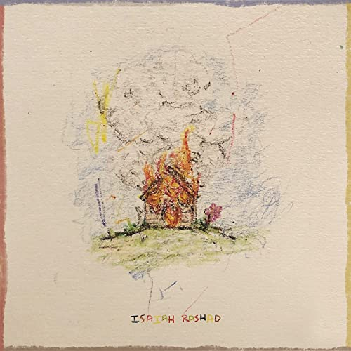

import { Slider, Button } from "carbon-components-react";
import { ArrowUpRight24 } from "@carbon/icons-react";

import SliderJS1 from "../review/slider1";
import SliderJS2 from "../review/slider2";
import SliderJS3 from "../review/slider3";
import SliderJS4 from "../review/slider4";
import AdvJS2 from "../review/adv2";
import AdvJS3 from "../review/adv3";

import { Link } from "gatsby";

Album review

<h1 className="h1--no--margin">{props.pageContext.frontmatter.title}</h1>

  <Link to="/best50/2021/">2021 Black Music Best No.17</Link>

<Row  className="image-card-group">
	<Column colMd={"3"} colLg={"4"} noGutterMdLeft="">
       <ImageCard>

</ImageCard>
	</Column>
	<Column colMd={"4"} colLg={"8"} noGutterMdLeft="">
		

			Tennesse出身,30歳のRapper, Isaiah Rashadの5年ぶり2作目。この間、アリコール依存症になってたとのことで、リハビリにて復活してのリリースとなり、Lyricにもその辺りのことが織り込まれている。
			 サンプリングやGuestなどサウス志向ではあるが、土着感はあまりなく、また、R&B寄りのメローでソウルフルなTrackも多数で、何とも言えないユニークなサウンドに仕上がっている。
			 IsaiahのRapは唄うようなもの、語りかけるようなもの、パーカッシブなものなど硬軟織り交ざていて、これをほぼFreestyleでレコーディングしたとのことで、相当なスキルだということが判る。
			 SZAやAmindiなど女性Voのはいったトラックも良いと思う。
		

		

		  <Button className="button-right-mergin"  href="https://amzn.to/3Jq17mV" kind="primary" size="small" renderIcon={ArrowUpRight24}>
  	    amazon.com
  	  </Button>
  	  <Button className="button-right-mergin"  href="https://amzn.to/3gKBu3z" kind="secondary" size="small" renderIcon={ArrowUpRight24}>
  	    amazon.co.jp
  	  </Button>
			<Button className="button-right-mergin"  href="https://apple.co/3GMZayR" kind="tertiary" size="small" renderIcon={ArrowUpRight24}>
  	   	apple music
  	  </Button>
			<AdvJS2/>
		

	</Column>
</Row>
<Row >
	<Column colMd={"4"} colLg={"4"} noGutterMdLeft="">
		

		  <h3>Score card</h3>
			<SliderJS1 value="1" />
		  <SliderJS2 value="2" />
			<SliderJS3 value="2" />
		  <SliderJS4 value="9" />
		

	</Column>
	<Column colMd={"8"} colLg={"8"} noGutterMdLeft="">
		

			<h3>Producers</h3>
			

				Devin Malik and Beat Butcha(1)
				 Kal Banx, Keanu Beats, Banshee The Great and Free P(2)
				 Kal Banx(3)
				 Hollywood Cole(4)
				 Kal Banx, J. Lbs, Groove(5)
				 Hollywood Cole and Henry Was(6)
				 Devin Malik(7)
				 Kal Banx(8)
				 Devin Malik and Wu10(9)
				 Amaire Johnson, Rory Behr and Kal Banx(10)
				 Kal Banx and Rory Behr(11)
				 Devin Malik, Kal Banx and Sam Yun(12)
				 Devin Malik and Kal Banx(13)
				 Kenny Beats
				 Kal Banx(14)
				 Free P and Tiggi(15)
				 Crooklin, Pete (Scum) Nebula, Kal Banx and Rory Behr(16)
			

			<h3>Guests</h3>
			

				Lil Uzi Vert, Duke Deuce, Smino, Amindi, Jay Rock, Jay Worthy, Doechii, Kal Banx, YGTUT, SZA, 6lack
			

		

	</Column>
</Row>

<h3>Tracks</h3>

| No. | Title                    | Composers                                                                                                                                                                                                                                           | Performer                                | Time  |
| --- | ------------------------ | --------------------------------------------------------------------------------------------------------------------------------------------------------------------------------------------------------------------------------------------------- | ---------------------------------------- | ----- |
| 1   | Darkseid                 | Isaiah McClain, Devin Williams, Eliot Dubock                                                                                                                                                                                                        | Isaiah Rashad                            | 02:07 |
| 2   | From the Garden          | Isaiah McClain, Symere Woods, Kalon Berry, Keanu Torres, Solal Tong Cuong, Freddie Jefferson III                                                                                                                                                    | Isaiah Rashad feat. Lil Uzi Vert         | 03:09 |
| 3   | RIP Young                | Isaiah McClain, Kalon Berry, Patrick Houston, Paul Beauregard, Jordan Houston, Jorge Barreiro                                                                                                                                                       | Isaiah Rashad                            | 02:38 |
| 4   | Lay wit Ya               | Isaiah McClain, Patavious Isom, Kameron Cole, Paul Beauregard, J. Houston, James Johnson Jr., LeRoi Johnson                                                                                                                                         | Isaiah Rashad feat. Duke Deuce           | 03:22 |
| 5   | Claymore                 | Isaiah McClain, Christopher Smith Jr., Kalon Berry, Jason Pounds, Benjamin Tolbert                                                                                                                                                                  | Isaiah Rashad feat. Smino                | 03:06 |
| 6   | Headshots (4r da Locals) | Isaiah McClain, Kameron Cole, Henry Fagenson, Piero Piccioni                                                                                                                                                                                        | Isaiah Rashad                            | 03:13 |
| 7   | All Herb                 | Isaiah McClain, Amindi Frost, Devin Williams                                                                                                                                                                                                        | Isaiah Rashad feat. Amindi               | 03:44 |
| 8   | Hey Mista                | Isaiah McClain, Kalon Berry                                                                                                                                                                                                                         | Isaiah Rashad                            | 01:56 |
| 9   | True Story               | Isaiah McClain, Johnny McKinzie Jr., James Sidhoo, Devin Williams, Kelvin Wooten                                                                                                                                                                    | Isaiah Rashad feat. Jay Rock, Jay Worthy | 03:47 |
| 10  | Wat U Sed                | Isaiah McClain, Jaylah Hickmon, Kalon Berry, Amaire Johnson, Rory Behr                                                                                                                                                                              | Isaiah Rashad feat. Doechii, Kal Banx    | 02:57 |
| 11  | Don't Shoot              | Isaiah McClain, Kalon Berry, Rory Behr                                                                                                                                                                                                              | Isaiah Rashad                            | 02:21 |
| 12  | Chad                     | Isaiah McClain, Kevin Adams Jr., Devin Williams, Kalon Berry, Sam Yun                                                                                                                                                                               | Isaiah Rashad feat. YGTUT                | 02:40 |
| 13  | 9-3 Freestyle            | Isaiah McClain, Devin Williams, Kalon Berry                                                                                                                                                                                                         | Isaiah Rashad                            | 01:46 |
| 14  | Score                    | Isaiah McClain, Kenneth Blume III, Kalon Berry, Solana Rowe, Ricardo Valentine Jr.                                                                                                                                                                  | Isaiah Rashad feat. SZA, 6lack           | 03:21 |
| 15  | THIB                     | Isaiah McClain, Freddie Jefferson III, Calvin Tarvin, Melissa Elliott, Timothy Mosley, Margaret Peebles, Bernard Miller, Donald Bryant, Robert Barnett, Patrick Brown, Thomas Callaway, Cameron Gipp, William Knighton Jr. Raymon Murray, Rico Wade | Isaiah Rashad                            | 02:35 |
| 16  | HB2U                     | Isaiah McClain, Russell Scott-Wood, Tyran Donaldson II, Kalon Berry, Rory Behr, William Stewart II                                                                                                                                                  | Isaiah Rashad                            | 05:45 |

<AdvJS3 />
