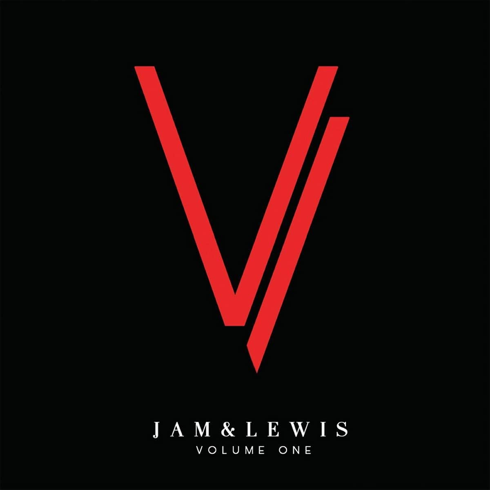

import { Slider, Button } from "carbon-components-react";
import { ArrowUpRight24 } from "@carbon/icons-react";

import SliderJS1 from "../review/slider1";
import SliderJS2 from "../review/slider2";
import SliderJS3 from "../review/slider3";
import SliderJS4 from "../review/slider4";
import AdvJS2 from "../review/adv2";
import AdvJS3 from "../review/adv3";

import { Link } from "gatsby";

Album review

<h1 className="h1--no--margin">{props.pageContext.frontmatter.title}</h1>

<Row  className="image-card-group">
	<Column colMd={"3"} colLg={"4"} noGutterMdLeft="">
       <ImageCard>

</ImageCard>
	</Column>
	<Column colMd={"4"} colLg={"8"} noGutterMdLeft="">
		

			80年代より活躍し、Produser TeamとしてR&B史を代表する輝かしい実績を築いてきたJam & Lewisの意外にも初リーダー作。GrammyのProducer Of The Yearにも最多11回ノミネートされている(受賞は1回)。
			 単なる懐古趣味的なアルバムだろうという先入観を大きく裏切る素晴らしい作品に仕上がっている。本人たちはProduce専門なので、人脈を駆使して、全曲、唄のGuestを迎えており、これが、これ以上望めない豪華なラインナップになっていて、しかも、全員が個性そのままに期待以上の仕事をしている。特にSounds Of BlackessやBoyz II Menあたりは懐かしい気もする。
			 Trackは、かつての王道R&Bそのもので、ファンクな曲、ソウルフルな曲、しっとりとしたバラードなど様々で、皆、きちんと作りこまれている。目新しさは皆無であるが、安定感は抜群で、たまにはこういうアルバムの良いと思う。
		

		

		  <Button className="button-right-mergin"  href="https://amzn.to/3E6gaQ7" kind="primary" size="small" renderIcon={ArrowUpRight24}>
  	    amazon.com
  	  </Button>
  	  <Button className="button-right-mergin"  href="https://amzn.to/3D7VWEh" kind="secondary" size="small" renderIcon={ArrowUpRight24}>
  	    amazon.co.jp
  	  </Button>
			<Button className="button-right-mergin"  href="https://apple.co/3o4tGOY" kind="tertiary" size="small" renderIcon={ArrowUpRight24}>
  	   	apple music
  	  </Button>
			<AdvJS2/>
		

	</Column>
</Row>
<Row >
	<Column colMd={"4"} colLg={"4"} noGutterMdLeft="">
		

		  <h3>Score card</h3>
			<SliderJS1 value="5" />
		  <SliderJS2 value="2" />
			<SliderJS3 value="1" />
		  <SliderJS4 value="9" />
		

	</Column>
	<Column colMd={"8"} colLg={"8"} noGutterMdLeft="">
		

			<h3>Producers</h3>
			

				Jimmy Jam and Terry Lewis(all)
			

			<h3>Guests</h3>
			

				Sounds Of Blackness, Mary J. Blige, Boyz II Men, Mariah Carey, Babyface, Toni Braxton, Heather Headley, Charlie Wilson, Usher, Morris Day & Jerome, The Roots
			

		

	</Column>
</Row>

<h3>Tracks</h3>

| No. | Title                                           | Composers                                                                                                                                                                                               | Performer                                     | Time  |
| --- | ----------------------------------------------- | ------------------------------------------------------------------------------------------------------------------------------------------------------------------------------------------------------- | --------------------------------------------- | ----- |
| 1   | Til I Found You                                 | Bobby Ross Avila / Issiah J. Avila / Leroy Bonner / James Harris III / Marshall Jones / Terry Lewis / Ralph Middlebrooks / Marvin Pierce / Clarence "Satch" Satchell / James Williams / James Q. Wright | Jam & Lewis x Sounds Of Blackness             | 05:16 |
| 2   | Spinnin                                         | Mary J. Blige / James Harris III / Terry Lewis                                                                                                                                                          | Jam & Lewis x Mary J. Blige                   | 03:49 |
| 3   | The Next Best Day                               | James Harris III / Terry Lewis / Nathan Morris / Wanya Morris / Shawn Stockman                                                                                                                          | Jam & Lewis x Boyz II Men                     | 05:06 |
| 4   | Somewhat Loved (There You Go Breakin' My Heart) | Mariah Carey / James Harris III / Terry Lewis / Terius Nash                                                                                                                                             | Jam & Lewis x Mariah Carey                    | 03:53 |
| 5   | He Don't Know Nothin' Bout It                   | Kenneth Edmonds / James Harris III / Terry Lewis                                                                                                                                                        | Jam & Lewis x Babyface                        | 05:28 |
| 6   | Happily Unhappy                                 | Toni Braxton / James Harris III / Terry Lewis                                                                                                                                                           | Jam & Lewis x Toni Braxton                    | 06:09 |
| 7   | Maybe I've Changed (Or Did You)                 | Heather Headley / James Harris III / Terry Lewis / James Q. Wright                                                                                                                                      | Jam & Lewis x Heather Headley                 | 04:46 |
| 8   | Do What I Do                                    | James Harris III / Terry Lewis / Charlie Wilson                                                                                                                                                         | Jam & Lewis x Charlie Wilson                  | 04:17 |
| 9   | Do It Yourself                                  | Bobby Ross Avila / Issiah J. Avila / James Harris III / Usher Raymond IV / Terry Lewis                                                                                                                  | Jam & Lewis x Usher                           | 04:36 |
| 10  | Babylove                                        | Malik Abdul-Basit / Jerome Benton / Morris Day / Kamal Gray / James Harris III / Terry Lewis / Ahmir Thompson / Tariq Trotter                                                                           | Jam & Lewis x Morris Day & Jerome + The Roots | 05:08 |
