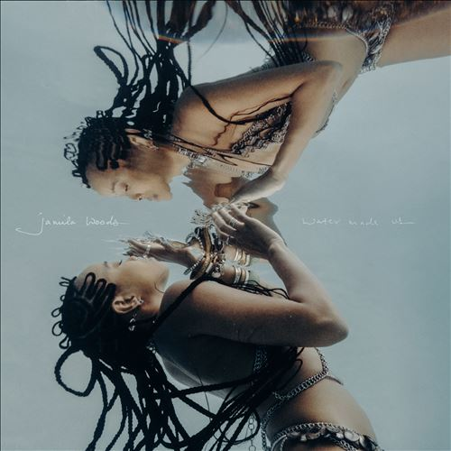

import { Slider, Button } from "@carbon/react";
import { ArrowUpRight } from "@carbon/icons-react";

import SliderJS1 from "./slider1";
import SliderJS2 from "./slider2";
import SliderJS3 from "./slider3";
import SliderJS4 from "./slider4";
import AdvJS2 from "../review/adv2";
import AdvJS3 from "../review/adv3";

import { Link } from "gatsby";

import Review1 from "./jamilawoods2.mdx";
import Review2 from "./jamilawoods1.mdx";

Album Review

<h1 className="h1--no--margin">{props.pageContext.frontmatter.title}</h1>

  <Link to="/best50/2023/">2023 Black Music Best No.47</Link>

<Row  className="image-card-group">
	<Column colMd={3} colLg={4} noGutterMdLeft="">
       <ImageCard>

</ImageCard>
	</Column>
	<Column colMd={4} colLg={8} noGutterMdLeft="">
		

			Jamila Woodsの4年振り2作目。引き続き、穏やかでオーガニックなソウルアルバムに仕上がっている。
			 スポークンワードや、モノローグが多用されてたり、Popで軽快な曲も数曲あったり、フォーキーな曲もあったりとバラエティには富んでいるが、全体は揺蕩うような優しいトーンで統一されている。
			 Guestは少なめだが、SabaやPeter Cottontaleなど地元勢のサポートを得ている。Vocalも引き続き、柔らかい声が温かみのあるもので、Lyricはよりパーソナルなものになっているが、暗さは感じられない。タイトルにあるように海に包まれているような印象の作品である。
		

		

		  <Button className="button-right-mergin"  href="https://amzn.to/3UugW4G" renderIcon={ArrowUpRight} size='sm' kind='primary'>
  	    amazon.com
  	  </Button>
  	  <Button className="button-right-mergin"  href="https://amzn.to/3UCmsSW" renderIcon={ArrowUpRight} size='sm' kind='secondary'>
  	    amazon.co.jp
  	  </Button>
			<Button className="button-right-mergin"  href="https://apple.co/3SAeyXB" renderIcon={ArrowUpRight} size='sm' kind='tertiary'>
  	    apple music
  	  </Button>
			<AdvJS2/>
		

	</Column>
</Row>
<Row >
	<Column colMd={4} colLg={4} noGutterMdLeft="">
		

		  <h3>Score card</h3>
			<SliderJS1 value="5" />
		  <SliderJS2 value="2" />
			<SliderJS3 value="1" />
		  <SliderJS4 value="9" />
		

	</Column>
	<Column colMd={8} colLg={8} noGutterMdLeft="">
		

			<h3>Producers</h3>
			

				Alissia Benveniste(1)
				 Wynne Bennett(2)
				 McClenney(3,9,11,14
				 McClenney, Peter Cottontale and Jamila Woods(5)
				 Peter Cottontale(6,7)
				 Gia Margaret and Jamila Woods(10)
				 GRADES and McClenney(13)
				 Biako(16)
				 Wynne Bennett(17)
			

			<h3>Guests</h3>
			

			

		

	</Column>
</Row>

<h3>Tracks</h3>

| No. | Title               | Composers                                                                        | Performer                           | Time  |
| --- | ------------------- | -------------------------------------------------------------------------------- | ----------------------------------- | ----- |
| 1   | Bugs                | Alissia Benveniste / Jasmin Charles / Homer Steinweiss / Jamila Woods            | Jamila Woods                        | 03:21 |
| 2   | Tiny Garden         | Wynne Bennett / Candace Camacho / Chris McClenney / Jamila Woods                 | Jamila Woods feat: Duendita         | 04:11 |
| 3   | Practice            | Chris McClenney / Saba / Jamila Woods                                            | Jamila Woods feat: Saba             | 03:14 |
| 4   | Let the Cards Fall  |                                                                                  | Jamila Woods                        | 00:43 |
| 5   | Send a Dove         | Chris McClenney / Peter Wilkins / Jamila Woods                                   | Jamila Woods                        | 03:56 |
| 6   | Wreckage Room       | Julian Reed / Peter Wilkins / Jamila Woods                                       | Jamila Woods                        | 03:19 |
| 7   | Thermostat          | Justin Canavan / Nate Fox / Shaan Ramaprasad / Peter Wilkins / Jamila Woods      | Jamila Woods feat: Peter CottonTale | 03:00 |
| 8   | Out of the Doldrums |                                                                                  | Jamila Woods                        | 00:36 |
| 9   | Wolfsheep           | Chris McClenney / Jamila Woods                                                   | Jamila Woods                        | 02:57 |
| 10  | I Miss All My Exes  | Gia Margaret / Nico Segal / Jamila Woods                                         | Jamila Woods                        | 01:57 |
| 11  | Backburner          | Chris McClenney / Jamila Woods                                                   | Jamila Woods                        | 03:29 |
| 12  | Libra Intuition     |                                                                                  | Jamila Woods                        | 00:14 |
| 13  | Boomerang           | Neo Jessica Joshua / Chris McClenney / George Moore / Dan Traynor / Jamila Woods | Jamila Woods                        | 03:02 |
| 14  | Still               | Wynne Bennett / Chris McClenney / Jamila Woods                                   | Jamila Woods                        | 03:02 |
| 15  | The Best Thing      |                                                                                  | Jamila Woods                        | 00:33 |
| 16  | Good News           | Jean Placide / Itai Shapira / Jamila Woods                                       | Jamila Woods                        | 03:03 |
| 17  | Headfirst           | Wynne Bennett / George Lewis Jr. / Jamila Woods                                  | Jamila Woods                        | 04:24 |

<h3>Other Reviews</h3>

<Row>
  <Column colMd={3} colLg={3} noGutterMdLeft>
    <Review1 />
  </Column>
</Row>
<Row>
  <Column colMd={3} colLg={3} noGutterMdLeft>
    <Review2 />
  </Column>
</Row>

<AdvJS3 />
