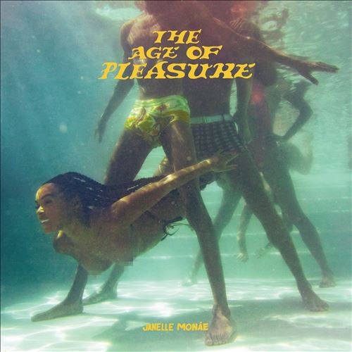

import { Slider, Button } from "@carbon/react";
import { ArrowUpRight } from "@carbon/icons-react";

import SliderJS1 from "../review/slider1";
import SliderJS2 from "../review/slider2";
import SliderJS3 from "../review/slider3";
import SliderJS4 from "../review/slider4";
import AdvJS2 from "../review/adv2";
import AdvJS3 from "../review/adv3";

import { Link } from "gatsby";

import Review1 from "../review/janellemonae3.mdx";

Album Review

<h1 className="h1--no--margin">{props.pageContext.frontmatter.title}</h1>

  <Link to="/best50/2023/">2023 Black Music Best No.7</Link>

<Row  className="image-card-group">
	<Column colMd={3} colLg={4} noGutterMdLeft="">
       <ImageCard>

</ImageCard>
	</Column>
	<Column colMd={4} colLg={8} noGutterMdLeft="">
		

			前作あたりで女性R&B Vocalの実力トップに上り詰めた感もあるJanelle Monáeの5年ぶり4作目。当作も、クオリティの高さを見せているが、長めにインターバルをとっていることが、好影響になってると思う。
			 制作は引き続き、Nate "Rocket" Wonder,が中心となり、相性の良さが良くわかるが、アルバムの全体感はガラッと変わっていて、レゲエ/ダンスホールやアフリカ的なリズムの曲が大半を占めており、純粋なR&B曲は無い。そのぶん、アーシーで、US以外の世界まで取り込んでいく意欲が感じられ、それはSean Kutiをはじめとするゲスト陣のセレクションにも現れている。
			 リズミカルでノリの良いが多数であり、快楽的なLyricも相俟って、コンセプト的には、一味違うパーティーアルバムを目指しているようだ。
		

		

		  <Button className="button-right-mergin"  href="https://amzn.to/3vnRenL" renderIcon={ArrowUpRight} size='sm' kind='primary'>
  	    amazon.com
  	  </Button>
  	  <Button className="button-right-mergin"  href="https://amzn.to/4aHjulH" renderIcon={ArrowUpRight} size='sm' kind='secondary'>
  	    amazon.co.jp
  	  </Button>
			<Button className="button-right-mergin"  href="https://apple.co/3SajfqX" renderIcon={ArrowUpRight} size='sm' kind='tertiary'>
  	    apple music
  	  </Button>
			<AdvJS2/>
		

	</Column>
</Row>
<Row >
	<Column colMd={4} colLg={4} noGutterMdLeft="">
		

		  <h3>Score card</h3>
			<SliderJS1 value="5" />
		  <SliderJS2 value="3" />
			<SliderJS3 value="1" />
		  <SliderJS4 value="9" />
		

	</Column>
	<Column colMd={8} colLg={8} noGutterMdLeft="">
		

			<h3>Producers</h3>
			

				Nate "Rocket" Wonder, Nana Kwabena and Sensei Bueno(1,3,4,5)
				 Nate "Rocket" Wonder(2,7,8,9,10,11,12,13)
				 Nate "Rocket" Wonder and Sensei Bueno(6,14)
				 Nana Kwabena(13)
			

			<h3>Guests</h3>
			

				Sean Kuti & Egypt 80, Grace Jones, Nia Long, Amaarae, Sister Nancy, CKay
			

		

	</Column>
</Row>

<h3>Tracks</h3>

| No. | Title             | Composers                                                                                                                                                                                                           | Performer                                     | Time  |
| --- | ----------------- | ------------------------------------------------------------------------------------------------------------------------------------------------------------------------------------------------------------------- | --------------------------------------------- | ----- |
| 1   | Float             | Jarrett Goodly / Nathaniel Irving III / Janelle Monáe Robinson / Nana Kwabena Tuffuor                                                                                                                               | Janelle Monáe feat. Sean Kuti & Egypt 80      | 03:59 |
| 2   | Champagne Shit    | Jarrett Goodly / Nathaniel Irving III / Barrington Levy / Janelle Monáe Robinson / Nana Kwabena Tuffuor                                                                                                             | Janelle Monáe                                 | 02:23 |
| 3   | Black Sugar Beach | Roman GianArthur / Jarrett Goodly / Nathaniel Irving III / Barrington Levy / Janelle Monáe Robinson / Nana Kwabena Tuffuor                                                                                          | Janelle Monáe                                 | 01:05 |
| 4   | Phenomenal        | Roman GianArthur / Jarrett Goodly / Jayalam Ji Maya Hickmon / Nathaniel Irving III / Janelle Monáe Robinson / Nana Kwabena Tuffuor                                                                                  | Janelle Monáe                                 | 03:37 |
| 5   | Haute             | Jarrett Goodly / Nathaniel Irving III / Janelle Monáe Robinson / Nana Kwabena Tuffuor                                                                                                                               | Janelle Monáe                                 | 01:36 |
| 6   | Ooh La La         | Jarrett Goodly / Nathaniel Irving III / Grace Jones / Janelle Monáe Robinson / Nana Kwabena Tuffuor                                                                                                                 | Janelle Monáe feat. Grace Jones               | 00:35 |
| 7   | Lipstick Lover    | Ewart Brown / Sensei Bueno / Clifton Dillon / Sly Dunbar / Richard Foulks / Brian Gold / Herbert Harris / Janelle Monáe Robinson / Leroy Romans / Handel Tucker / Nana Kwabena Tuffuor / Nate Wonder / Stevie Wonde | Janelle Monáe                                 | 02:49 |
| 8   | The Rush          | Ama Serwaa Genfi / Jarrett Goodly / Nathaniel Irving III / Janelle Monáe Robinson / Nana Kwabena Tuffuor                                                                                                            | Janelle Monáe feat. Nia Long, Amaarae         | 02:43 |
| 9   | The French 75     | Jarrett Goodly / Nathaniel Irving III / Janelle Monáe Robinson / Ophlin Russell / Nana Kwabena Tuffuor                                                                                                              | Janelle Monáe feat. Sister Nancy              | 01:09 |
| 10  | Water Slide       | Ewart Brown / Sensei Bueno / Clifton Dillon / Sly Dunbar / Richard Foulks / Brian Gold / Herbert Harris / Janelle Monáe Robinson / Leroy Romans / Handel Tucker / Nana Kwabena Tuffuor / Nate Wonder / Stevie Wonde | Janelle Monáe                                 | 02:44 |
| 11  | Know Better       | Chukwuka Ekweani / Nathaniel Irving III / Michael McEwan / Janelle Monáe Robinson                                                                                                                                   | Janelle Monáe feat. CKay, Sean Kuti & Egypt 8 | 02:49 |
| 12  | Paid in Pleasure  | Jarrett Goodly / Nathaniel Irving III / Janelle Monáe Robinson / Nana Kwabena Tuffuor / Emile Walcott                                                                                                               | Janelle Monáe                                 | 01:46 |
| 13  | Only Have Eyes 42 | Jarrett Goodly / Derrick Harriott / Nathaniel Irving III / Janelle Monáe Robinson / Nana Kwabena Tuffuor / Emile Walcott                                                                                            | Janelle Monáe                                 | 02:50 |
| 14  | A Dry Red         | Jarrett Goodly / Nathaniel Irving III / Janelle Monáe Robinson / Nana Kwabena Tuffuor                                                                                                                               | Janelle Monáe                                 | 01:51 |

<h3>Other Reviews</h3>

<Row>
  <Column colMd={3} colLg={3} noGutterMdLeft>
    <Review1 />
  </Column>
</Row>

<AdvJS3 />
