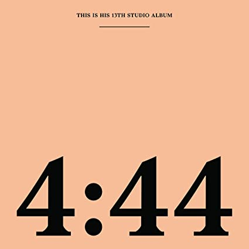

import { Slider, Button } from 'carbon-components-react';
import { ArrowUpRight24  } from '@carbon/icons-react';

import SliderJS1 from "../review/slider1"
import SliderJS2 from "../review/slider2"
import SliderJS3 from "../review/slider3"
import SliderJS4 from "../review/slider4"

import { Link } from "gatsby"

Album Review

<h1 className="h1--no--margin">{props.pageContext.frontmatter.title}</h1>

<Link to="/best50/2017/">2017 Black Music Album Best No.5</Link>

<Row  className="image-card-group">
	<Column colMd={"3"} colLg={"4"} noGutterMdLeft="">
       <ImageCard>

 
</ImageCard>
	</Column>
	<Column colMd={"4"} colLg={"8"} noGutterMdLeft="">
	

	Jay-Zの4年振り、13作目。Beyonceが前作のLemonodeで、Jay-Zの浮気を嘆いていたことに対するアンサー作的な位置づけになり、1曲目からKill Jay-ZとRapしたり、Beyonceや娘(Bonus Track)をGuestに起用したうえで、Family色を押し出した曲を後半に配置したりと、イメージ回復に躍起となっている。前作No IDによるTrackは、古めのソウル曲のサンプリングを多用しつつ、うまくまとめており、流石のQualityと統一感を生んでいる。弟子のKanyeの初期の作品を彷彿させる気もする。まあ、壮大な茶番劇といえないこともなく、こんなことまでビジネスに結びつけるJay-Zは流石の商売人だ思う。
	

	

	  <Button className="button-right-mergin"  href="https://amzn.to/2X6Bt0C" kind="primary" size="small" renderIcon={ArrowUpRight24}>
      amazon.com
    </Button>
    <Button className="button-right-mergin"  href="https://amzn.to/30UZ9Gt" kind="secondary" size="small" renderIcon={ArrowUpRight24}>
      amazon.co.jp
    </Button>
	

	
	
	</Column>
</Row>
<Row >
	<Column colMd={"4"} colLg={"4"} noGutterMdLeft="">

    <h3>Score card</h3>
	<SliderJS1 value="2" />
    <SliderJS2 value="1" />
	<SliderJS3 value="2" />
    <SliderJS4 value="8" />

</Column>
<Column colMd={"8"} colLg={"8"} noGutterMdLeft="">

<h3>Producers</h3>

No ID(all)

<h3>Guests</h3>

Gloria Carter, Frank Ocean, Beyonce, Damian Marley, Nina Simone

</Column>
</Row>

<h3>Tracks</h3>

| No. |	 Title            |	 Composers                                                                                                             	|	 Performer              | Time	|
| --- |	----------------- | ----------------------------------------------------------------------------------------------------------------------- | ------------------------- | ----- |
| 1	  |	Kill Jay-Z        | Shawn Carter / Alan Parsons / Dion Wilson / Eric Woolfson                                                              	| Jay-Z                    	| 02:58 |
| 2	  |	The Story of O.J. | Shawn Carter / Jimmy Crosby / Gene Redd / Nina Simone / Dion Wilson                                                    	| Jay-Z                    	| 03:52 |
| 3	  |	Smile             | Shawn Carter / Dion Wilson / Stevie Wonder                                                                             	| Jay-Z Feat. Gloria Carter	| 04:50 |
| 4	  |	Caught Their Eyes | Christopher Breaux / Shawn Carter / Randy Newman / Dion Wilson                                                         	| Jay-Z Feat. Frank Ocean  	| 03:26 |
| 5	  |	4:44	          | Shawn Carter / Kanan Keeney / Dion Wilson                                                                              	| Jay-Z                    	| 04:44 |
| 6	  |	Family Feud       | Shawn Carter / Elbernita Clark / Beyonc? Knowles / Dion Wilson                                                         	| Jay-Z Feat. Beyonce      	| 04:11 |
| 7	  |	Bam               | Shawn Carter / Roger Lewis / Damian Marley / Jacob Miller / Sister Nancy / Winston Riley / Ophlin Russell / Dion Wilson	| Jay-Z Feat. Damian Marley	| 03:55 |
| 8	  |	Moonlight         | Shawn Carter / Lauryn Hill / Wyclef Jean / Teena Marie / Allen McGrier / Pras Michel / Salaam Remi / Dion Wilson       	| Jay-Z                    	| 02:24 |
| 9	  |	Marcy Me          | T?z? Brito / Shawn Carter / Jos? Cid / Terius Nash / Dion Wilson                                                       	| Jay-Z                    	| 02:54 |
| 10  |	Legacy            | Shawn Carter / Donny Hathaway / Edward Howard / Dion Wilson                                                            	| Jay-Z                    	| 02:57 |
