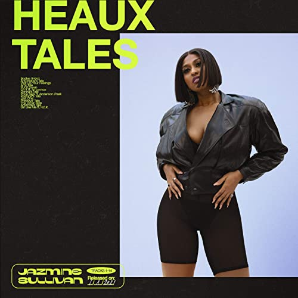

import { Slider, Button } from "carbon-components-react";
import { ArrowUpRight24 } from "@carbon/icons-react";

import SliderJS1 from "../review/slider1";
import SliderJS2 from "../review/slider2";
import SliderJS3 from "../review/slider3";
import SliderJS4 from "../review/slider4";

import { Link } from "gatsby";

Album Review

<h1 className="h1--no--margin">{props.pageContext.frontmatter.title}</h1>

  <Link to="/best50/2021/">2021 Black Music Best No.4</Link>

<Row  className="image-card-group">
	<Column colMd={"3"} colLg={"4"} noGutterMdLeft="">
       <ImageCard>

</ImageCard>
	</Column>
	<Column colMd={"4"} colLg={"8"} noGutterMdLeft="">
	

	Jazmine Sullivanの約6年ぶりの4作目。ダイエットに成功したそうで、ジャケットを見ると顔がシュッとして、若返ったように思える。(といっても、まだ33歳)。
   そんなジャケットからは手抜き感を感じるが、内容も、良い意味で抜きがあり、敢えて最小限の伴奏で最大限のグルーブを醸し出している。Guiterが効果的で、生楽器の強みを活かしたゆったりとしたTrackに、Jazmineの力強いVocalが何とも心地よく、癖になる。
   出自であるGospelの影響も唄いまわしやコーラスで強く感じることができる。14曲中6曲はInterrude的な女性によるモノローグになっていて、自己肯定のようなことが語られており、全体としてはコンセプチャルな作品になっている。
   ただ音楽面だけでもクオリティは相当高いと思うし、個人的には、かなりハマってます。
  

  

	  <Button className="button-right-mergin"  href="https://amzn.to/3kS7qnT" kind="primary" size="small" renderIcon={ArrowUpRight24}>
      amazon.com
    </Button>
    <Button className="button-right-mergin"  href="https://amzn.to/3v2oT1A" kind="secondary" size="small" renderIcon={ArrowUpRight24}>
      amazon.co.jp
    </Button>
    <Button className="button-right-mergin"  href="https://apple.co/38fRSFB" kind="tertiary" size="small" renderIcon={ArrowUpRight24}>
      apple music
    </Button>
	

  </Column>
</Row>
<Row >
  <Column colMd={"4"} colLg={"4"} noGutterMdLeft="">
    

      <h3>Score card</h3>
	    <SliderJS1 value="5" />
      <SliderJS2 value="2" />
	    <SliderJS3 value="1" />
      <SliderJS4 value="9" />
    

  </Column>
  <Column colMd={"4"} colLg={"8"} noGutterMdLeft="">
    

      <h3>Producers</h3>
      

        Key Wane(1,5)
         DZL(3)
         Cardiak, WU10(6)
         JMO(8)
         Dave "Pop" Watson(10)
         Dilemma, Joe Logix and Gee(12)
         Bongo ByThwWay(14)
      

      <h3>Guests</h3>
      

        Ari Lennox, Anderson.Paak, H.E.R.
      

    

  </Column>
</Row>

<h3>Tracks</h3>

| No. | Title                 | Composers                                                                                         | Performer                            | Time  |
| --- | --------------------- | ------------------------------------------------------------------------------------------------- | ------------------------------------ | ----- |
| 1   | Bodies (Intro)        | Dwane Weir II / Jazmine Sullivan                                                                  | Jazmine Sullivan                     | 02:02 |
| 2   | Antoinette's Tale     | Banda NÃ                                                                                          | Jazmine Sullivan                     | 00:37 |
| 3   | Pick Up Your Feelings | Denisia Andrews / Audra Butts / Kyle Coleman / Brittany Coney / Michael Holmes / Jazmine Sullivan | Jazmine Sullivan                     | 03:49 |
| 4   | Ari's Tale            | Ari Lennox                                                                                        | Jazmine Sullivan feat. Ari Lennox    | 00:50 |
| 5   | Put It Down           | Dwane Weir II / Jazmine Sullivan / Jason Vaughn                                                   | Jazmine Sullivan                     | 03:21 |
| 6   | On It                 | Carl McCormick / Courtney Salter / Jazmine Sullivan / Kelvin Wooten                               | Jazmine Sullivan feat. Ari Lennox    | 03:25 |
| 7   | Donna's Tale          | Banda NÃ                                                                                          | Jazmine Sullivan                     | 01:10 |
| 8   | Pricetags             | Brandon Anderson / Jairus Mozee / Jazmine Sullivan                                                | Jazmine Sullivan feat. Anderson.Paak | 04:24 |
| 9   | Rashida's Tale        | Banda NÃ                                                                                          | Jazmine Sullivan                     | 01:10 |
| 10  | Lost One              | Dave Watson, Jr. / Jazmine Sullivan                                                               | Jazmine Sullivan                     | 02:59 |
| 11  | Precious' Tale        | Banda NÃ                                                                                          | Jazmine Sullivan                     | 00:43 |
| 12  | The Other Side        | Joe Gallagher / Jazmine Sullivan / Dan Thomas / Sam Wishkoski / Matt Wong                         | Jazmine Sullivan                     | 03:33 |
| 13  | Amanda's Tale         | Banda NÃ                                                                                          | Jazmine Sullivan                     | 00:38 |
| 14  | Girl Like Me          | Tarron Crayton / Uforo Ebong / Stephen Feigenbaum / H.E.R. / Jazmine Sullivan                     | Jazmine Sullivan feat. H.E.R.        | 03:45 |
