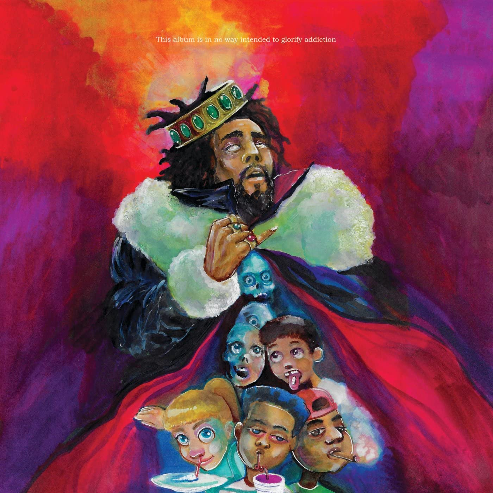

import { Slider, Button } from "carbon-components-react";
import { ArrowUpRight24 } from "@carbon/icons-react";

import SliderJS1 from "../review/slider1";
import SliderJS2 from "../review/slider2";
import SliderJS3 from "../review/slider3";
import SliderJS4 from "../review/slider4";

import { Link } from "gatsby";

import Review1 from "../review/jcole4.mdx";

Album Review

<h1 className="h1--no--margin">{props.pageContext.frontmatter.title}</h1>

  <Link to="/best50/2018/">2018 Black Music Best No.43</Link>

<Row  className="image-card-group">
	<Column colMd={"3"} colLg={"4"} noGutterMdLeft="">
       <ImageCard>

</ImageCard>
	</Column>
	<Column colMd={"4"} colLg={"8"} noGutterMdLeft="">
	

	J. Coleの2年ぶりとなる5作目。Sportifyのリリース初日ストリーミング数の記録を樹立するなど、多くの注目を集めている。
	 アルバムタイトルは”Kidz On Drugz”, “King Overdose”, ”Kill Our Demonz”の3つの意味を持つらしく、Art Workもそんな感じになっている。というように、強いメッセージが込められたアルバムであり、Drug, SNS, 金に囚われることから逃れることを訴えている。
	 また⑦では友人であるコメディ俳優kevin Hartの不貞にも触れている。このようにLyricに注目が集まっているが、Trackはほぼ本人によるProduceで、Sampling中心のJazzyでゆったりと落ち着いたものになっている。
	 FeaturingでクレジットされているKill Edwardとは、J.Coleの別名であり、極めて私的な作品とも言える。
	

	

	  <Button className="button-right-mergin"  href="https://amzn.to/3dHN8bQ" kind="primary" size="small" renderIcon={ArrowUpRight24}>
      amazon.com
    </Button>
    <Button className="button-right-mergin"  href="https://amzn.to/3i98KBc" kind="secondary" size="small" renderIcon={ArrowUpRight24}>
		  amazon.co.jp
    </Button>
	

	
	</Column>
</Row>
<Row >
	<Column colMd={"4"} colLg={"4"} noGutterMdLeft="">

  <h3>Score card</h3>
	<SliderJS1 value="2" />
  <SliderJS2 value="1" />
	<SliderJS3 value="1" />
  <SliderJS4 value="8" />

</Column>
<Column colMd={"8"} colLg={"8"} noGutterMdLeft="">

<h3>Producers</h3>

	J. Cole(1,2,3,5,6,8.9.10.11.12)
	 J. Cole and BLVK(4)
	 T-Minus(7)

<h3>Guests</h3>

</Column>
</Row>

<h3>Tracks</h3>

| No. | Title                          | Composers                                                                                    | Performer                  | Time  |
| --- | ------------------------------ | -------------------------------------------------------------------------------------------- | -------------------------- | ----- |
| 1   | Intro                          | Jermaine Cole, Richard Clay, Carl Clay, Wayne Garfield                                       | J. Cole                    | 01:47 |
| 2   | KOD                            | Jermaine Cole                                                                                | J. Cole                    | 03:11 |
| 3   | Photograph                     | Jermaine Cole, Raymond Evans, Jay Livingston, Francis Hime                                   | J. Cole                    | 03:38 |
| 4   | The Cut Off                    | Jermaine Cole, Kill Edward, Bill Withers, Takehiro Honda                                     | J. Cole feat,. Kill Edward | 03:57 |
| 5   | ATM                            | Jermaine Cole, Nicholas Brodszky, ]Sammy Cahn                                                | J. Cole                    | 03:36 |
| 6   | Motiv8                         | Jermaine Cole, Roy Ayers, James Bedford, Lamont Porter, Sylvia Striplin, Christopher Wallace | J. Cole                    | 02:13 |
| 7   | Kevin's Heart                  | Jermaine Cole, Tyler Williams, Mark Pellizzer                                                | J. Cole                    | 03:20 |
| 8   | Brackets                       | Jermaine Cole, Richard Pryor, Marilyn Bergman, Alan Bergman, Quincy Jones                    | J. Cole                    | 05:15 |
| 9   | Once an Addict (Interlude)     | Jermaine Cole, Ron Gilmore, Micha? Urbaniak                                                  | J. Cole                    | 03:17 |
| 10  | Friends                        | Jermaine Cole, Kill Edward, John Dankworth                                                   | J. Cole feat,. Kill Edward | 04:17 |
| 11  | Window Pain (Outro)            | Jermaine Cole, Kill Edward                                                                   | J. Cole                    | 04:46 |
| 12  | 1985 (Intro to "The Fall Off") | Jermaine Cole, Jorge Barreiro                                                                | J. Cole                    | 03:10 |

<h3>Other Reviews</h3>

<Row>
  <Column colMd={3} colLg={3} noGutterMdLeft>
    <Review1 />
  </Column>
</Row>

