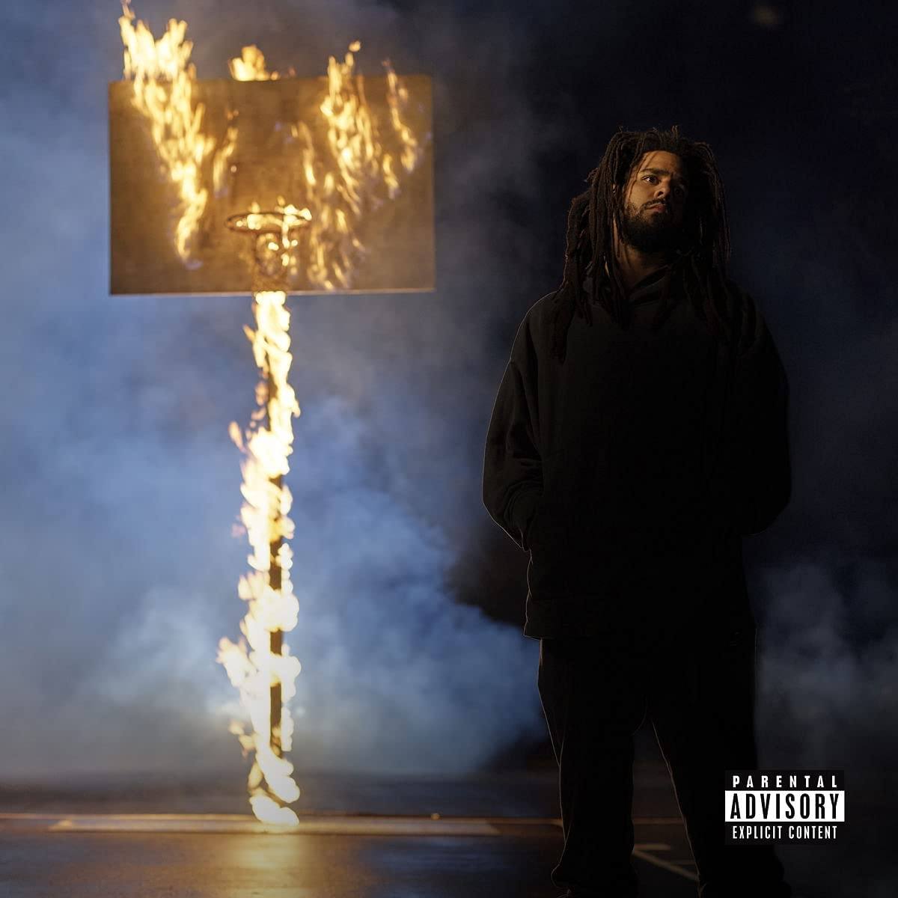

import { Slider, Button } from "carbon-components-react";
import { ArrowUpRight24 } from "@carbon/icons-react";

import SliderJS1 from "../review/slider1";
import SliderJS2 from "../review/slider2";
import SliderJS3 from "../review/slider3";
import SliderJS4 from "../review/slider4";
import AdvJS2 from "../review/adv2";
import AdvJS3 from "../review/adv3";

import { Link } from "gatsby";

import Review1 from "../review/jcole3.mdx";

Album Review

<h1 className="h1--no--margin">{props.pageContext.frontmatter.title}</h1>

  <Link to="/best50/2021/">2021 Black Music Best No.7</Link>

<Row  className="image-card-group">
	<Column colMd={"3"} colLg={"4"} noGutterMdLeft="">
       <ImageCard>

</ImageCard>
	</Column>
	<Column colMd={"4"} colLg={"8"} noGutterMdLeft="">
	

		今や、Top Rapperの一人となったJ. Coleの3年ぶりとなる6作目。タイトルはプロスポーツなど使われるOff-Seasonのことで、休みをとって本番に備えて研ぎ澄ますみたいな意味のようだ。なので、過去の作品とは様相が違っていて、まずは外部ProducerやGuestを多く迎えている点があり、おかげで以前よりOpenな印象を受ける。
		 LyricもStory Tellingな作風から、言葉遊びや高度なライムの組み立てに比重を移している。全体的にTrackは手堅いつくりのゆるめな感触で、メロウなものが多数。
		 Rapでは、さらに磨かれた高度なスキルを披露しており、余裕をも感じさせる。派手さは無いが、プロ好み、ディープなファン好みの作品である。
	

	

	  <Button className="button-right-mergin"  href="https://amzn.to/2YELFBG" kind="primary" size="small" renderIcon={ArrowUpRight24}>
      amazon.com
    </Button>
    <Button className="button-right-mergin"  href="https://amzn.to/3FDOeV5" kind="secondary" size="small" renderIcon={ArrowUpRight24}>
      amazon.co.jp
    </Button>
		<Button className="button-right-mergin"  href="https://apple.co/30kMVKA" kind="tertiary" size="small" renderIcon={ArrowUpRight24}>
      apple music
    </Button>
		<AdvJS2/>
	

	</Column>
</Row>
<Row >
	<Column colMd={"4"} colLg={"4"} noGutterMdLeft="">
	

	  <h3>Score card</h3>
		<SliderJS1 value="2" />
	  <SliderJS2 value="2" />
		<SliderJS3 value="1" />
	  <SliderJS4 value="9" />
	

</Column>
<Column colMd={"8"} colLg={"8"} noGutterMdLeft="">

	<h3>Producers</h3>
	

		Boi-1da and Coleman(1)
		 Timbaland and Sucuki(2)
		 Jake One and J. Cole(3)
		 J. Cole(4,10,11)
		 TacBeast and Mario Luciano(5)
		 J. Cole and T-Minus(6)
		 T-Minus(7)
		 DJ Dahi and Frank Dukes(8)
		 J. Cole, T-Minus and Tommy Parker(9)
		 Boi-1da, DrtWrk and Don Mills(12)
	

	<h3>Guests</h3>
	

		Morray, 21 Savage, 6Lack, Bas, Lil Baby
	

</Column>
</Row>

<h3>Tracks</h3>

| No. | Title                               | Composers                                                  | Performer                        | Time  |
| --- | ----------------------------------- | ---------------------------------------------------------- | -------------------------------- | ----- |
| 1   | 9 5 . s o u t h                     | J. Cole                                                    | J. Cole                          | 03:17 |
| 2   | a m a r i                           | J. Cole                                                    | J. Cole                          | 02:28 |
| 3   | m y . l i f e                       | J. Cole / 21 Savage                                        | J. Cole feat: Morray / 21 Savage | 03:39 |
| 4   | a p p l y i n g . p r e s s u r e   | J. Cole                                                    | J. Cole                          | 02:57 |
| 5   | p u n c h i n ‘ . t h e . c l o c k | J. Cole                                                    | J. Cole                          | 01:52 |
| 6   | 1 0 0 . m i l ‘                     | J. Cole                                                    | J. Cole feat: Bas                | 02:43 |
| 7   | p r i d e . i s . t h e . d e v i l | Lil Baby / J. Cole                                         | J. Cole feat: Lil Baby           | 03:38 |
| 8   | l e t . g o . m y . h a n d         | Bas / J. Cole                                              | J. Cole feat: 6LACK / Bas        | 04:26 |
| 9   | i n t e r l u d e                   | J. Cole                                                    | J. Cole                          | 02:11 |
| 10  | The c l i m b . b a c k             | Maximilian Axelrod / Gary Bailey / Montey Bailey / J. Cole | J. Cole                          | 05:05 |
| 11  | c l o s e                           | J. Cole                                                    | J. Cole                          | 02:49 |
| 12  | h u n g e r . o n . h i l l s i d e | J. Cole                                                    | J. Cole feat: Bas                | 03:59 |

<h3>Other Reviews</h3>

<Row>
  <Column colMd={3} colLg={3} noGutterMdLeft>
    <Review1 />
  </Column>
</Row>

<AdvJS3 />
