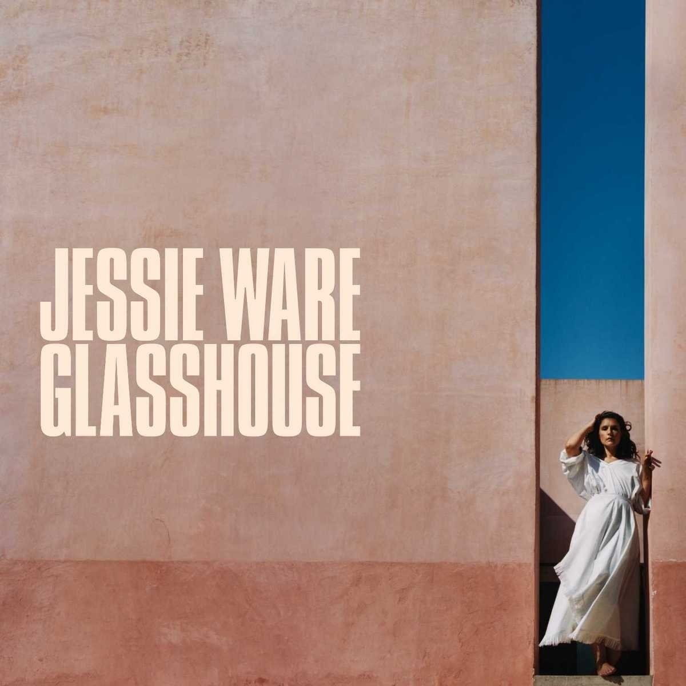

import { Slider, Button } from 'carbon-components-react';
import { ArrowUpRight24  } from '@carbon/icons-react';

import SliderJS1 from "../review/slider1"
import SliderJS2 from "../review/slider2"
import SliderJS3 from "../review/slider3"
import SliderJS4 from "../review/slider4"

import { Link } from "gatsby"

import Review1 from "../review/jessieware4.mdx"

Album Review

<h1 className="h1--no--margin">{props.pageContext.frontmatter.title}</h1>

<Link to="/best50/2017/">2017 Black Music Album Best No.44</Link>

<Row  className="image-card-group">
	<Column colMd={"3"} colLg={"4"} noGutterMdLeft="">
       <ImageCard>

 
</ImageCard>
	</Column>
	<Column colMd={"4"} colLg={"8"} noGutterMdLeft="">
	

	UKの歌姫Jessie Wareの3年ぶりとなる3作目。前作以降、幼馴染(⑪のタイトルとなっているSamさん)との結婚、出産と私生活での順調さを持ち込んだような穏やかで落ち着いた作品である。曲もスロー中心で包み込むようで揺蕩うような暖かさを感じさせるものが多く、今まで以上に普遍的なVocalアルバムに仕上がっている。Jessieのささやくようなシーツ声の艶も増して、美メロとの相性も良く、耳に心地よい。Ed Sheeran参加の⑪なんか、ほんと、沁みてくる。
	

	

	  <Button href="https://amzn.to/3h9Sxul" kind="primary" size="small" renderIcon={ArrowUpRight24}>
      amazon.com
    </Button>
    <Button href="https://amzn.to/3ew3vsp" kind="secondary" size="small" renderIcon={ArrowUpRight24}>
      amazon.co.jp
    </Button>
	

	
	
	</Column>
</Row>
<Row >
	<Column colMd={"4"} colLg={"4"} noGutterMdLeft="">

  <h3>Score card</h3>
	<SliderJS1 value="5" />
  <SliderJS2 value="1" />
	<SliderJS3 value="1" />
  <SliderJS4 value="8" />

</Column>
<Column colMd={"8"} colLg={"8"} noGutterMdLeft="">

<h3>Producers</h3>

Carassius Gold(1)
 Kid Harpoon(2)
 Stint(3,4)
 Stint and Kid Harpoon(5)
 Benny Blanco(6,12)
 Starsmith(7)
 Benny Blanco and Two Inch Punch(8)
 Fred Ball(9)
 Julian Bunetta and John Ryan(10)
 Hugo White(11)

<h3>Guests</h3>

Paul Buchanan

</Column>
</Row>

<h3>Tracks</h3>

| No. |	 Title                                 	|	 Composers                                                                                                                                                                |	 Performer             | Time  |
| --- |	--------------------------------------- | --------------------------------------------------------------------------------------------------------------------------------------------------------------------------- | ---------------------- | ----- |
| 1	  |	My Collection                          	| Nayvadius Wilburn, Leland Wayne, Kevin Gomringer, Tim Gomringer                                                                                                             |	Future                 | 04:15 |
| 2	  |	Comin Out Strong (featuring The Weeknd)	| Nayvadius Wilburn, Kevin Vincent, Noel Fisher, Henry Walter, Abel Tesfaye, Ahmad Balshe                                                                                     |	Future ft. The Weeknd  | 04:14 |
| 3	  |	Lookin Exotic                          	| Nayvadius Wilburn, Joshua Luellen, Jacob Dutton, Kendricke Brown, Andrew Mayer Cohen                                                                                        |	Future                 | 03:46 |
| 4	  |	Damage                                 	| Nayvadius Wilburn, Dijon McFarlane, Te Whiti Warbrick, Nick Audino, Lewis Hughes, Khaled Rohaim, Noel Fisher, Gene Griffin, Teddy Riley, Aaron Robin Hall, William Gaitling |	Future                 | 03:57 |
| 5	  |	Use Me                                 	| Nayvadius Wilburn, Noel Fisher, Sidney Swift, Justin Bradley, Ruben Raymond, Justin Rodriguez                                                                               |	Future                 | 04:16 |
| 6	  |	Incredible                             	| Nayvadius Wilburn, Andre Proctor, William Moore, Ngandu Andy Kabamba                                                                                                        |	Future                 | 04:08 |
| 7	  |	Testify                                	| Nayvadius Wilburn, Joshua Luellen                                                                                                                                           |	Future                 | 02:58 |
| 8	  |	Fresh Air                              	| Nayvadius Wilburn, Omar Walker, Noel Fisher, Evan Smith, Benjahmin Singh-Reynolds                                                                                           |	Future                 | 04:30 |
| 9	  |	Neva Missa Lost                        	| Nayvadius Wilburn, Noel Fisher, Omar Walker, Xeryus Gittens, Donald DeGrate, Cedric Hailey                                                                                  |	Future                 | 03:58 |
| 10  |	Keep Quiet                             	| Nayvadius Wilburn, Gary Hill, Kendricke Brown                                                                                                                               |	Future                 | 03:22 |
| 11  |	Hallucinating                          	| Nayvadius Wilburn, Andre Proctor                                                                                                                                            |	Future                 | 03:41 |
| 12  |	I Thank U                              	| Nayvadius Wilburn, Wesley Glass                                                                                                                                             |	Future                 | 02:21 |
| 13  |	New Illuminati                         	| Nayvadius Wilburn, Dwan Avery, Shawn Kyles                                                                                                                                  |	Future                 | 03:01 |
| 14  |	Turn On Me                             	| Nayvadius Wilburn, Kelvin Brown, Joshua Luellen                                                                                                                             |	Future                 | 04:24 |
| 15  |	Selfish (featuring Rihanna)            	| Nayvadius Wilburn, Noel Fisher, Omar Walker, Evan Smith, Robyn Fenty                                                                                                        |	Future ft. Rihanna     | 04:11 |
| 16  |	Solo                                   	| Nayvadius Wilburn, Andre Proctor                                                                                                                                            |	Future                 | 04:26 |
| 17  |	Sorry                                  	| Nayvadius Wilburn, Leland Wayne, K. Gomringer, T. Gomringer                                                                                                                 |	Future                 | 07:31 |
| 18  |	Pie (featuring Chris Brown)            	| Nayvadius Wilburn, Noel Fisher, David Doman, Christopher Brown, Justin Thomas, Jim Stewart, Thomas Klotz                                                                    |	Future ft. Chris Brown | 03:31 |
| 19  |	You da Baddest (featuring Nicki Minaj) 	| Nayvadius Wilburn, Onika Maraj, Noel Fisher, Andre Price                                                                                                                    |	Future ft. Nicki Minaj | 04:01 |

<h3>Other Reviews</h3>

<Row>
<Column colMd={3} colLg={3} noGutterMdLeft>
<Review1 />
</Column>
</Row>