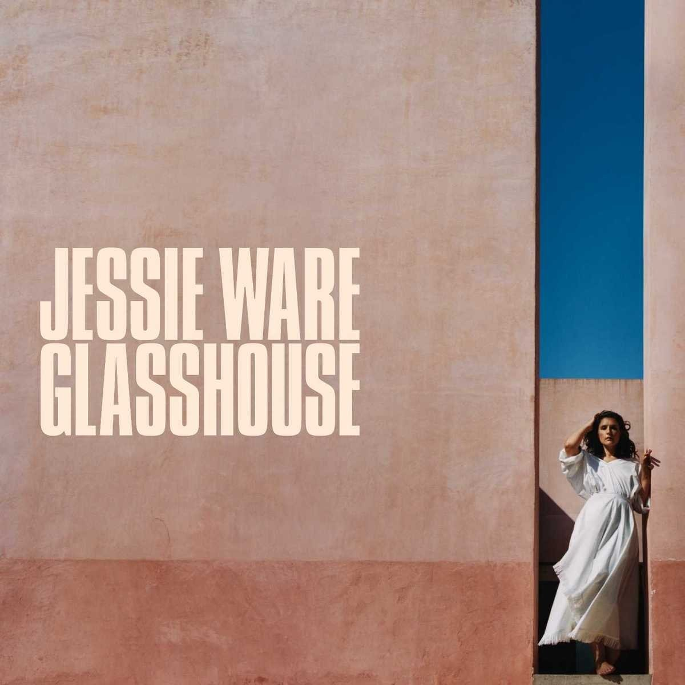

import { Slider, Button } from "@carbon/react";
import { ArrowUpRight } from "@carbon/icons-react";

import SliderJS1 from "../review/slider1";
import SliderJS2 from "../review/slider2";
import SliderJS3 from "../review/slider3";
import SliderJS4 from "../review/slider4";
import AdvJS2 from "../review/adv2";
import AdvJS3 from "../review/adv3";

import { Link } from "gatsby";

import Review1 from "../review/jessieware5.mdx";
import Review2 from "../review/jessieware4.mdx";

Album Review

<h1 className="h1--no--margin">{props.pageContext.frontmatter.title}</h1>

	<Link to="/best50/2017/">2017 Black Music Album Best No.44</Link>

<Row className="image-card-group">
	<Column colMd={3} colLg={4} noGutterMdLeft="">
		<ImageCard>

		</ImageCard>
	</Column>
	<Column colMd={4} colLg={8} noGutterMdLeft="">
		

			UKの歌姫Jessie Wareの3年ぶりとなる3作目。前作以降、幼馴染(⑪のタイトルとなっているSamさん)との結婚、出産と私生活での順調さを持ち込んだような穏やかで落ち着いた作品である。
			 曲もスロー中心で包み込むようで揺蕩うような暖かさを感じさせるものが多く、今まで以上に普遍的なVocalアルバムに仕上がっている。
			 Jessieのささやくようなシーツ声の艶も増して、美メロとの相性も良く、耳に心地よい。Ed Sheeran参加の⑪なんか、ほんと、沁みてくる。
		

		

			<Button className="button-right-mergin" href="https://amzn.to/3h9Sxul" renderIcon={ArrowUpRight} size='sm' kind='primary'>
				amazon.com
			</Button>
			<Button className="button-right-mergin" href="https://amzn.to/3ew3vsp" renderIcon={ArrowUpRight} size='sm' kind='secondary'>
				amazon.co.jp
			</Button>
			<Button className="button-right-mergin" href="https://apple.co/3wOT6al" renderIcon={ArrowUpRight} size='sm' kind='tertiary'>
				apple music
			</Button>
			<AdvJS2/>
		

	</Column>
</Row>
<Row>
	<Column colMd={4} colLg={4} noGutterMdLeft="">
		

			<h3>Score card</h3>
			<SliderJS1 value="5" />
			<SliderJS2 value="1" />
			<SliderJS3 value="1" />
			<SliderJS4 value="8" />
		

	</Column>
	<Column colMd={8} colLg={8} noGutterMdLeft="">
		

			<h3>Producers</h3>
			

				Carassius Gold(1)
				 Kid Harpoon(2)
				 Stint(3,4)
				 Stint and Kid Harpoon(5)
				 Benny Blanco(6,12)
				 Starsmith(7)
				 Benny Blanco and Two Inch Punch(8)
				 Fred Ball(9)
				 Julian Bunetta and John Ryan(10)
				 Hugo White(11)
			

			<h3>Guests</h3>
			

				Paul Buchanan
			

		

	</Column>
</Row>

<h3>Tracks</h3>

| No. | Title                      | Composers                                                                                                                           | Performer                     | Time  |
| --- | -------------------------- | ----------------------------------------------------------------------------------------------------------------------------------- | ----------------------------- | ----- |
| 1   | Midnight                   | Bastian Langebæk / Jordan Thomas / Kiah Victoria / Andrew Wansel / Jessie Ware                                                      | Jessie Ware                   | 03:57 |
| 2   | Thinking About You         | Thomas Hull / Jessie Ware                                                                                                           | Jessie Ware                   | 03:29 |
| 3   | Stay Awake, Wait for Me    | Ajay Bhattacharyya / Danny Parker / Jessie Ware                                                                                     | Jessie Ware                   | 03:36 |
| 4   | Your Domino                | Ajay Bhattacharyya / Danny Parker / Daniel Schnair / Jessie Ware                                                                    | Jessie Ware                   | 03:47 |
| 5   | Alone                      | Sarah Aarons / Thomas Hull / Jessie Ware                                                                                            | Jessie Ware                   | 03:37 |
| 6   | Selfish Love               | Ross Golan / Magnus August Høiberg / Benjamin Levin / Ammar Malik / Nathan Perez / Ryan Tedder / Jessie Ware                        | Jessie Ware                   | 03:58 |
| 7   | First Time                 | Fin Dow-Smith / James Newman / Jessie Ware                                                                                          | Jessie Ware                   | 04:06 |
| 8   | Hearts                     | Benjamin Ash / Benjamin Levin / Julia Michaels / Jessie Ware                                                                        | Jessie Ware                   | 03:34 |
| 9   | Slow Me Down               | Frederik Ball / Nina Nesbitt / Sam Preston / Jessie Ware                                                                            | Jessie Ware                   | 03:24 |
| 10  | Finish What We Started     | Julian Bunetta / John Ryan / Jamie Scott / Jessie Ware                                                                              | Jessie Ware                   | 03:49 |
| 11  | Last of the True Believers | Paul Buchanan / Liam Howe / Jessie Ware / Felix White / Hugo White                                                                  | Jessie Ware ft. Paul Buchanan | 03:53 |
| 12  | Sam                        | Dave Christopher / Benjamin Levin / Dave Okumu / Pino Palladino / Nico Segal / Ed Sheeran / Francis Farewell Starlite / Jessie Ware | Jessie Ware                   | 05:16 |

<h3>Other Reviews</h3>

<Row>
	<Column colMd={3} colLg={3} noGutterMdLeft>
		<Review1 />
	</Column>
	<Column colMd={3} colLg={3} noGutterMdLeft>
		<Review2 />
	</Column>
</Row>

<AdvJS3 />
