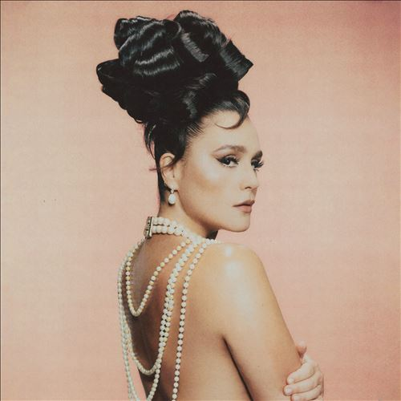

import { Slider, Button } from "@carbon/react";
import { ArrowUpRight } from "@carbon/icons-react";

import SliderJS1 from "../review/slider1";
import SliderJS2 from "../review/slider2";
import SliderJS3 from "../review/slider3";
import SliderJS4 from "../review/slider4";
import AdvJS2 from "../review/adv2";
import AdvJS3 from "../review/adv3";

import { Link } from "gatsby";

import Review1 from "../review/jessieware4.mdx";
import Review2 from "../review/jessieware3.mdx";

Album Review

<h1 className="h1--no--margin">{props.pageContext.frontmatter.title}</h1>

  <Link to="/best50/2023/">2023 Black Music Best No.12</Link>

<Row  className="image-card-group">
	<Column colMd={3} colLg={4} noGutterMdLeft="">
       <ImageCard>

</ImageCard>
	</Column>
	<Column colMd={4} colLg={8} noGutterMdLeft="">
		

			Jessie Wareの3年ぶりとなる5作目。前作でDance/Pop方面に大きく舵をきったが、そちらの路線を突き詰めていて、ほぼディスコと言ってよさそう。
			 ダンサブルでノリの良いTrackが続き、アラファーにして、一層、若々しく、明るくなっている。
			 Produceは前作から引き続きのJames Fordに加え、古くはMadonna, 最近ではRina Sawayama, Dua Lipaなどとも組んでいるStuart Priceが4曲を担当しており、サウンドはStringsを多用し、あくまでもゴージャスで煌びやか、LyricもPositiveなものが多そうだ。
			 Jessieの唄は、以前に比べ、はっきりと強めに声を張っており、特に高音の伸びが素晴らしい。
			

		

		  <Button className="button-right-mergin"  href="https://amzn.to/3Mnwhze" renderIcon={ArrowUpRight} size='sm' kind='primary'>
  	    amazon.com
  	  </Button>
  	  <Button className="button-right-mergin"  href="https://amzn.to/40jyyRH" renderIcon={ArrowUpRight} size='sm' kind='secondary'>
  	    amazon.co.jp
  	  </Button>
			<Button className="button-right-mergin"  href="https://apple.co/49ejJUB" renderIcon={ArrowUpRight} size='sm' kind='tertiary'>
  	    apple music
  	  </Button>
			<AdvJS2/>
		

	</Column>
</Row>
<Row >
	<Column colMd={4} colLg={4} noGutterMdLeft="">
		

		  <h3>Score card</h3>
			<SliderJS1 value="5" />
		  <SliderJS2 value="1" />
			<SliderJS3 value="1" />
		  <SliderJS4 value="9" />
		

	</Column>
	<Column colMd={8} colLg={8} noGutterMdLeft="">
		

			<h3>Producers</h3>
			

				James Ford(1,4,5,6,8,10)
				 Stuart Price(2,3,7,9)
			

			<h3>Guests</h3>
			

			

		

	</Column>
</Row>

<h3>Tracks</h3>

| No. | Title             | Composers                                                        | Performer   | Time  |
| --- | ----------------- | ---------------------------------------------------------------- | ----------- | ----- |
| 1   | That! Feels Good! | James Ford / Shungudzo Kuyimba / Danny Parker / Jessie Ware      | Jessie Ware | 04:23 |
| 2   | Free Yourself     | Clarence Coffee, Jr. / Stuart Price / Jessie Ware                | Jessie Ware | 03:54 |
| 3   | Pearls            | Sarah Hudson / Clarence Coffee, Jr. / Stuart Price / Jessie Ware | Jessie Ware | 04:03 |
| 4   | Hello Love        | James Ford / Shungudzo Kuyimba / Danny Parker / Jessie Ware      | Jessie Ware | 04:42 |
| 5   | Begin Again       | James Ford / Shungudzo Kuyimba / Danny Parker / Jessie Ware      | Jessie Ware | 05:24 |
| 6   | Beautiful People  | James Ford / Shungudzo Kuyimba / Danny Parker / Jessie Ware      | Jessie Ware | 03:35 |
| 7   | Freak Me Now      | Clarence Coffee, Jr. / Stuart Price / Jessie Ware                | Jessie Ware | 03:28 |
| 8   | Shake The Bottle  | James Ford / Shungudzo Kuyimba / Danny Parker / Jessie Ware      | Jessie Ware | 03:23 |
| 9   | Lightning         | Clarence Coffee, Jr. / Stuart Price / Jessie Ware                | Jessie Ware | 03:10 |
| 10  | These Lips        | James Ford / Shungudzo Kuyimba / Danny Parker / Jessie Ware      | Jessie Ware | 04:23 |

<h3>Other Reviews</h3>

<Row>
  <Column colMd={3} colLg={3} noGutterMdLeft>
    <Review1 />
  </Column>
  <Column colMd={3} colLg={3} noGutterMdLeft>
    <Review2 />
  </Column>
</Row>

<AdvJS3 />
