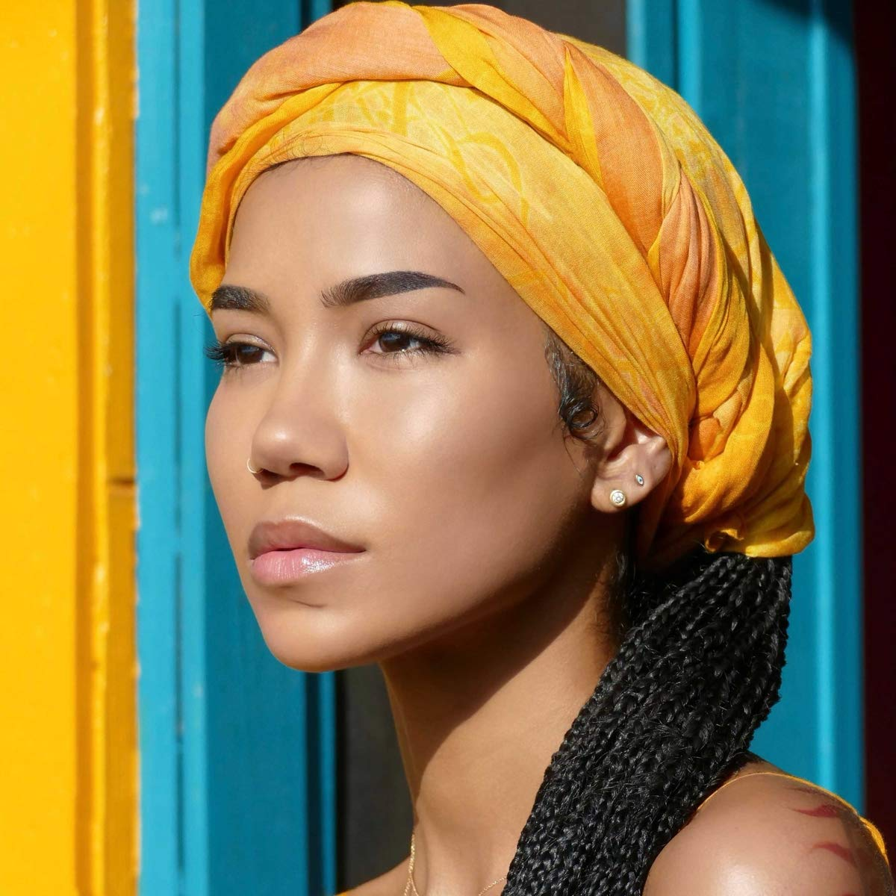

import { Slider, Button } from 'carbon-components-react';
import { ArrowUpRight24  } from '@carbon/icons-react';

import SliderJS1 from "../review/slider1"
import SliderJS2 from "../review/slider2"
import SliderJS3 from "../review/slider3"
import SliderJS4 from "../review/slider4"

import { Link } from "gatsby"

Album Review

<h1 className="h1--no--margin">{props.pageContext.frontmatter.title}</h1>

<Row  className="image-card-group">
	<Column colMd={"4"} colLg={"4"} noGutterMdLeft="">
       <ImageCard>

 
</ImageCard>
	</Column>
	<Column colMd={"8"} colLg={"8"} noGutterMdLeft="">
	

	Jhené Aikoの3年ぶりの3作目。10代半ばから活動をはじめ、現在(2020年)32歳になるので、経歴は長く、ここ数年でメジャーな存在になりつつある。お母さんが日系人とのことで、名前やお顔からは日本的なものを感じるが、音楽に和風なものは含まれていない。またハワイ島で制作され、CDジャケットもハワイで撮影されているようだが、現地の音楽を取り入れてるわけではない。FisticuffsとLejkeysの作り出すサウンドは、静謐で揺蕩うようなものが多く、ナチュラルで幻想的。抑え気味で語り掛けるように唄うVocalとの相性が良い。なお、声質はAriana Grandeに似ている。(ただし、こちらが先輩)。4年前にDuo作をリリースしたEx彼氏のBig DeanをGuestに迎えたことも話題になっている。
	

	

	  <Button href="https://amzn.to/3ggBXZD" kind="primary" size="small" renderIcon={ArrowUpRight24}>
      amazon.com
      </Button>
      <Button href="https://amzn.to/33inOHR" kind="secondary" size="small" renderIcon={ArrowUpRight24}>
      amazon.co.jp
      </Button>
	

	
	
	</Column>
</Row>
<Row >
	<Column colMd={"4"} colLg={"4"} noGutterMdLeft="">

    <h3>Score card</h3>
	<SliderJS1 value="5" />
    <SliderJS2 value="2" />
	<SliderJS3 value="1" />
    <SliderJS4 value="9" />

</Column>
<Column colMd={"8"} colLg={"8"} noGutterMdLeft="">

<h3>Producers</h3>

Lejkeys(1,8,14,15,16,17,19,20)
 Fisticuffs and Lejkeys(2,4,6,13)
 Fisticuffs(3,5,7,10,12,18)
 Jhené Aiko(9)
 Micah Powell and Heavy Mellow(11)

<h3>Guests</h3>

Big Sean, H.E.R., Future, Miguel, Ab-Soul, Dr. Chill, Nas, John Legend

</Column>
</Row>

<h3>Tracks</h3>

| No. |	 Title                            |	 Composers                                                                                                     	|	 Performer                    |	 Time |
| - - |	--------------------------------- | --------------------------------------------------------------------------------------------------------------- | ------------------------------- | ----- |
| 1	  |	Lotus (Intro)                     | Jhené Aiko Chilombo, Julian-Quán Việt Lê                                                                    	| Jhené Aiko                      |	01:12 |
| 2	  |	Triggered (Freestyle)             | Jhené Aiko Chilombo, Brian Keith Warfield, Julian-Quán Việt Lê, Maclean Robinson, Ross James                	| Jhené Aiko                      |	03:29 |
| 3	  |	None of Your Concern              | Jhené Aiko Chilombo, Sean Anderson, Brian Keith Warfield, Maclean Robinson                                    	| Jhené Aiko feat. Big Sean       |	04:19 |
| 4	  |	Speak                             | Jhené Aiko Chilombo, Brian Keith Warfield, Julian-Quán Việt Lê, Maclean Robinson                            	| Jhené Aiko                      |	03:05 |
| 5	  |	B.S.                              | Jhené Aiko Chilombo, Gabriella Wilson, Brian Keith Warfield, Maclean Robinson, Sean Anderson                  	| Jhené Aiko feat. H.E.R.         |	03:32 |
| 6	  |	P*$$Y Fairy (OTW)                 | Jhené Aiko Chilombo, Julian-Quán Việt Lê, Micah Powell                                                      	| Jhené Aiko                      |	03:41 |
| 7	  |	Happiness Over Everything (H.O.E) | Jhené Aiko Chilombo, Nayvadius Wilburn, Miguel Pimentel, Andre Benjamin, Brian Keith Warfield, Maclean Robinson	| Jhené Aiko feat. Future & Migue |	03:08 |
| 8	  |	One Way St.                       | Jhené Aiko Chilombo, Julian-Quán Việt Lê                                                                    	| Jhené Aiko feat. Ab-Soul        |	02:54 |
| 9	  |	Define Me (Interlude)             | Jhené Aiko Chilombo                                                                                           	| Jhené Aiko                      |	01:48 |
| 10  |	Surrender                         | Jhené Aiko Chilombo, Kharamo Chilombo, Brian Keith Warfield, Maclean Robinson                                 	| Jhené Aiko                      |	04:18 |
| 11  |	Tryna Smoke                       | Jhené Aiko Chilombo, Micah Powell                                                                             	| Jhené Aiko feat. Dr. Chill      |	04:29 |
| 12  |	Born Tired                        | Jhené Aiko Chilombo, Brian Keith Warfield, Maclean Robinson                                                   	| Jhené Aiko                      |	03:15 |
| 13  |	Love                              | Jhené Aiko Chilombo, Brian Keith Warfield, Julian-Quán Việt Lê, Maclean Robinson                            	| Jhené Aiko                      |	02:36 |
| 14  |	10k Hours                         | Jhené Aiko Chilombo, Nasir Jones, Julian-Quán Việt Lê                                                       	| Jhené Aiko feat. Nas            |	04:17 |
| 15  |	Summer 2020 (Interlude)           | Jhené Aiko Chilombo, Julian-Quán Việt Lê                                                                    	| Jhené Aiko                      |	01:45 |
| 16  |	Mourning Doves                    | Jhené Aiko Chilombo, Julian-Quán Việt Lê                                                                    	| Jhené Aiko                      |	02:47 |
| 17  |	Pray for You                      | Jhené Aiko Chilombo, Julian-Quán Việt Lê                                                                    	| Jhené Aiko                      |	01:54 |
| 18  |	Lightning & Thunder               | Jhené Aiko Chilombo, John Stephens, Brian Keith Warfield, Julian-Quán Việt Lê, Maclean Robinson, Ross James 	| Jhené Aiko feat. John Legend    |	04:28 |
| 19  |	Magic Hour                        | Jhené Aiko Chilombo, Julian-Quán Việt Lê                                                                    	| Jhené Aiko                      |	03:16 |
| 20  |	Party for Me (Outro)              | Jhené Aiko Chilombo                                                                                           	| Jhené Aiko                      |	01:34 |
                                                                                                                	|	                                	|	00:00 	| 