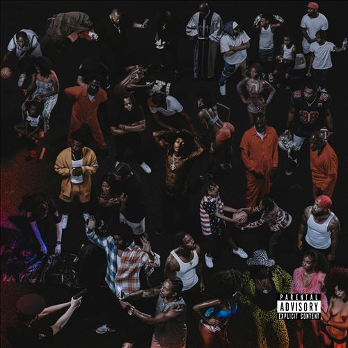

import { Slider, Button } from "@carbon/react";
import { ArrowUpRight } from "@carbon/icons-react";

import SliderJS1 from "../review/slider1";
import SliderJS2 from "../review/slider2";
import SliderJS3 from "../review/slider3";
import SliderJS4 from "../review/slider4";
import AdvJS2 from "../review/adv2";
import AdvJS3 from "../review/adv3";

import { Link } from "gatsby";

import Review1 from "../review/spillagevillage1.mdx";

Album review

<h1 className="h1--no--margin">{props.pageContext.frontmatter.title}</h1>

  <Link to="/best50/2022/">2022 Black Music Best No.10</Link>

<Row  className="image-card-group">
	<Column colMd={3} colLg={4} noGutterMdLeft="">
       <ImageCard>

</ImageCard>
	</Column>
	<Column colMd={4} colLg={8} noGutterMdLeft="">
		

			ATL出身のRapper, JIDの4年ぶりの3作目。J. ColeのDreamville所属でSpillage Villageのメンバーとしても知られ、現在32歳と油ののっている人でもある。
			 サウンドはオーガニックで、サウスらしいアーシーさも併せ持ち、サンプリング多めのTrackはファンクで耳馴染みの良いものが並ぶ。KaytranadaやJames Blakeなど多方面からの制作陣や、Ari Lennox, Ravyn Lenaeといった今が旬の女性Vocalも参加し、バラエティにも富んでいる。また、⑮ではThundercatがインパクトを残している。
			 JIDのフローは、少し撚れ気味であるが、技巧は高めで、高速Rapも披露している。
			 Lyricは家族や仲間、音楽への愛などを綴っていて、そのせいか、アルバムを通して、温かみのある印象を受ける。
		

		

		  <Button className="button-right-mergin"  href="https://amzn.to/3Kd4YqS" renderIcon={ArrowUpRight} size='sm' kind='primary'>
  	    amazon.com
  	  </Button>
  	  <Button className="button-right-mergin"  href="https://amzn.to/3xoGjIg" renderIcon={ArrowUpRight} size='sm' kind='secondary'>
  	    amazon.co.jp
  	  </Button>
  	  <Button className="button-right-mergin"  href="https://apple.co/3lwVnRv" renderIcon={ArrowUpRight} size='sm' kind='tertiary'>
  	    apple music
  	  </Button>
			<AdvJS2/>
		

	</Column>
</Row>
<Row >
	<Column colMd={4} colLg={4} noGutterMdLeft="">
		

			<h3>Score card</h3>
			<SliderJS1 value="5" />
			<SliderJS2 value="3" />
			<SliderJS3 value="1" />
			<SliderJS4 value="9" />
		

	</Column>
	<Column colMd={8} colLg={8} noGutterMdLeft="">
		

			<h3>Producers</h3>
			

				Monte Booker(1)
				 Pluss, Nonstop da Hitman, Childish Major, Christo, 2One2 and QRiley(2)
				 Christo and Aviad(3)
				 Tommy Brown, Nami, Cardiak, Groove and Christo(4)
				 Kaytranada and JD Beck(5)
				 DJ Scheme, Nurі Saberin and Christo(6)
				 Christo, Benji, Yuli and Tane Runo(7)
				 DJ Khalil, Tu! and Christo(8)
				 Hollywood Cole, Christo and Yuli(9)
				 Elite and Christo(10)
				 BadBadNotGood, E. Jones and Christo(11)
				 Booker and Christo(12)
				 Khrysis(13)
				 Christo, Benji and Hero the Band(14)
				 James Blake(15)
			

			<h3>Guests</h3>
			

				Kenny Mason, 21 Savage, Baby Tate, Lil Durk, Ari Lennox, Mos Def, Lil Wayne, Johnta Austin, Eryn Allen Kane, Ravyn Lenae, Thundercat
			

		

	</Column>
</Row>

<h3>Tracks</h3>

| No. | Title               | Composers                                                                                                                                                                       | Performer                               | Time  |
| --- | ------------------- | ------------------------------------------------------------------------------------------------------------------------------------------------------------------------------- | --------------------------------------- | ----- |
| 1   | Galaxy              | Ahmanti Booker / Destin Route                                                                                                                                                   | JID                                     | 00:52 |
| 2   | Raydar              | Gary Evan Fountaine / Jesse Gumer / Asheton Hogan / James Icart / Jalaluddin Mansur Nuriddin / Markus Randle / Destin Route / John Welch                                        | JID                                     | 03:24 |
| 3   | Dance Now           | Shlomo Gaisin / Zachary Goldschmiedt / Edwin Kenneth Green Jr / Elisha Mlotek / Aviad Poznansky / Destin Route / John Welch                                                     | JID feat: Kenny Mason                   | 03:47 |
| 4   | Crack Sandwich      | Thomas Brown / Carl McCormick / Destin Route / Dylan Ismael Teixeira / Benjamin Tolbert / John Welch                                                                            | JID                                     | 04:57 |
| 5   | Can’t Punk Me       | James Beck / Louis Kevin Celestin / Olu Fann / Eian Parker / Destin Route                                                                                                       | JID feat: EarthGang                     | 03:23 |
| 6   | Surround Sound      | Sheyaa Bin Abraham-Joseph / Tate Farris / Gabriel Guerra / Destin Route / Nuri Saberin / Charles Singleton / Eddie Snyder / John Welch                                          | JID feat: 21 Savage / Baby Tate         | 03:50 |
| 7   | Kody Blu 31         | Taji Ausar / Dj Barnett / Jerramy Barnett / Justin Barnett / Nicolas Barnett / Destin Route / Ian Welch / John Welch / Margaux Whitney                                          | JID                                     | 03:44 |
| 8   | Bruddanem           | Khalil Abdul-Rahman / Durk Banks / Neal H. Pogue / Destin Route / Daniel Seeff / John Welch / Margaux Whitney                                                                   | JID feat: Lil Durk                      | 03:55 |
| 9   | Sistanem            | Kameron Cole / Taalib Johnson / James Litherland / Osunlade / Eric Roberson / Destin Route / John Welch                                                                         | JID                                     | 06:09 |
| 10  | Can’t Make U Change | Jorge Miguel Cardoso Augusto / Bruce Fisher / Alex Joseph Hall / Quincy Jones / Anthony Parrino / Stanley Richardson / Destin Route / Courtney Salters / Leon Ware / John Welch | JID feat: Ari Lennox                    | 04:48 |
| 11  | Stars               | Taji Ausar / Mos Def / Chester Hansen / Eric Jones / Destin Route / Alexander Sowinski / Matthew Tavares / John Welch                                                           | JID feat: Mos Def                       | 04:18 |
| 12  | Just in Time        | Ahmanti Booker / Edwin Kenneth Green Jr / Destin Route / Lil Wayne / John Welch                                                                                                 | JID feat: Kenny Mason / Lil Wayne       | 03:27 |
| 13  | Money               | Paul Coleman / Destin Route / Christopher Tyson                                                                                                                                 | JID                                     | 04:26 |
| 14  | Better Days         | Johnta Austin / Dj Barnett / Jerramy Barnett / Justin Barnett / Nicolas Barnett / Destin Route / Ian Welch / John Welch                                                         | JID feat: Johnta Austin                 | 04:14 |
| 15  | Lauder Too          | Ahmanti Booker / Leon Sylvers III / Ravyn Lenae / James Litherland / Destin Route / Edmund Sylvers / Benjamin Tolbert                                                           | JID feat: Eryn Allen Kane / Ravyn Lenae | 03:53 |

<h3>Other Reviews</h3>

<Row>
  <Column colMd={3} colLg={3} noGutterMdLeft>
    <Review1 />
  </Column>
</Row>

<AdvJS3 />
