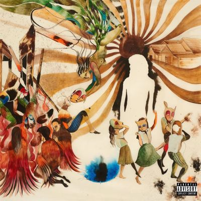

import { Slider, Button } from "@carbon/react";
import { ArrowUpRight } from "@carbon/icons-react";

import SliderJS1 from "../review/slider1";
import SliderJS2 from "../review/slider2";
import SliderJS3 from "../review/slider3";
import SliderJS4 from "../review/slider4";
import AdvJS2 from "../review/adv2";
import AdvJS3 from "../review/adv3";

import { Link } from "gatsby";
import Review1 from "../review/jid1.mdx";
import Review2 from "../review/spillagevillage1.mdx";

Album Review

<h1 className="h1--no--margin">{props.pageContext.frontmatter.title}</h1>

  <Link to="/best50/2025/">2025 Black Music Best No.20</Link>

<Row  className="image-card-group">
	<Column colMd={3} colLg={4} noGutterMdLeft="">
       <ImageCard>

</ImageCard>
	</Column>
	<Column colMd={4} colLg={8} noGutterMdLeft="">
		

			JIDの約3年ぶりとなる4枚目のスタジオアルバム。グラミー賞で2部門にノミネートされるなど、高評価を得ている。
			 亡き祖母が遺した「神は醜いものも好む（God does like ugly）」という、不条理な現実への洞察をもとに、自身の「醜さ」を直視しして、自らコントロールすることを描き、ポスト・アポカリプスのアトランタを舞台に、聖と俗が混在する物語を展開している。
			 サウンドは、盟友Christoを製作総指揮に迎え、南部トラップを軸にゴスペル、ジャズ、インダストリアル、ファンク等を融合させており、曲調もバラエティに富んだものになっている。
            多彩な声色、緩急交えたラップやスペイン語での高速ラップなど、変幻自在なフローも特徴的で、人脈を活かして、ゲストもかなり豪華。
			 最終曲で父親になったことを明かすなど、内省的で誠実な作品になっている。
		

		

		  <Button className="button-right-mergin"  href="https://amzn.to/3O77un0" renderIcon={ArrowUpRight} size='sm' kind='primary'>
  	    	amazon.com
  	  </Button>
  		<Button className="button-right-mergin"  href="https://amzn.to/4vc0Dct" renderIcon={ArrowUpRight} size='sm' kind='secondary'>
      	amazon.co.jp
	  	</Button>
			<Button className="button-right-mergin"  href="https://apple.co/47KthaK" renderIcon={ArrowUpRight} size='sm' kind='tertiary'>
  	    	apple music
	  	</Button>
			<AdvJS2/>
		

	</Column>
</Row>
<Row >
	<Column colMd={4} colLg={4} noGutterMdLeft="">
		

		  <h3>Score card</h3>
			<SliderJS1 value="5" />
		  <SliderJS2 value="2" />
			<SliderJS3 value="2" />
		  <SliderJS4 value="9" />
		

	</Column>
	<Column colMd={4} colLg={8} noGutterMdLeft="">
		

			<h3>Producers</h3>
			

				Childish Major, Christo, Luke Crowder, Lex Luger, Rodney Akil Pratt
				 Shroomand Tú(1)
				 Beatnick Dee and Lex Luger(2)
				 Pluss and Christo(3)
				 Frankie P. and Mario Luciano(4)
				 Christo and Trakgirl(5)
				 Jay Versace(6)
				 Jay Card and Nice Rec(7)
				 Ambezza, Nik D, Cameone and Buddy Ross(8)
				 Benji, Yuli and Christo(9)
				 Timothy Suby(10)
				 Gordon Ritchie-Haughton and Thundercat(11)
				 BOI 1DA, VINYLZ, Cubeatz and Scotty Lavell Coleman(12)
				 Mereba, Childish Major, Trey Lander, Eli Macedon, TRYBISHOP, Gib DJ, Noah
				 Scharf and Christo(13)
				 Muzikman Sam, Major Seven and Christo(14)
				 Tú and STEALTHISMETAL(15)
			

			<h3>Guests</h3>
			

				Westside Gunn, Clipse, Vince Staples, Ciara, EarthGang, Clipse, Don Toliver, Jessie Reyez, Baby Kia, Mereba, Pastor Troy
			

		

	</Column>
</Row>

<h3>Tracks</h3>

| No. | Title                     | Composers                                                                                                                                                                  | Performer                                      | Time |
| --- | ------------------------- | -------------------------------------------------------------------------------------------------------------------------------------------------------------------------- | ---------------------------------------------- | ---- |
| 1   | YouUgly                   | Luke Crowder, Destin Route, Alvin Worthy, Neal Pogue II, Tim Schoegje, John Welch, Markus Randle, Akil Pratt                                                               | JID feat. Westside Gunn, Clipse, Vince Staples | 4:43 |
| 2   | Glory                     | Destin Route, Nicholas Doherty, Lexus Lewis                                                                                                                                | JID                                            | 3:59 |
| 3   | WRK                       | Destin Route, Asheton Hogan, John Christopher Welch III                                                                                                                    | JID                                            | 3:14 |
| 4   | Community                 | Destin Route, Frank Parra, TERRENCE THORNTON, Gene Thornton, Mario Dragoi                                                                                                  | JID feat. Clipse                               | 4:25 |
| 5   | Gz                        | Destin Route, John Welch, Shakari Linder                                                                                                                                   | JID                                            | 3:28 |
| 6   | VCRs                      | Destin Route, Jahlil Gunter, Vince Staples                                                                                                                                 | JID feat. Vince Staples                        | 3:58 |
| 7   | Sk8                       | John Christopher Welch III, Destin Route, Ciara Harris, Olu Fann, Eian Parker, Jackson Card, Peter Mudge, Jason Harris                                                     | JID feat. Ciara, EarthGang                     | 3:10 |
| 8   | What We On                | Destin Route, Caleb Toliver, Mathias Daniel Liyew, Chase Benjamin, Nik Frascona, Michael Cerda, Josiah Sherman, Derek &quot;206derek&quot; Anderson, Edgar Panford Nabeyin | JID feat. Don Toliver                          | 3:58 |
| 9   | Wholeheartedly            | Ian Welch, Margaux Whitney, Destin Route, Tyrone Griffin Jr, John Welch, 6LACK                                                                                             | JID, Ty Dolla $ign, 6LACK                      | 3:45 |
| 10  | No Boo                    | Destin Route, Tim Suby                                                                                                                                                     | JID feat. Jessie Reyez                         | 3:35 |
| 11  | And We Vibing (Interlude) | Gordon Ritchie-Haughton, Stephen Bruner, Destin Route                                                                                                                      | JID                                            | 0:41 |
| 12  | On McAfee                 | Mereba, Jeremy Hicks, Gibson Alcott, Destin Route, Markus Randle, Donald B. Lander III, Elijah Sinclair Forbes                                                             | JID feat. Baby Kia                             | 2:50 |
| 13  | Of Blue                   | Destin Route                                                                                                                                                               | JID feat. Mereba                               | 6:36 |
| 14  | K-Word                    | Destin Route, Micah Troy, O. Walker, Samuel Williams John Welch                                                                                                            | JID feat. Pastor Troy                          | 5:11 |
| 15  | For Keeps                 | Destin Route, Neal Pogue II, Robert Harry Cannady                                                                                                                          | JID                                            | 3:45 |

<h3>Other Reviews</h3>

<Row>
  <Column colMd={3} colLg={3} noGutterMdLeft>
    <Review1 />
  </Column>
  <Column colMd={3} colLg={3} noGutterMdLeft>
    <Review2 />
  </Column>
</Row>

<AdvJS3 />
