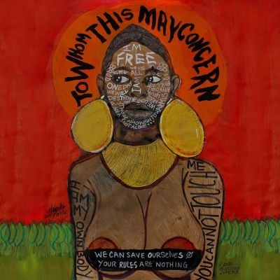

import { Slider, Button } from "@carbon/react";
import { ArrowUpRight } from "@carbon/icons-react";

import SliderJS1 from "../review/slider1";
import SliderJS2 from "../review/slider2";
import SliderJS3 from "../review/slider3";
import SliderJS4 from "../review/slider4";
import AdvJS2 from "../review/adv2";
import AdvJS3 from "../review/adv3";

import { Link } from "gatsby";

Album Review

<h1 className="h1--no--margin">{props.pageContext.frontmatter.title}</h1>

<Row  className="image-card-group">
	<Column colMd={3} colLg={4} noGutterMdLeft="">
       <ImageCard>

</ImageCard>
	</Column>
	<Column colMd={4} colLg={8} noGutterMdLeft="">
		

			Jill Scottのなんと11年ぶりとなる6作目のスタジオアルバム。その不在感を埋めるべく19曲58分に及んでおり、デジタルに支配された現代の抵抗と、表層的な繋がりに対し内面性や本物の人間関係、成熟した大人の視点を提唱する骨太な作品になっている。
			 サウンドは生楽器の演奏とアナログの温かみを優先した豊かな音のパレットが特徴で。R&amp;Bをベースにファンク、ジャズ、ヒップホップ、ハウス、ブルース、ゴスペルまで黒人音楽を横断的に融合させている。曲調もアップからスローまで曲調も様々で即興性と有機的なグルーヴに満ちた構成になっている。
       ゲストも豪華だが、中でもTierra Whackとの⑤での地元愛溢れるRapの掛け合いが面白い。
			 Lyricでは自己実現、地元/コミュニティ愛、先達への敬意、現代社会批判など表現しており、これを低音から高音までの独特の質感を持つ、滑らかなVocalで歌い上げている。
		

		

		  <Button className="button-right-mergin"  href="https://amzn.to/4xsXfeD" renderIcon={ArrowUpRight} size='sm' kind='primary'>
  	    amazon.com
  	  </Button>
  	  <Button className="button-right-mergin"  href="https://amzn.to/4ek46y3" renderIcon={ArrowUpRight} size='sm' kind='secondary'>
  	    amazon.co.jp
  	  </Button>
			<Button className="button-right-mergin"  href="https://apple.co/4fMOsxO" renderIcon={ArrowUpRight} size='sm' kind='tertiary'>
  	    apple music
  	  </Button>
		<AdvJS2/>
		

	</Column>
</Row>
<Row >
	<Column colMd={4} colLg={4} noGutterMdLeft="">
		

		  <h3>Score card</h3>
			<SliderJS1 value="5" />
		  <SliderJS2 value="2" />
			<SliderJS3 value="1" />
		  <SliderJS4 value="9" />
		

	</Column>
	<Column colMd={4} colLg={8} noGutterMdLeft="">
		

			<h3>Producers</h3>
			

				Andre &quot;Dre&quot; Harris and Anthony Bell(1)
				 Trombone Shorty, Adam Blackstone, D.K. The Punisher(2)
				 Om’Mas Keith(3,17)
				 Vincent “VT” Tolan and Riley Geare(4,12)
				 DJ Premier(5)
				 Jill Scott(6)
				 Adam Blackstone and Louis York(7)
				 Adam Blackstone and Vincent “VT” Tolan(8)
				 Khari Mateen(9)
				 Seige Monstracity(10,15,16)
				 Camper(11)
				 Dwayne “DW” Wright, Eric Wortham(13)
				 YOUNG RJ(14)
				 Andre Harris(18)
				 Marc Bridges, S1(19)
			

			<h3>Guests</h3>
			

				Maha Adachi Earth, Trombone Shorty, Tierra Whack, Too $hort, Ab-Soul, JID
			

		

	</Column>
</Row>

<h3>Tracks</h3>

| No. | Title                 | Composers                                                                                                                                      | Performer                          | Time |
| --- | --------------------- | ---------------------------------------------------------------------------------------------------------------------------------------------- | ---------------------------------- | ---- |
| 1   | Dope Shit             | Andre Harris, Anthony Bell, Hope Ostane-Baucom                                                                                                 | Jill Scott feat. Maha Adachi Earth | 0:55 |
| 2   | Be Great              | Jill Scott, Troy Andrews, Adam Blackstone, Donovan Knight                                                                                      | Jill Scott feat. Trombone Shorty   | 3:12 |
| 3   | Beautiful People      | Jill Scott, Om'Mas Keith                                                                                                                       | Jill Scott                         | 3:47 |
| 4   | Offdaback             | Jill Scott, Riley Geare, Vincent Tolan                                                                                                         | Jill Scott                         | 3:28 |
| 5   | Norf Side             | Jill Scott, Chris Martin, Robert Martin, Tierra Whack                                                                                          | Jill Scott feat. Tierra Whack      | 2:51 |
| 6   | Disclaimer            | Jill Scott                                                                                                                                     | Jill Scott                         | 0:31 |
| 7   | Pay U on Tuesday      | Jill Scott, Adam Blackstone, Charles Harmon, Claude Kelly                                                                                      | Jill Scott                         | 3:04 |
| 8   | Pressha               | Jill Scott, Adam Blackstone, Vincent Tolan, Ayo Brame, Kevin Choice, Richard Benitez III                                                       | Jill Scott                         | 4:16 |
| 9   | BPOTY                 | Jill Scott, Khari Mateen, Todd Anthony Shaw                                                                                                    | Jill Scott feat. Too $hort         | 3:04 |
| 10  | Me 4                  | Jill Scott, Chad Hugo, Gene Thornton Jr., Terrence Thornton, Marcus Christopher White, Bryan Williams, Pharrell Williams                       | Jill Scott                         | 1:34 |
| 11  | The Math              | Jill Scott, Darhyl Camper, Jr., Terrell Roper, Taner&eacute;lle Stephens                                                                       | Jill Scott                         | 3:28 |
| 12  | A Universe            | Jill Scott, Riley Geare, Vincent Tolan                                                                                                         | Jill Scott                         | 3:17 |
| 13  | Liftin&#39; Me Up     | Jill Scott, Eric Wortham, Dwayne Wright                                                                                                        | Jill Scott                         | 4:25 |
| 14  | Ode to Nikki          | Jill Scott, Aleksandrs Gr&#299;va, Herbert Anthony Stevens IV, Viktor Vlasov, Tommy James, Robert King, Craig Lane, Christon Mason, Ralph Rice | Jill Scott feat. Ab-Soul           | 2:51 |
| 15  | Don&#39;t Play        | Jill Scott, Marcus Christopher White                                                                                                           | Jill Scott                         | 2:42 |
| 16  | To B Honest           | Jill Scott, Carol Connors, David Shire, James Di Pasquale, Marcus Christopher White, Destin Route                                              | Jill Scott feat. JID               | 4:30 |
| 17  | Right Here, Right Now | Jill Scott, Lamar Andrews, Carvin Haggins, Om'Mas Keith, Yountie Strickland, Malek Ben Yisrael                                                 | Jill Scott                         | 4:24 |
| 18  | À&#7779;&#7865;       | Jill Scott, Andre Harris                                                                                                                       | Jill Scott                         | 3:11 |
| 19  | Sincerely Do          | Jill Scott, Larry D. Griffin Jr., Marc Bridges                                                                                                 | Jill Scott                         | 2:41 |

<AdvJS3 />
