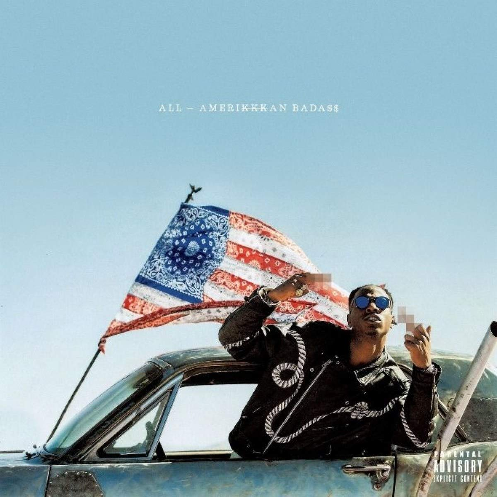

import { Slider, Button } from "@carbon/react";
import { ArrowUpRight } from "@carbon/icons-react";

import SliderJS1 from "../review/slider1";
import SliderJS2 from "../review/slider2";
import SliderJS3 from "../review/slider3";
import SliderJS4 from "../review/slider4";
import AdvJS2 from "../review/adv2";
import AdvJS3 from "../review/adv3";

import { Link } from "gatsby";

Album Review

<h1 className="h1--no--margin">{props.pageContext.frontmatter.title}</h1>

  <Link to="/best50/2017/">2017 Black Music Best No.16</Link>

<Row  className="image-card-group">
	<Column colMd={3} colLg={4} noGutterMdLeft="">
			 <ImageCard>

</ImageCard>
	</Column>
	<Column colMd={4} colLg={8} noGutterMdLeft="">
		

			Joey Bada$$の2年振り2作目。90年代イーストコーストのHip-Hopを受けついでいる人で、DJ Khahliliや身内のKirk Knightなどによるサウンドは、ハードコアでストレートなものもあるが、全体的にはメロウでスムースでPop。
			 それだけでも十分に楽しめるのだが、Lyricsのほうは、とってもポリティカルで現状の黒人社会の状況を憂い、怒りを体制にぶつけており、本人も若い世代が意見を主張することが重要と言っている。
			 それに加え、Rapスキルは一層高まっていて、22歳とは思えない落ち着きを示している。
		

		

		  <Button className="button-right-mergin"  href="https://amzn.to/2CZLxBW" renderIcon={ArrowUpRight} size='sm' kind='primary'>
		    amazon.com
		  </Button>
		  <Button className="button-right-mergin"  href="https://amzn.to/30g5bSK" renderIcon={ArrowUpRight} size='sm' kind='secondary'>
		    amazon.co.jp
		  </Button>
		  <Button className="button-right-mergin"  href="https://apple.co/3QYPsl4" renderIcon={ArrowUpRight} size='sm' kind='tertiary'>
		    apple music
		  </Button>
		<AdvJS2/>
		

	</Column>
</Row>
<Row >
	<Column colMd={4} colLg={4} noGutterMdLeft="">

	<h3>Score card</h3>
	<SliderJS1 value="2" />
	<SliderJS2 value="1" />
	<SliderJS3 value="1" />
	<SliderJS4 value="9" />

</Column>
<Column colMd={8} colLg={8} noGutterMdLeft="">

<h3>Producers</h3>

	DJ Khalil(1,2,12)
	 1-900, Kirk Knight(3,4,8)
	 1-900, Kirk Knight, Powers Pleasant(5)
	 1-900, Powers Pleasant(6)
	 Chuck Strangers, 1-900(7)
	 Statik Selektah(9,11)
	 Like, 1-900(10)

<h3>Guests</h3>

	Schoolboy Q, Kirk Knight, Nyck Caution, Meechy Darko, Styles PChronixx, J. Cole

</Column>
</Row>

<h3>Tracks</h3>

| No. | Title                                                                 | Composers                                                                 | Performer   | Time  |
| --- | --------------------------------------------------------------------- | ------------------------------------------------------------------------- | ----------- | ----- |
| 1   | Good Morning Amerikkka                                                | Jo-Vaughn Scott, Khalil Abdul-Rahman, Sam Barsh, Dan Seeff                | Joey Bada$$ | 01:38 |
| 2   | For My People                                                         | Jo-Vaughn Scott, Khalil Abdul-Rahman, Sam Barsh, Dan Seeff, Adam Pallin   | Joey Bada$$ | 03:53 |
| 3   | Temptation                                                            | Jo-Vaughn Scott, Adam Pallin, Kirlan Labarrie                             | Joey Bada$$ | 04:04 |
| 4   | Land of the Free                                                      | Jo-Vaughn Scott, Adam Pallin, Kirlan Labarrie                             | Joey Bada$$ | 04:44 |
| 5   | Devastated                                                            | Jo-Vaughn Scott, Adam Pallin, Kirlan Labarrie                             | Joey Bada$$ | 03:27 |
| 6   | Y U Don't Love Me? (Miss Amerikkka)                                   | Jo-Vaughn Scott, Adam Pallin                                              | Joey Bada$$ | 03:19 |
| 7   | Rockabye Baby (featuring Schoolboy Q)                                 | Jo-Vaughn Scott, Adam Pallin, Che Jessamy, Quincy Hanley                  | Joey Bada$$ | 03:44 |
| 8   | Ring the Alarm (featuring Kirk Knight, Nyck Caution and Meechy Darko) | Jo-Vaughn Scott, Adam Pallin, Che Jessamy, Jesse Cordasco, Dimitri Simms  | Joey Bada$$ | 04:20 |
| 9   | Super Predator (featuring Styles P)                                   | Jo-Vaughn Scott, Patrick Baril, David Styles                              | Joey Bada$$ | 04:12 |
| 10  | Babylon (featuring Chronixx)                                          | Jo-Vaughn Scott, Adam Pallin, Gabriel Stevenson, Jamar McNaughton         | Joey Bada$$ | 05:36 |
| 11  | Legendary (featuring J. Cole)                                         | Jo-Vaughn Scott, Adam Pallin, Jermaine Cole                               | Joey Bada$$ | 04:38 |
| 12  | Amerikkkan Idol                                                       | Jo-Vaughn Scott, Khalil Abdul-Rahman, Sam Barsh, Dan Seeff, Pranam Injeti | Joey Bada$$ | 0612  |

<AdvJS3 />
