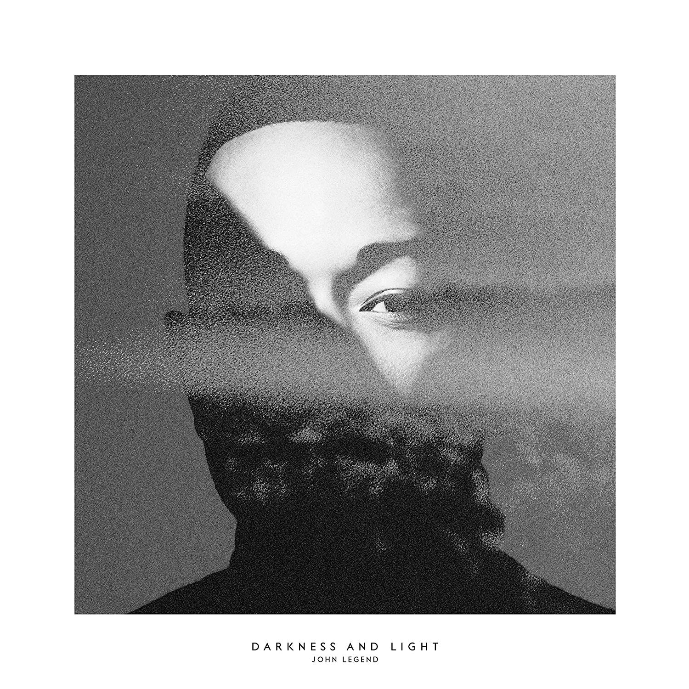

import { Slider, Button } from "carbon-components-react";
import { ArrowUpRight24 } from "@carbon/icons-react";

import SliderJS1 from "../review/slider1";
import SliderJS2 from "../review/slider2";
import SliderJS3 from "../review/slider3";
import SliderJS4 from "../review/slider4";

import { Link } from "gatsby";

import Review1 from "../review/johnlegend6.mdx";

Album Review

<h1 className="h1--no--margin">{props.pageContext.frontmatter.title}</h1>

<Row  className="image-card-group">
	<Column colMd={"3"} colLg={"4"} noGutterMdLeft="">
       <ImageCard>

</ImageCard>
	</Column>
	<Column colMd={"4"} colLg={"8"} noGutterMdLeft="">
	

	3年振りとなるJohn Legendの5作目。Alabama Shakesの出世作"Sound & Color"をProduceしたBlake Millsに制作を任せており、いつものR&Bとはまた違った印象が目新しい。
	 固めのBass音が特徴的なアコースティックで太めのバンドサウンドに、Organ, Strings, Horns, PresussionをところどころフィーチャーしたTrackはそれだけでも聴き応え十分。そのうえで、John Legendが硬軟取り混ぜ、自由に唄いあげている。
	 良メロディーのしみじみとした曲も多く、味わいがある。
	

	

	  <Button className="button-right-mergin"  href="https://amzn.to/319qhSc" kind="primary" size="small" renderIcon={ArrowUpRight24}>
      amazon.com
    </Button>
    <Button className="button-right-mergin"  href="https://amzn.to/3gljX06" kind="secondary" size="small" renderIcon={ArrowUpRight24}>
      amazon.co.jp
    </Button>
	

	
	</Column>
</Row>
<Row >
	<Column colMd={"4"} colLg={"4"} noGutterMdLeft="">

  <h3>Score card</h3>
	<SliderJS1 value="5" />
  <SliderJS2 value="3" />
	<SliderJS3 value="1" />
  <SliderJS4 value="9" />

</Column>
<Column colMd={"8"} colLg={"8"} noGutterMdLeft="">

<h3>Producers</h3>

	Bake Mills(1,2,3,4,6,7,8,9,10,11,12)
	 Bake Mills and John Ryan(5)

<h3>Guests</h3>

	Chance The Rapper,Brittany Howard, Miguel, Kamasi Washington, Perfume Genius

</Column>
</Row>

<h3>Tracks</h3>

| No. | Title                   | Composers                                                                                     | Performer                           | Time  |
| --- | ----------------------- | --------------------------------------------------------------------------------------------- | ----------------------------------- | ----- |
| 1   | I Know Better           | Blake Mills / Will Oldham / John Stephens                                                     | John Legend                         | 03:03 |
| 2   | Penthouse Floor         | Chancellor Bennet / Greg Kurstin / Blake Mills / John Stephens                                | John Legend fear. Chance The Rapper | 04:43 |
| 3   | Darkness and Light      | Will Oldham / John Ryan / John Stephens                                                       | John Legend feat. Brittany Howard   | 03:50 |
| 4   | Overload                | Blake Mills / Miguel Pimentel / John Stephens                                                 | John Legend feat. Miguel            | 03:20 |
| 5   | Love Me Now             | Blake Mills / John Ryan / John Stephens                                                       | John Legend                         | 03:30 |
| 6   | What You Do to Me       | Julia Michaels / Blake Mills / John Stephens / Matt Sweeney / Justin Tranter / Michael Tucker | John Legend                         | 03:21 |
| 7   | Surefire                | Ludwig G?ransson / Julia Michaels / Blake Mills / Will Oldham / John Stephens                 | John Legend                         | 04:03 |
| 8   | Right By You (For Luna) | Ethan Gruska / Blake Mills / John Stephens                                                    | John Legend                         | 04:16 |
| 9   | Temporarily Painless    | Blake Mills / John Ryan / John Stephens                                                       | John Legend                         | 03:55 |
| 10  | How Can I Blame You     | Blake Mills / John Stephens / Matt Sweeney / Francis White                                    | John Legend                         | 03:56 |
| 11  | Same Old Story          | Tobias Jesso, Jr. / Blake Mills / John Stephens                                               | John Legend                         | 03:32 |
| 12  | Marching Into the Dark  | Tobias Jesso, Jr. / Blake Mills / John Stephens                                               | John Legend                         | 04:21 |

<h3>Other Reviews</h3>

<Row>
  <Column colMd={3} colLg={3} noGutterMdLeft>
    <Review1 />
  </Column>
</Row>