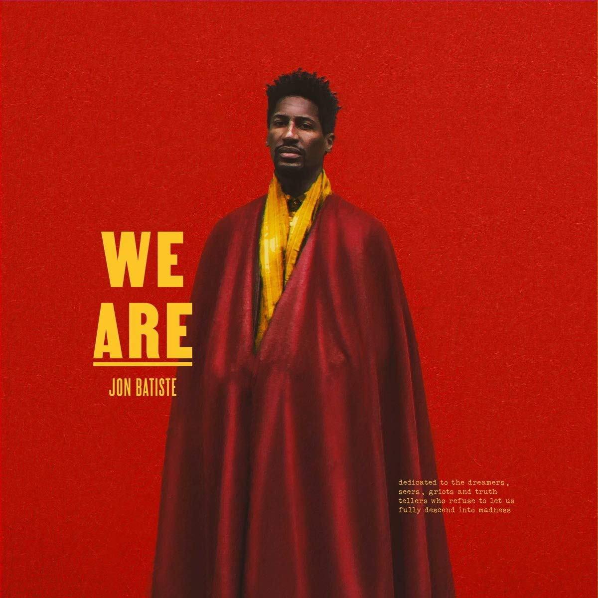

import { Slider, Button } from "carbon-components-react";
import { ArrowUpRight24 } from "@carbon/icons-react";

import SliderJS1 from "../review/slider1";
import SliderJS2 from "../review/slider2";
import SliderJS3 from "../review/slider3";
import SliderJS4 from "../review/slider4";

import { Link } from "gatsby";

Album Review

<h1 className="h1--no--margin">{props.pageContext.frontmatter.title}</h1>

  <Link to="/best50/2021/">2021 Black Music Best No.19</Link>

<Row  className="image-card-group">
	<Column colMd={"3"} colLg={"4"} noGutterMdLeft="">
       <ImageCard>

</ImageCard>
	</Column>
	<Column colMd={"4"} colLg={"8"} noGutterMdLeft="">
	

		Disney映画"Soul"'(日本だとソウルフル・ワールド)で2021年のGloden GloveのBest Score Motion Pictureを受賞したり、CoachのFall 2021 Collectionに登場したり、はたまたTVショーのハウスバンドのリーダーをつとめたりと、ちょっとした時の人になっているJon BatisteのR&B作。
		 New Orleans出身でJazz Pianistとしても活躍しており、34歳ということで既に経歴も豊かな人である。当アルバムは、そんな背景からの想像を裏切らない、Old Soulの逸品となっている。
		 ソウル、ファンク、ブルースあたりがベースになったアーシーなサウンドを基本に、①などはマーチングバンドやゴスペルを交えた荘厳な曲だし、Trombone Shortyを招いた⑥はJazzyで洒落ていてカッコ良い。続く⑦はPianoメインのJazz Instrumental曲、⑧はHot 8 Bras Bandを迎えたメローなナンバー、⑧はMavis Staplesによるモノローグと中盤で変化をつけている。
		

	

	  <Button className="button-right-mergin"  href="https://amzn.to/3fQwzyP" kind="primary" size="small" renderIcon={ArrowUpRight24}>
      amazon.com
    </Button>
    <Button className="button-right-mergin"  href="https://amzn.to/3t1vI2b" kind="secondary" size="small" renderIcon={ArrowUpRight24}>
      amazon.co.jp
    </Button>
		<Button className="button-right-mergin"  href="https://apple.co/2PGiQA9" kind="tertiary" size="small" renderIcon={ArrowUpRight24}>
      apple music
    </Button>
	

	</Column>
</Row>
<Row >
	<Column colMd={"4"} colLg={"4"} noGutterMdLeft="">

  <h3>Score card</h3>
	<SliderJS1 value="5" />
  <SliderJS2 value="4" />
	<SliderJS3 value="1" />
  <SliderJS4 value="8" />

</Column>
<Column colMd={"8"} colLg={"8"} noGutterMdLeft="">

<h3>Producers</h3>

	Jon Batiste, Kizzo and Pomo(1,3)
	 Jon Batiste(2,7,8,9,13)
	 Jon Batiste and Kizzo(4,10)
	 Jon Batiste and Pomo(5)
	 Jon Batiste, Jahaan Sweat and Sunny Levine(6)
	 Jon Batiste Autumn Rowe and Kizzo(11)
	 Ricky Reed, King Garbage and Nate Mercereau(12)

<h3>Guests</h3>

	St. Augustine High School Marching 100, David Gauthier, Gospel Soul Children, Craig Adams, Braedon Gauthier, Brennan Gauthier, Autumn Rowe, PJ Morton, Trombone Shorty, Hot 8 Brass Band, Zadie Smith, Smily King

</Column>
</Row>

<h3>Tracks</h3>

| No. | Title             | Composers                                                                              | Performer                                                                                                                                                    | Time  |
| --- | ----------------- | -------------------------------------------------------------------------------------- | ------------------------------------------------------------------------------------------------------------------------------------------------------------ | ----- |
| 1   | We Are            | Jon Batiste                                                                            | Jon Batiste feat. St. Augustine High School Marching 100, David Gauthier, Gospel Soul Children, Craig Adams, Braedon Gauthier, Brennan Gauthier, Autumn Rowe | 04:24 |
| 2   | Tell the Truth    | Jon Batiste                                                                            | Jon Batiste                                                                                                                                                  | 03:21 |
| 3   | Cry               | Jon Batiste / Steve McEwan                                                             | Jon Batiste                                                                                                                                                  | 03:57 |
| 4   | I Need You        | Jon Batiste / Autumn Rowe                                                              | Jon Batiste                                                                                                                                                  | 02:37 |
| 5   | Whatchutalkinbout | Jon Batiste                                                                            | Jon Batiste                                                                                                                                                  | 02:21 |
| 6   | Boy Hood          | Troy "Trombone Shorty" Andrews / Jon Batiste / Sunny Levine / PJ Morton / Jahaan Sweet | Jon Batiste feat. PJ Morton, Trombone Shorty                                                                                                                 | 04:26 |
| 7   | Movement 11'      | Jon Batiste                                                                            | Mavis Staples                                                                                                                                                | 02:01 |
| 8   | Adulthood         | Jon Batiste                                                                            | Jon Batiste feat. Hot 8 Brass Band                                                                                                                           | 03:41 |
| 9   | Mavis             | Mavis Staples                                                                          | Jon Batiste                                                                                                                                                  | 00:20 |
| 10  | Freedom           | Jon Batiste / Autumn Rowe                                                              | Jon Batiste                                                                                                                                                  | 02:58 |
| 11  | Show Me the Way   | Jon Batiste                                                                            | Jon Batiste faet. Zadie Smith                                                                                                                                | 03:40 |
| 12  | Sing              | Jon Batiste / Zach Cooper / Vic Dimotsis / Eric Frederic / Autumn Rowe                 | Jon Batiste                                                                                                                                                  | 03:07 |
| 13  | Until             | Jon Batiste                                                                            | Jon Batiste                                                                                                                                                  | 01:03 |
