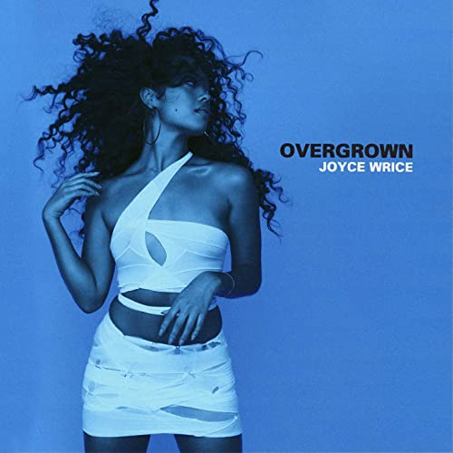

import { Slider, Button } from "carbon-components-react";
import { ArrowUpRight24 } from "@carbon/icons-react";

import SliderJS1 from "../review/slider1";
import SliderJS2 from "../review/slider2";
import SliderJS3 from "../review/slider3";
import SliderJS4 from "../review/slider4";

import { Link } from "gatsby";

Album Review

<h1 className="h1--no--margin">{props.pageContext.frontmatter.title}</h1>

  <Link to="/best50/2021/">2021 Black Music Best No.49</Link>

<Row  className="image-card-group">
	<Column colMd={"3"} colLg={"4"} noGutterMdLeft="">
       <ImageCard>

</ImageCard>
	</Column>
	<Column colMd={"4"} colLg={"8"} noGutterMdLeft="">
	

		LA出身のSinger, Song Writer, Joyce Wriceの初フルバム。自身のインディレーベルからのリリースである。母親が日本人ということで、表情には日本人の面影が残っている。ただ、サウンドのほうは今どきの王道R&Bで、アップ、ミディアム、スローがバランス良く配されている。
		 D'Mileがメインプロデューサーなので、Trackのクオリティは安定しており、その中で尖った曲も数曲あって、飽きさせない。また、Lucky Daye, Freddie Gibbs, Westside Gunn, KAYTRANADA, MndsgnといったGusetも通好みでアルバムに幅を持たせている。
		 既に28歳ということで、若くてキラキラという感じではないが、透き通って芯のある歌声はなにものにも代えがたいし、表現も豊かだと思う。
		 ⑬で突然、日本語の歌詞がでてきて、あ、そうだったんだなと思うが、それ以外は和なところはない。
	

	

	  <Button className="button-right-mergin"  href="https://amzn.to/2V1CKI5" kind="primary" size="small" renderIcon={ArrowUpRight24}>
      amazon.com
    </Button>
    <Button className="button-right-mergin"  href="https://amzn.to/3Ao1cng" kind="secondary" size="small" renderIcon={ArrowUpRight24}>
      amazon.co.jp
    </Button>
		<Button className="button-right-mergin"  href="https://geo.music.apple.com/us/album/overgrown/1554528971?itsct=music_box_link&itscg=30200&at=11lcug&ct=albums_overgrown&ls=1&app=music" kind="tertiary" size="small" renderIcon={ArrowUpRight24}>
      apple music
    </Button>
	

	</Column>
</Row>
<Row >
	<Column colMd={"4"} colLg={"4"} noGutterMdLeft="">

  <h3>Score card</h3>
	<SliderJS1 value="5" />
  <SliderJS2 value="1" />
	<SliderJS3 value="1" />
  <SliderJS4 value="9" />

</Column>
<Column colMd={"8"} colLg={"8"} noGutterMdLeft="">

<h3>Producers</h3>

	D'Mile(1,2,3,4,5,12)
	 ESTA.(6)
	 Jonah Christian and D'Mile (7,9)
	 KATRANADA and River Tiber(8)
	 Jonah Christian and D'Mile
	 Mndsgn and Devin Morrison(10)
	 Jonah Christian, Bradford Tidwell and Jason Kawu-Eugenio(11)
	 Austin Brown and D'Mile(13)
	 Mack Kean(14)

<h3>Guests</h3>

	Lucky Daye, Freddie Gibbs, Westside Gunn, ESTA., Masego, Mndsgn, Devin Morrison, UMI

</Column>
</Row>

<h3>Tracks</h3>

| No. | Title                          | Composers                                                                       | Performer                                | Time  |
| --- | ------------------------------ | ------------------------------------------------------------------------------- | ---------------------------------------- | ----- |
| 1   | Chandler                       | Joyce Wrice, Mack Keane, Preston Harris                                         | Joyce Wrice                              | 03:04 |
| 2   | Falling in Love                | Daniel Church, Davion Farris, Joyce Wrice, Lucy Daye                            | Joyce Wrice feat: Lucky Daye             | 02:59 |
| 3   | On One                         | Daniel Church, Freddie Gibbs, Joyce Wrice                                       | Joyce Wrice feat. Freddie Gibbs          | 03:23 |
| 4   | Losing                         | Daniel Church, Joyce Wrice                                                      | Joyce Wrice                              | 03:10 |
| 5   | You                            | Daniel Church, Joyce Wrice                                                      | Joyce Wrice                              | 01:49 |
| 6   | Westside Gunn's Interlude      | Westside Gunn                                                                   | Joyce Wrice feat: Westside Gunn, ESTA.   | 02:03 |
| 7   | Addicted                       | D'Mile, Daniel Church, James Poyser, Jonah Christian, Joyce Wrice               | Joyce Wrice                              | 03:16 |
| 8   | Kaytra's Interlude             | Joyce Wrice, KATRANADA, Mack Keane                                              | Joyce Wrice feat: KAYTRANADA             | 01:20 |
| 9   | Must Be Nice                   | D'Mile, Jonah Christian, Joyce Wrice, Masego, Shawn                             | Joyce Wrice feat: Masego                 | 03:35 |
| 10  | Hot Minute Interlude           | Devin Morrison, Joyce Wrice, Mndsgn                                             | Joyce Wrice feat: Mndsgn, Devin Morrison | 01:16 |
| 11  | Think About You                | Bradford Tidwell, Jason Kawu-Eugenio, Jonah Christian, Joyce Wrice, Varren Wade | Joyce Wrice                              | 02:48 |
| 12  | So So Sick                     | Daniel Church, Joyce Wrice                                                      | Joyce Wrice                              | 03:59 |
| 13  | That's on You [Japanese Remix] | Austin Brown, Joyce Wrice, Sol Was, UMI                                         | Joyce Wrice Feat: UMI                    | 02:47 |
| 14  | Overgrown                      | Joyce Wrice, Mack Keane                                                         | Joyce Wrice                              | 03:11 |

	

