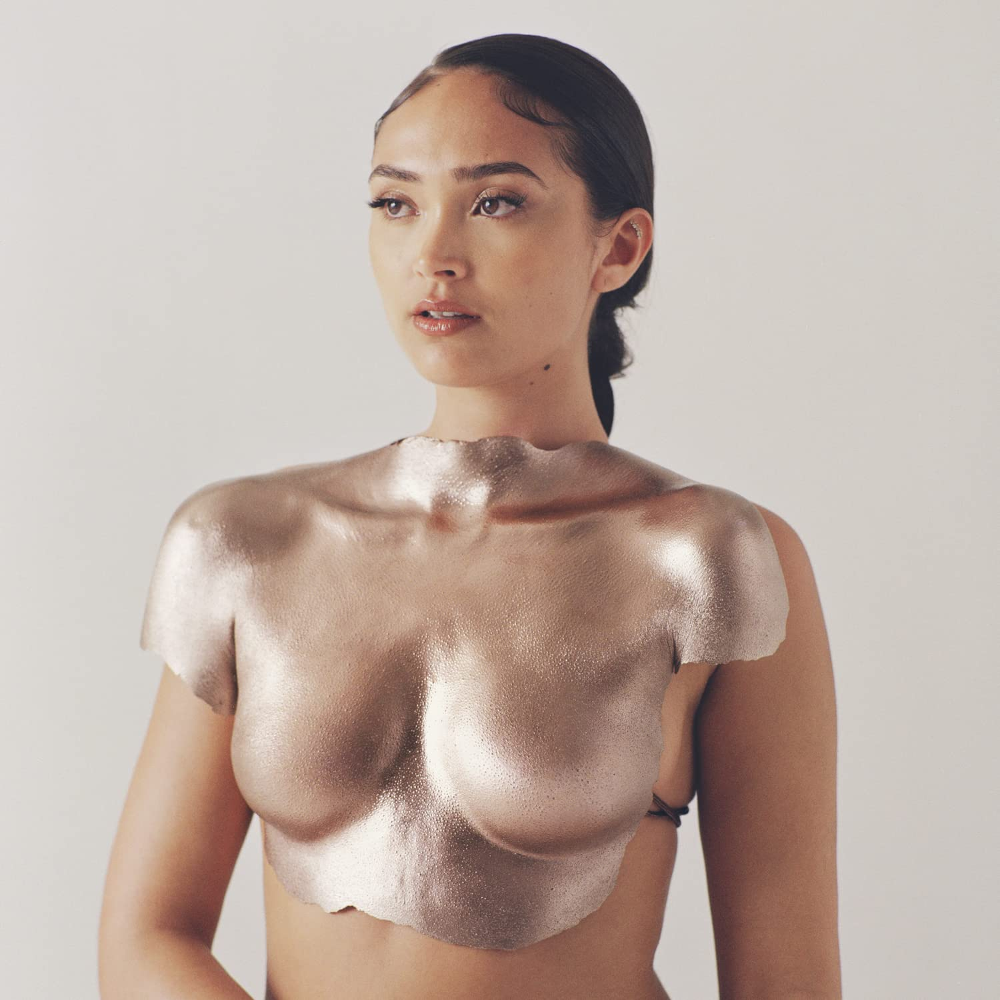

import { Slider, Button } from "carbon-components-react";
import { ArrowUpRight24 } from "@carbon/icons-react";

import SliderJS1 from "../review/slider1";
import SliderJS2 from "../review/slider2";
import SliderJS3 from "../review/slider3";
import SliderJS4 from "../review/slider4";
import AdvJS2 from "../review/adv2";
import AdvJS3 from "../review/adv3";

import { Link } from "gatsby";

Album review

<h1 className="h1--no--margin">{props.pageContext.frontmatter.title}</h1>

  <Link to="/best50/2021/">2021 Black Music Album Best No.47</Link>

<Row  className="image-card-group">
	<Column colMd={"3"} colLg={"4"} noGutterMdLeft="">
       <ImageCard>

</ImageCard>
	</Column>
	<Column colMd={"4"} colLg={"8"} noGutterMdLeft="">
		

			South London出身の23歳、Joy Crookesのデビューアルバム。10代から創作活動を初めて、SNSで見つかり、数枚のEPリリース後、アルバムデビューに至っている。BangladeshiとIrelandのハーフとのことで、CDのアートワークでも、UK Asianな雰囲気を出していて、音楽面でも、少なからず、その影響が見られる。
			 ただ基調は、UKらしいVintage soulで、Amy Winehouseから痛々しさを弱めたような印象である。アコースティック中心のTrackは、手作り感は残しつつ、BalladからUpなものと様で、Joy Crookesの落ち着いたVocalを際立たせるものとなっている。
			 また、Lyricでは恋愛や自身の考え方などを唄っている。
		

		

		  <Button className="button-right-mergin"  href="https://amzn.to/3zQGGw0" kind="primary" size="small" renderIcon={ArrowUpRight24}>
  	    amazon.com
  	  </Button>
  	  <Button className="button-right-mergin"  href="https://amzn.to/3QCbszs" kind="secondary" size="small" renderIcon={ArrowUpRight24}>
  	    amazon.co.jp
  	  </Button>
			<Button className="button-right-mergin"  href="https://apple.co/3QfYh7J" kind="tertiary" size="small" renderIcon={ArrowUpRight24}>
  	   	apple music
  	  </Button>
			<AdvJS2/>
		

	</Column>
</Row>
<Row >
	<Column colMd={"4"} colLg={"4"} noGutterMdLeft="">
		

		  <h3>Score card</h3>
			<SliderJS1 value="5" />
		  <SliderJS2 value="3" />
			<SliderJS3 value="1" />
		  <SliderJS4 value="8" />
		

	</Column>
	<Column colMd={"8"} colLg={"8"} noGutterMdLeft="">
		

			<h3>Producers</h3>
			

				Joy Crookes(1)
				 Blue May(2,3,4,5,6,9,10,11,12,13)
				 Blue May and Jonny Lattimer(7)
				 Blue May and Joy Crookes(8)
			

			<h3>Guests</h3>
			

			

		

	</Column>
</Row>

<h3>Tracks</h3>

| No. | Title                  | Composers                                                          | Performer   | Time  |
| --- | ---------------------- | ------------------------------------------------------------------ | ----------- | ----- |
| 1   | I Don't Mind           | Joy Crookes / Harvey Grant                                         | Joy Crookes | 02:55 |
| 2   | 19th Floor             | Ajay Bhattacharya / Joy Crookes / Jonny Lattimer                   | Joy Crookes | 03:09 |
| 3   | Poison                 | Joy Crookes                                                        | Joy Crookes | 03:31 |
| 4   | Trouble                | Joy Crookes / Jonny Lattimer / Barney Lister                       | Joy Crookes | 03:04 |
| 5   | When You Were Mine     | Joy Crookes / Jonny Lattimer / Francis Anthony White               | Joy Crookes | 03:23 |
| 6   | To Lose Someone        | Joy Crookes / Jamie Kennedy / Amy Langley / Audra Mae / Blue May   | Joy Crookes | 04:10 |
| 7   | Unlearn You            | Joy Crookes / Jonny Lattimer / Glen Roberts                        | Joy Crookes | 02:42 |
| 8   | Kingdom                | Joy Crookes / Glen Roberts                                         | Joy Crookes | 03:08 |
| 9   | Feet Don't Fail Me Now | Joy Crookes / Barney Lister / Joel Pott                            | Joy Crookes | 03:18 |
| 10  | Wild Jasmine           | Alex Cosmo Blake / Joy Crookes / Ariowa Irosogie / J. Warner       | Joy Crookes | 03:35 |
| 11  | Skin                   | Danny Casio / Joy Crookes / Matt Maltese                           | Joy Crookes | 02:58 |
| 12  | Power                  | Joy Crookes / Alex Hope / Audra Mae / Blue May / Ntuthuko Nhlumayo | Joy Crookes | 04:42 |
| 13  | Theek Ache             | Ajay Bhattacharya / Joy Crookes / Jonny Lattimer                   | Joy Crookes | 02:12 |

<AdvJS3 />
