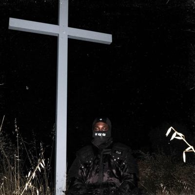

import { Slider, Button } from "@carbon/react";
import { ArrowUpRight } from "@carbon/icons-react";

import SliderJS1 from "../review/slider1";
import SliderJS2 from "../review/slider2";
import SliderJS3 from "../review/slider3";
import SliderJS4 from "../review/slider4";
import AdvJS2 from "../review/adv2";
import AdvJS3 from "../review/adv3";

import { Link } from "gatsby";

import Review1_1 from "../review/jpegmafia1.mdx";
import Review2_1 from "../review/jpegmafia_dannybrown1.mdx";

Album Review

<h1 className="h1--no--margin">{props.pageContext.frontmatter.title}</h1>

	<Link to="/best50/2024/">2024 Black Music Album Best No.24</Link>

<Row  className="image-card-group">
	<Column colMd={3} colLg={4} noGutterMdLeft="">
			 <ImageCard>

</ImageCard>
	</Column>
	<Column colMd={4} colLg={8} noGutterMdLeft="">
		

			去年(2023)年のDanny Brownとのコラボ作が大好評だったJPEGMAFIAのソロとしては5作目。
			 パンク、ヘビーメタル、サイケにブラジルのバイリファンキ、Jazzなど、様々なジャンルの音楽を雑多に混ぜ込んだコラージュ的なアプローチは今まで同様。ヘビーなTrackが多めだが、メローな⑬で和ませてくれたりもしている。
			 全体的には、Experimentalでありながらも、孤高な感じでもないので、比較的聴き易く、次に何がでてくるか、耳をそばだてる必要がある。
			 これをゲストプロデューサー少な目でやりきってしまうのは流石だと思う。
		

		

		  <Button className="button-right-mergin"  href="https://amzn.to/3XNc7nQ" renderIcon={ArrowUpRight} size='sm' kind='primary'>
		    amazon.com
		  </Button>
		  <Button className="button-right-mergin"  href="https://amzn.to/4j3RWus" renderIcon={ArrowUpRight} size='sm' kind='secondary'>
		    amazon.co.jp
		  </Button>
		  <Button className="button-right-mergin"  href="https://apple.co/4iRqEr4" renderIcon={ArrowUpRight} size='sm' kind='tertiary'>
		    apple music
		  </Button>		
			<AdvJS2/>
		

	</Column>
</Row>
<Row >
	<Column colMd={4} colLg={4} noGutterMdLeft="">
		

		  <h3>Score card</h3>
			<SliderJS1 value="1" />
		  <SliderJS2 value="1" />
			<SliderJS3 value="2" />
		  <SliderJS4 value="9" />
		

	</Column>
	<Column colMd={8} colLg={8} noGutterMdLeft="">
		

			<h3>Producers</h3>
			

				JPEGMAFIA(1,2,3,6,7,8,11,12,13,14)
				 JPEGMAFIA and DJ RaMeMes(4)
				 JPEGMAFIA and Flume(5)
				 JPEGMAFIA and Kenny Beats(9)
				 JPEGMAFIA, Kenny Beats, Nick Lee, Billy Ray and Alex Goldblatt(10)
			

			<h3>Guests</h3>
			

				Vince Staples, FREAKYMAFIACULT, Denzel Curry Buzzy Lee
			

		

	</Column>
</Row>

<h3>Tracks</h3>

| No. | Title | Composers | Performer | Time | 
| --- | --------------------------------------------------------- | ---------------------------------------------------------------- | ------------------------------- | ----- | 
| 1 | i scream this in the mirror before i interact with anyone | JPEGMAFIA | JPEGMAFIA | 01:48 | 
| 2 | SIN MIEDO | JPEGMAFIA, Alex Goldblatt , DATPIFFMAFIA | JPEGMAFIA | 02:46 | 
| 3 | I'll Be Right There | JPEGMAFIA, Vassal Benford , Ronald Spearman | JPEGMAFIA | 02:48 | 
| 4 | it's dark and hell is hot | JPEGMAFIA, FREAKYMAFIACULT, DJ RaMeMes , MC PR , Alex Goldblatt | JPEGMAFIA | 02:30 | 
| 5 | New Black History | JPEGMAFIA, Vince Staples, Future , Sonny Digital | JPEGMAFIA feat. Vince Staples | 02:16 | 
| 6 | don't rely on other men | JPEGMAFIA, FREAKYMAFIACULT , Alex Goldblatt | JPEGMAFIA feat. FREAKYMAFIACULT | 02:51 | 
| 7 | vulgar display of power | JPEGMAFIA , Alex Goldblatt | JPEGMAFIA | 02:52 | 
| 8 | Exmilitary | JPEGMAFIA | JPEGMAFIA | 05:01 | 
| 9 | JIHAD JOE | JPEGMAFIA , Alex Goldblatt | JPEGMAFIA | 02:14 | 
| 10 | JPEGULTRA! | JPEGMAFIA, Kenny Beats, Nick Lee, Billy Ray, Alex Goldblatt | JPEGMAFIA feat. Denzel Curry | 04:51 | 
| 11 | either on or off the drugs | JPEGMAFIA , Alex Goldblatt | JPEGMAFIA | 02:20 | 
| 12 | loop it and leave it | JPEGMAFIA | JPEGMAFIA | 02:00 | 
| 13 | Don't Put Anything On the Bible | JPEGMAFIA, Buzzy Lee, Robert Hazard, Alex Goldblatt | JPEGMAFIA feat. Buzzy Lee | 04:04 | 
| 14 | i recovered from this | JPEGMAFIA, Terry Lewis, Jimmy Jam, Janet Jackson, Alex Goldblatt | JPEGMAFIA | 02:55 | 

<h3>Other Reviews</h3>

<Row>
	<Column colMd={3} colLg={3} noGutterMdLeft>
		<Review1_1 />
	</Column>
</Row>
<Row>
	<Column colMd={3} colLg={3} noGutterMdLeft>
		<Review2_1 />
	</Column>
</Row>

<AdvJS3 />
