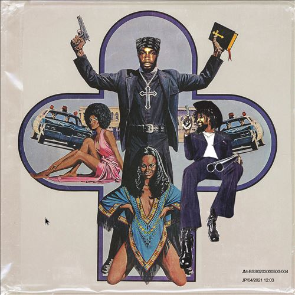

import { Slider, Button } from "@carbon/react";
import { ArrowUpRight } from "@carbon/icons-react";

import SliderJS1 from "../review/slider1";
import SliderJS2 from "../review/slider2";
import SliderJS3 from "../review/slider3";
import SliderJS4 from "../review/slider4";
import AdvJS2 from "../review/adv2";
import AdvJS3 from "../review/adv3";

import { Link } from "gatsby";

Album Review

<h1 className="h1--no--margin">{props.pageContext.frontmatter.title}</h1>

<Row  className="image-card-group">
	<Column colMd={3} colLg={4} noGutterMdLeft="">
       <ImageCard>

</ImageCard>
	</Column>
	<Column colMd={4} colLg={8} noGutterMdLeft="">
		

			JPEGMAFIAとDanny Brownという、曲者2人による共作。Danny Brownの前作にJPEGMAFIAもゲストとして呼ばれているが、そのへんのつながりからフルアルバム作成にいたったのかもしれない。
			 全曲、ProduceはJPEGMAFIAのみ、MCはRedveilが客演している1曲を覗いて両人のみというシンプルなCreditになっている。全体の印象は、かなり刺激的で強烈なもので、サンプリング含め、Jazz, Funk, Hip-Hop,ゲーム音楽など様々な要素が、コラージュ的に入れ替わり立ち替わり現れ、音圧高めの曲も多くて、単純に面白く、JPEGMAFIAの才能が爆発している感じである。(しかも全てのビートをThe SP 404というコンパクトサンプラーで作成したとのこと)。
			 Experimentalではあるが、聴きにくい感じでも無いので、普通に楽しめると思う。
			 また、マルハニチロやファミコンのCMからのサンプリングや、坂本真綾の"約束はいらない"をループに使った曲など、このへんはJPEGMAFIAに日本在住経験が活かされているのであろう。
		

		

		  <Button className="button-right-mergin"  href="https://amzn.to/3queNJE" renderIcon={ArrowUpRight} size='sm' kind='primary'>
  	    amazon.com
  	  </Button>
  	  <Button className="button-right-mergin"  href="https://amzn.to/445cU3Q" renderIcon={ArrowUpRight} size='sm' kind='secondary'>
  	    amazon.co.jp
  	  </Button>
			<Button className="button-right-mergin"  href="https://apple.co/45olSKr" renderIcon={ArrowUpRight} size='sm' kind='tertiary'>
  	    apple music
			</Button>
			<AdvJS2/>
		

	</Column>
</Row>
<Row >
	<Column colMd={4} colLg={4} noGutterMdLeft="">
		

		  <h3>Score card</h3>
			<SliderJS1 value="1" />
		  <SliderJS2 value="2" />
			<SliderJS3 value="2" />
		  <SliderJS4 value="9" />
		

	</Column>
	<Column colMd={8} colLg={8} noGutterMdLeft="">
		

			<h3>Producers</h3>
			

				Raul Midon(all)Barrington Hendricks(all)
			

			<h3>Guests</h3>
			

				Helelna Deland, Buzzy Lee, Abdu Ali
			

		

	</Column>
</Row>

<h3>Tracks</h3>

| No  | Title                                     | Composer                                                                     | Performer                           | Time |
| --- | ----------------------------------------- | ---------------------------------------------------------------------------- | ----------------------------------- | ---- |
| 1   | Jesus Forgive Me, I Am a Thot             | Barrington Hendricks                                                         | JPEGMAFIA                           | 2:36 |
| 2   | Kenan Vs. Kel                             | Barrington Hendricks                                                         | JPEGMAFIA                           | 3:01 |
| 3   | Beta Male Strategies                      | Barrington Hendricks                                                         | JPEGMAFIA                           | 3:18 |
| 4   | JPEGMAFIA TYPE BEAT                       | Barrington Hendricks                                                         | JPEGMAFIA                           | 0:54 |
| 5   | Grimy Waifu                               | Barrington Hendricks                                                         | JPEGMAFIA                           | 2:55 |
| 6   | PTSD                                      | Barrington Hendricks                                                         | JPEGMAFIA                           | 2:28 |
| 7   | Rap Grow Old & Die x No Child Left Behind | Barrington Hendricks                                                         | JPEGMAFIA                           | 2:47 |
| 8   | All My Heroes Are Cornballs               | Barrington Hendricks                                                         | JPEGMAFIA                           | 3:23 |
| 9   | BBW                                       | Barrington Hendricks                                                         | JPEGMAFIA                           | 1:36 |
| 10  | PRONE!                                    | Barrington Hendricks                                                         | JPEGMAFIA                           | 2:42 |
| 11  | Lifes Hard, Here's a Song About Sorrel    | Barrington Hendricks                                                         | JPEGMAFIA                           | 1:01 |
| 12  | Thot Tactics                              | Barrington Hendricks                                                         | JPEGMAFIA                           | 2:50 |
| 13  | Free the Frail                            | Barrington Hendricks, Helena Deland                                          | JPEGMAFIA feat. Helelna Deland      | 3:30 |
| 14  | Post Verified Lifestyle                   | Barrington Hendricks                                                         | JPEGMAFIA                           | 3:35 |
| 15  | BasicBitchTearGas                         | Kandi Burruss, Kevin Briggs, Tameka Cottle, Lisa Lopes, Barrington Hendricks | JPEGMAFIA                           | 1:16 |
| 16  | DOTS [Freestyle Remix]                    | Barrington Hendricks                                                         | JPEGMAFIA feat. Buzzy Lee, Abdu Ali | 2:07 |
| 17  | BUTTERMILK JESUS TYPE BEAT                | Barrington Hendricks                                                         | JPEGMAFIA                           | 1:09 |
| 18  | Papi I Missed U                           | Barrington Hendricks                                                         | JPEGMAFIA                           | 4:02 |

<AdvJS3 />